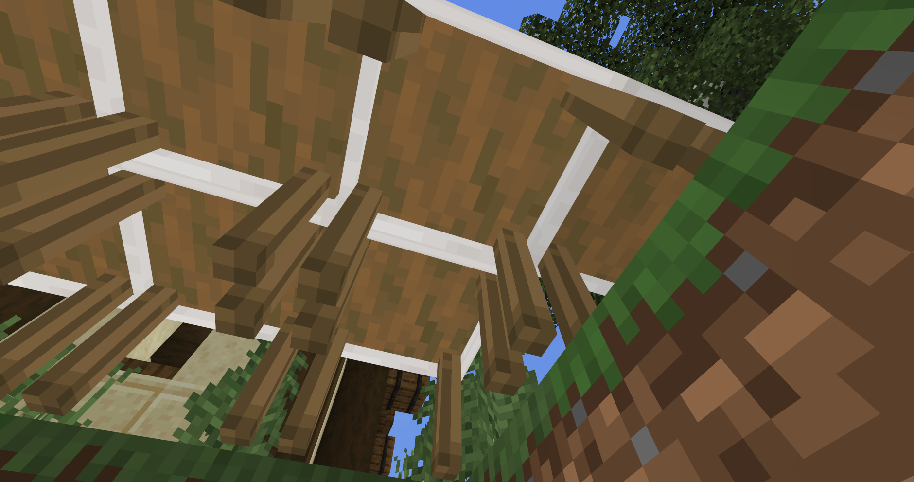
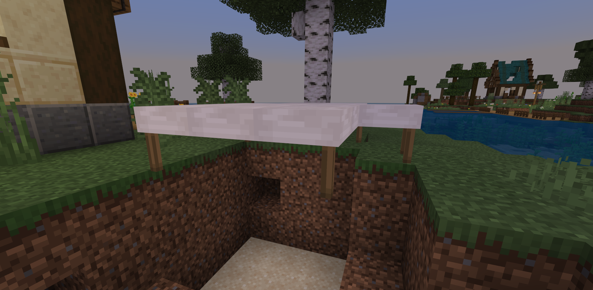
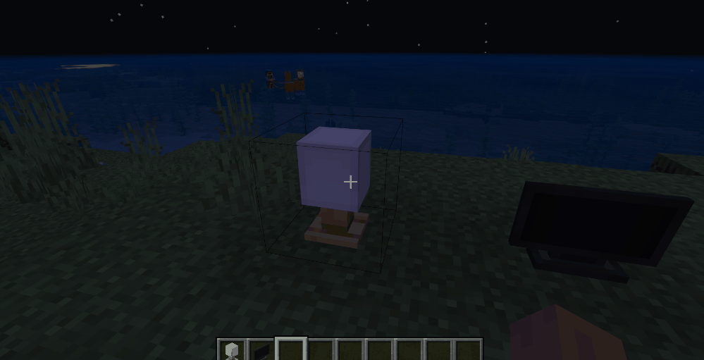
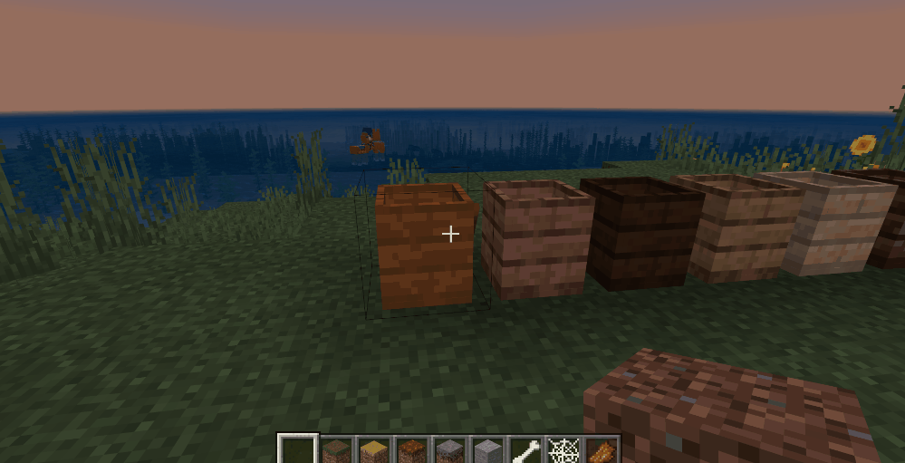
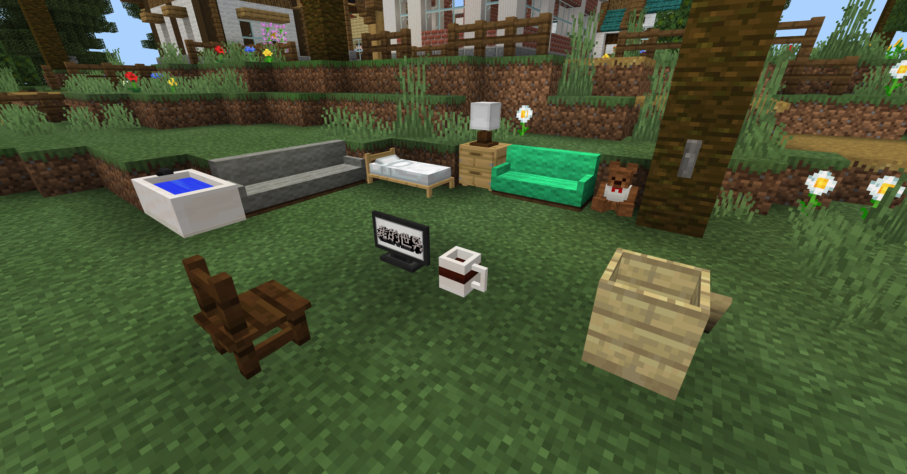

--- 
front: https://nie.res.netease.com/r/pic/20210730/ee109f39-8987-46e0-9fe7-40ebb23060fa.png 
hard: Advanced 
time: 80 minutes 
--- 
# Start adding furniture blocks 

In addition to crops, we also need to continue making furniture, which is also one of the important ways to play in the map; the same method of using new custom blocks is used, but different functions need to be added to different furniture. 

 

## Learn to set the block's rotation direction 

When we make custom blocks, if the four directions of the block model are the same, then it doesn't matter in which direction the block is placed; but if it is a furniture block, such as a sofa, when the player puts it down, it is not appropriate if the backrest of the sofa faces forward, so we need to set the block's rotation direction so that each placement can ensure that the front of the block is suitable; 

We need to add the rotation attribute [0,1,2,3] to the block to correspond to the four directions: east, south, west and north. Then add four combinations, use the **"minecraft:rotation"** component to correspond to the rotation angles of these four directions, and get the angle of the player's direction when placing the block, then modify the rotation property of the block according to the different angles, and add combinations based on the rotation property. The code is as follows: 

```json 
{ 
"format_version": "1.16.100", 
"minecraft:block": { 
"description": { 
"identifier": "farm:water_tap", 
"register_to_creative_menu": true, 
"properties": { 
"farm:rotation":[0,1,2,3] //Rotation property 
} 

}, 
"permutations": [ 
{ 
"condition": "query.block_property('farm:rotation') == 0", //When the player angle obtained below is 2 (2-2=0) North 
"components": { 
"minecraft:rotation": [ //Set the block rotation angle 
0, 
180, 
0 
] 
} 
}, 
{ 
"condition": "query.block_property('farm:rotation') == 1", //When the player angle obtained below is 2 (3-2=1) South 
"components": { 
"minecraft:rotation": [ //Set the block rotation angle 
0, 
0, 
0 
] 
}

}, 
{ 
"condition": "query.block_property('farm:rotation') == 2", //When the player angle obtained below is 2 (4-2=2) West 
"components": { 
"minecraft:rotation": [ //Set the block rotation angle 
0, 
270, 
0 
] 
} 
}, 
{ 
"condition": "query.block_property('farm:rotation') == 3", //When the player angle obtained below is 2 (5-2=3) East 
"components": { 
"minecraft:rotation": [ //Set the block rotation angle 
0, 
90, 
0 
] 
} 
} 
], 
"components": { 
"minecraft:loot": "loot_tables/blocks/water_tap.json", 
"minecraft:explosion_resistance": 1, 
"minecraft:pick_collision": { 
"origin": [-8, 0, -8], 
"size": [16, 10, 16] 
}, 
"minecraft:geometry": "geometry.water_tap", 
"minecraft:block_light_absorption": 0, 
"minecraft:material_instances": { 
"*": { 
"texture": "farm:water_tap", 
"render_method": "alpha_test", 
"ambient_occlusion": false 
} 
}, 
"minecraft:on_player_placing": { //Event triggered when the player places a block 
"event": "farm:set_rotation" 
}, 
"minecraft:entity_collision": { 
"origin": [-8, 0, -8], 
"size": [16, 10, 16] 
} 
}, 
"events": { 
"farm:set_rotation": { 
"set_block_property": { //Set block properties 
"farm:rotation": "query.cardinal_facing_2d-2"

//Use expression to get the player's direction (North=2.0, South=3.0, West=4.0, East=5.0, Undefined=6.0) 
//Because the block attributes above start from 0, the obtained number needs to be -2 to correspond to the block attributes above 
} 
} 
} 
} 
} 
``` 

 

## Make a table that can be put together 

Here you need to use the Chinese version of the custom model block writing method. Microsoft's 1.16+ custom block writing method cannot make this function for the time being; [Understanding the Chinese version of custom blocks](../../10-addon tutorial/Chapter 09: Custom blocks/Course 01. Understanding custom blocks.md) 

After adding basic components to the table block, you also need to use **"netease:connection"** to define the splicing properties of this block. 

```json
{
  "format_version": "1.10.0",
  "minecraft:block": {
   "description": {
     "identifier": "farm:connect_table",
	 "register_to_creative_menu": true,
	 "is_experimental": false
   },
   "components": {
	  "minecraft:block_light_absorption":{
		"value": 0
	  },
	  "netease:render_layer": {
	    "value": "alpha"
	  },
	  "netease:solid": {
	    "value": false
	  },
	  "netease:connection": {
		"blocks": ["farm:connect_table"]
	  }
    } } 
} 
``` 

Then open the table model file. We need to modify it so that when the table is spliced, some model blocks will disappear, such as the baffles around the table: 

```json 
{ 
"cubes": [···],

"enable": "!query.is_connect(2)", //Use an expression to determine the direction of the block connection surface (enable this part of the model when the connection surface is north, because it is added in front, so this part of the model is not enabled) 
// 0-down surface, 1-up surface, 2-north surface, 3-south surface, 4-west surface, 5-east surface 
"name": "n", //This part is the back baffle of the table 
"parent": "table", 
"pivot": [···], 
"rotation": [···] 
}, 
``` 

Use the above method to add the baffles in the four directions of southeast, northwest and northeast in turn. Click **Development and Testing** in the editor to enter the game. You can see from the bottom that when the tables are connected, the side baffles disappear; 

 

 

Compared with the baffles of the table, the corner of the table is not on one side, but the angle between two directions. Therefore, it is not enough to judge the connection in one direction. It will disappear only when there are tables in both directions: 

```json 
{ 
"cubes": [···], 
"enable": "!query.is_connect(5) && !query.is_connect(3)", //This part of the model is not enabled when there are tables on the east and south sides of the table 
// 0-down side, 1-up side, 2-north side, 3-south side, 4-west side, 5-east side 
"name": "east_south", //The table corner between the east and south sides 
"parent": "table", 
"pivot": [···], 
"rotation": [···] 
}, 
``` 

After setting all the table legs, enter the game like this 

 

## Make a decorative block with a switch 

Switches can add block attributes to make judgments. Add an attribute to the table lamp and TV with a value of [0,1], corresponding to on and off, and then use MODSDK to switch block attributes: 

```json 
{ 
"format_version": "1.16.100", 
"minecraft:block": { 
"description": { 
"identifier": "farm:acacia_table_lamp", //table lamp 
"register_to_creative_menu": true, 
"properties": { 
"farm:open_light" : [0, 1] //Add properties for turning on the light 
} 

}, 
"permutations": [

{ 
"condition": "query.block_property('farm:open_light') == 1", //When the property open_light is 1 
"components": { 
"minecraft:block_light_emission": 1 //Block emits light 

} 
} 
], 
"components": {···}, 
"events": {···} 

} 
} 
``` 

```python 
import time 
class Main(ServerSystem): 

def __init__(self, namespace, system_name): 
ServerSystem.__init__(self, namespace, system_name) 
self.interact_cooldown = {} #Create a timestamp variable to control the cooldown time of the player's interactive block to avoid multiple interactions in a very short time 
self.ListenForEvent(namespace, system_name,'ServerBlockUseEvent', self, self.using_item) 

def using_item(self, event): 
# Get the player ID 
player_id = event['playerId'] 
# Get the block type in the event 
block_name = event['blockName'] 
# Create an interface for getting block information 
blockstatecomp = serverApi.GetEngineCompFactory().CreateBlockState(serverApi.GetLevelId()) 
# Get the coordinates of the interactive block 
x = event['x'] 
y = event['y'] 
z = event['z'] 
# List of all table lamps 
table_lamp_list = ["farm:acacia_table_lamp", "farm:bigoak_table_lamp", "farm:birch_table_lamp", 
"farm:crimson_table_lamp", "farm:jungle_table_lamp", "farm:oak_table_lamp", 
"farm:spruce_table_lamp", "farm:warped_table_lamp"] 

#What if the interactive block is in the table lamp list? 
if block_name in table_lamp_list: 
#Get interactive block information 
state = blockstatecomp.GetBlockStates((x, y, z), 0) 
#If the player id is not in the timestamp variable 
if player_id not in self.interact_cooldown: 
#Add a player id and timestamp key value to the timestamp variable 
self.interact_cooldown[player_id] = time.time() 
#If the block's attribute open_light is equal to 0, the lamp is not turned on yet 
if state['farm:open_light'] == 0:

#Modify the open_light attribute of the lamp to 1 
state['farm:open_light'] = 1 
#Set the modified lamp attribute 
blockstatecomp.SetBlockStates((x, y, z), state, 0) 
#On the contrary, if the block attribute open_light is equal to 1, the lamp is already turned on 
else: 
#Modify the open_light attribute of the lamp to 0 
state['farm:open_light'] = 0 
#Set the modified lamp attribute 
blockstatecomp.SetBlockStates((x, y, z), state, 0) 

#If the current time minus the time stored in the timestamp variable is greater than 0.1 
elif time.time() - self.interact_cooldown[player_id] > 0.1: 
#The logic is the same as the if above 
if state['farm:open_light'] == 0: 
state['farm:open_light'] = 1 
blockstatecomp.SetBlockStates((x, y, z), state, 0) 
else: 
state['farm:open_light'] = 0 
blockstatecomp.SetBlockStates((x, y, z), state, 0) 
#Update the time in the timestamp variable 
self.interact_cooldown[player_id] = time.time() 
``` 

 

The same is true for TV and lamp. You only need to modify some judgment conditions: 

```json 
{ 
"format_version": "1.16.100", 
"minecraft:block": { 
"description": { 
"identifier": "farm:logo_tv", //TV 
"register_to_creative_menu": true, 
"properties": { 
"farm:open_tv": [0,1] //Add attributes to judge whether to turn on the TV 
} 

}, 
"permutations": [ 
{ 
"condition": "query.block_property('farm:open_tv') == 1", //When the property open_tv is 1 
"components": { 
"minecraft:material_instances": { //Modify the texture of the block 
"*": { 
"texture": "farm:logo_tv_open", 
"render_method": "alpha_test", 
"ambient_occlusion": false 
}

					}
				}
			}
		],
		"components": {···},
		"events": {···}

	}
}
```

```python
class Main(ServerSystem):
    def __init__(self, namespace, system_name):
        ServerSystem.__init__(self, namespace, system_name)
        self.ListenForEvent(namespace, system_name,'ServerBlockUseEvent', self, self.using_item)
        
    def using_item(self, event):
        if block_name == "farm:logo_tv":
            state = blockstatecomp.GetBlockStates((x, y, z), 0)
            if player_id not in self.interact_cooldown:
                self.interact_cooldown[player_id] = time.time()
                print state
                if state['farm:open_tv'] == 0:
                    state['farm:open_tv'] = 1
                    blockstatecomp.SetBlockStates((x, y, z), state, 0)
                else:
                    state['farm:open_tv'] = 0
                    blockstatecomp.SetBlockStates((x, y, z), state, 0)
            elif time.time() - self.interact_cooldown[player_id] > 0.1:
                if state['farm:open_tv'] == 0:
                    state['farm:open_tv'] = 1
                    blockstatecomp.SetBlockStates((x, y, z), state, 0)
                else:
                    state['farm:open_tv'] = 0
                    blockstatecomp.SetBlockStates((x, y, z), state, 0) self.interact_cooldown[player_id] = time.time() 
``` 

## Make a custom bed block 

It is more complicated to make a custom bed block, because the bed needs to be the same length as Steve, which is about two blocks, but the maximum collision box of a custom block is 16x16, so two blocks need to be spliced into a bed. We need to use modsdk to control the placement and destruction of the bed: 

```python 
class Main(ServerSystem): 
def __init__(self, namespace, system_name): 
ServerSystem.__init__(self, namespace, system_name) # Listen for events before and after the player places a block and destroys the block 
self.ListenForEvent(namespace, system_name,'EntityPlaceBlockAfterServerEvent', self, self.place_block) 
self.ListenForEvent(namespace, system_name,'ServerPlayerTryDestroyBlockEvent', self, self.player_destroy_block 
        self.ListenForEvent(namespace, system_name,'ServerEntityTryPlaceBlockEvent', self, self.try_place_block)


# Triggered after the player successfully places a block 
def place_block(self, args): 
# The lower half of a modern bed 
modern_bed_tail = { 
'name': 'farm:modern_bed_tail', 
'aux': 0 
} 
# Get the name of the placed block, block coordinates, player id, world id of the placed block, 
x = args["x"] 
y = args["y"] 
z = args["z"] 
blockname = args["fullName"] 
playerid = args["entityId"] 
worldid = args["dimensionId"] 
# Create block-related interfaces 
blockstatecomp = serverApi.GetEngineCompFactory().CreateBlockState(serverApi.GetLevelId()) 
blockcomp = serverApi.GetEngineCompFactory().CreateBlockInfo(serverApi.GetLevelId()) 
# If the placed block is farm:modern_bed_head (the upper part of the modern bed) 
if blockname == "farm:modern_bed_head": 
# Get the properties of this block 
block_state = blockstatecomp.GetBlockStates((x, y, z), worldid) 
# Get the block information of the east, west, south and north of this block by coordinates 
east_block_state = blockstatecomp.GetBlockStates((x + 1, y, z), worldid) 
west_block_state = blockstatecomp.GetBlockStates((x - 1, y, z), worldid) 
south_block_state = blockstatecomp.GetBlockStates((x, y, z + 1), worldid) 
north_block_state = blockstatecomp.GetBlockStates((x, y, z - 1), worldid) 
# Use if to determine the placement direction of the upper part 
if block_state["farm:rotation"] == 0: 
# Place the lower half of the block in the opposite direction of the upper half of the block 
blockcomp.SetBlockNew((x, y, z + 1), modern_bed_tail, 0, worldid) 
block_state['farm:rotation'] = 0 
blockstatecomp.SetBlockStates((x, y, z + 1), block_state, worldid) 
elif block_state["farm:rotation"] == 1: 
blockcomp.SetBlockNew((x, y, z - 1), modern_bed_tail, 0, worldid) 
block_state['farm:rotation'] = 1 
blockstatecomp.SetBlockStates((x, y, z - 1), block_state, worldid) 
elif block_state["farm:rotation"] == 2: 
blockcomp.SetBlockNew((x + 1, y, z), modern_bed_tail, 0, worldid) 
block_state['farm:rotation'] = 2 
blockstatecomp.SetBlockStates((x + 1, y, z), block_state, worldid) 
elif block_state["farm:rotation"] == 3: 
blockcomp.SetBlockNew((x - 1, y, z), modern_bed_tail, 0, worldid) 
block_state['farm:rotation'] = 3 
blockstatecomp.SetBlockStates((x - 1, y, z), block_state, worldid) 

# Triggered when the player destroys the block 
def player_destroy_block(self, args): 
# Block information dictionary (air) 
air = {

'name': 'minecraft:air', 
'aux': 0 
} 
# Block list (upper and lower parts of modern bed) 
block_list = ['farm:modern_bed_head', 'farm:modern_bed_tail'] 
# Get the name, coordinates, player id and world id of the destroyed block through the event 
blockname = args['fullName'] 
x = args['x'] 
y = args['y'] 
z = args['z'] 
blockname = args['fullName'] 
playerid = args['playerId'] 
worldid = args['dimensionId'] 
# Create block related interfaces 
blockstatecomp = serverApi.GetEngineCompFactory().CreateBlockState(serverApi.GetLevelId()) 
blockcomp = serverApi.GetEngineCompFactory().CreateBlockInfo(serverApi.GetLevelId()) 
# If the block name is farm:modern_bed_head (the upper part of the modern bed) 
if blockname == "farm:modern_bed_head": 
# Get the properties of this block 
block_state = blockstatecomp.GetBlockStates((x, y, z), worldid) 
# Use if to determine the rotation property of the block and destroy the block in the opposite direction at the same time (the opposite direction is the lower part) 
if block_state['farm:rotation'] == 0: 
blockcomp.SetBlockNew((x, y, z + 1), air, 0, worldid) 
elif block_state['farm:rotation'] == 1: 
blockcomp.SetBlockNew((x, y, z - 1), air, 0, worldid) 
elif block_state['farm:rotation'] == 2: 
blockcomp.SetBlockNew((x + 1, y, z), air, 0, worldid) 
elif block_state['farm:rotation'] == 3: 
blockcomp.SetBlockNew((x - 1, y, z), air, 0, worldid) 
# If the block name is farm:modern_bed_tail (the lower half of the modern bed) 
elif blockname == "farm:modern_bed_tail": 
# Get the properties of this block 
block_state = blockstatecomp.GetBlockStates((x, y, z), worldid) 
# Use if to determine the rotation property of the block and destroy the block in the opposite direction at the same time (the opposite direction is the upper half) 
if block_state['farm:rotation'] == 0: 
blockcomp.SetBlockNew((x, y, z - 1), air, 0, worldid) 
elif block_state['farm:rotation'] == 1: 
blockcomp.SetBlockNew((x, y, z + 1), air, 0, worldid) 
elif block_state['farm:rotation'] == 2: 
blockcomp.SetBlockNew((x - 1, y, z), air, 0, worldid) 
elif block_state['farm:rotation'] == 3: 
blockcomp.SetBlockNew((x + 1, y, z), air, 0, worldid) 

# Triggered when the player tries to place a block 
def try_place_block(self,args): 
# Get the coordinates, name, player id, world id of the block through the event 
x = args["x"] 
y = args["y"] 
z = args["z"] 
blockname = args["fullName"]

playerid = args["entityId"] 
worldid = args["dimensionId"] 
# Create block related interfaces 
blockinfocomp = serverApi.GetEngineCompFactory().CreateBlockInfo(serverApi.GetLevelId()) 
# Get the return value of getplayerrot 
playerrot = self.getplayerrot(playerid) 
# Get message related interfaces 
msgcomp = serverApi.GetEngineCompFactory().CreateMsg(playerid) 
# If the placed block is farm:modern_bed_head (the upper part of the modern bed) 
if blockname == "farm:modern_bed_head": 
# If the player's perspective is 2 
if playerrot == 2: 
# Get the block information dictionary of the perspective direction 
south_block = blockinfocomp.GetBlockNew((x,y,z+1), worldid) 
# If the name of the block is not air (it means there is a block blocking it) 
if south_block['name'] != "minecraft:air": 
# Cancel placing the block 
args['cancel'] = True 
# Remind the player who tried to place the block 
msgcomp.NotifyOneMessage(playerid, "There is a block blocking it nearby, so it cannot be placed", "§c") 
# The following if branch is the same as above, but the player's perspective angle is different 
elif playerrot == 3: 
west_block = blockinfocomp.GetBlockNew((x - 1,y,z), worldid) 
if west_block['name'] != "minecraft:air": 
args['cancel'] = True 
msgcomp.NotifyOneMessage(playerid, "There is a block blocking it nearby, so it cannot be placed", "§c") 
elif playerrot == 0: 
north_block = blockinfocomp.GetBlockNew((x,y,z-1), worldid) 
if north_block['name'] != "minecraft:air": 
args['cancel'] = True 
msgcomp.NotifyOneMessage(playerid, "There are blocks nearby, so you can't place blocks", "§c") 
elif playerrot == 1: 
east_block = blockinfocomp.GetBlockNew((x+1,y,z), worldid) 
if east_block['name'] != "minecraft:air": 
args['cancel'] = True 
msgcomp.NotifyOneMessage(playerid, "There are blocks nearby, so you can't place blocks", "§c") 

# Function to get the player's viewing angle 
def getplayerrot(self,playerid): 
# Get the player's angle 
rot = serverApi.GetEngineCompFactory().CreateRot(playerid).GetRot() 
# Return different numbers for judgment according to different angles 
if 135.0 < rot[1] <= 180.0: 
return 2 
elif 90.0 < rot[1] <= 135.0: 
return 1 
elif 45.0 < rot[1] <= 90.0: 
return 1 
elif 0.0 < rot[1] <= 45.0: 
return 0

elif -45.0 < rot[1] <= 0.0: 
return 0 
elif -90.0 < rot[1] <= -45.0: 
return 3 
elif -135.0 < rot[1] <= -90.0: 
return 3 
elif -180.0 < rot[1] <= -135.0: 
return 2 
else: 
return 0 

``` 

After writing the placement and destruction logic of the bed block, we also need to add logic related to its interactive function so that the player can set the birth point and sleep in the bed to skip a period of time: 

```python 
class Main(ServerSystem): 

def __init__(self, namespace, system_name): 
ServerSystem.__init__(self, namespace, system_name) 
# Listen for block interaction time 
self.ListenForEvent(namespace, system_name,'ServerBlockUseEvent', self, self.using_item) 
# Timestamp variable 
self.interact_cooldown = {} 


def using_item(self, event): 
# Create a timer interface 
timercomp = serverApi.GetEngineCompFactory().CreateGame(serverApi.GetLevelId()) 
# Create an interface for player behavior 
playercomp = serverApi.GetEngineCompFactory().CreatePlayer(player_id) 
# Create an interface for getting block information 
blockstatecomp = serverApi.GetEngineCompFactory().CreateBlockState(serverApi.GetLevelId()) 
# Create an interface for using commands 
commandcomp = serverApi.GetEngineCompFactory().CreateCommand(serverApi.GetLevelId()) 
# If the interactive block is a modern bed 
if block_name == "farm:modern_bed_head": 
# Get block properties 
state = blockstatecomp.GetBlockStates((x, y, z), 0) 
# Store some required parameters 
camera_event = {'state': state, 'x': x, 'y': y, 'z': z, 'playerid': player_id} 
# Set the player's spawn point 
commandcomp.SetCommand("spawnpoint @s ~ ~ ~") 
# If the rotation property of the block is 2 (determine the placement direction of the block and set the player's perspective according to the direction) 
if state['farm:rotation'] == 2: 
# Use the command to play the player's sleeping animation 
commandcomp.SetCommand("playanimation @s east_sleep") 
# Use the command to teleport the player to the bed 
commandcomp.SetCommand("tp @s {} {} {}".format(x,y+0.5,z)) 
# Set the player to be unable to move

playercomp.SetPlayerMovable(False) 
# Transmit events to the client and lock the player's perspective to a fixed position 
self.NotifyToClient(player_id, "camera_lock", camera_event) 
# Add a 4-second timer 
timercomp.AddTimer(4.0,self.standup,player_id,) 
# Same as above if, just judge different rotation angles to play player animations and perspectives in different directions 
elif state['farm:rotation'] == 0: 
commandcomp.SetCommand("tp @s {} {} {}".format(x,y+0.5,z)) 
commandcomp.SetCommand("playanimation @s west_sleep humanoid_base_pose 0") 
playercomp.SetPlayerMovable(False) 
self.NotifyToClient(player_id, "camera_lock", camera_event) 
                timercomp.AddTimer(4.0,self.standup,player_id,)
            elif state['farm:rotation'] == 1:
                commandcomp.SetCommand("tp @s {} {} {}".format(x,y+0.5,z))
                commandcomp.SetCommand("playanimation @s north_sleep humanoid_base_pose 0")
                playercomp.SetPlayerMovable(False)
                self.NotifyToClient(player_id, "camera_lock", camera_event)
                timercomp.AddTimer(4.0,self.standup,player_id,)
            elif state['farm:rotation'] == 3:
                commandcomp.SetCommand("tp @s {} {} {}".format(x,y+0.5,z))
                commandcomp.SetCommand("playanimation @s south_sleep humanoid_base_pose 0") 
playercomp.SetPlayerMovable(False) 
self.NotifyToClient(player_id, "camera_lock", camera_event) 
timercomp.AddTimer(4.0,self.standup,player_id,) 

# Function triggered by timer 
def standup(self,player_id): 
# Get related interfaces 
timecomp = serverApi.GetEngineCompFactory().CreateTime(serverApi.GetLevelId()) 
playercomp = serverApi.GetEngineCompFactory().CreatePlayer(player_id) 
# Set the player to be movable 
playercomp.SetPlayerMovable(True) 
# Total number of frames since the start of the game 
passedTime = timecomp.GetTime() 
# Number of frames in the current game day 
timeOfDay = passedTime % 24000 
# Number of game days since the start of the game 
day = passedTime / 24000 
# Use timestamp to avoid multiple executions 
if player_id not in self.interact_cooldown: 
self.interact_cooldown[player_id] = time.time() 
# According to current time + 12000 
timecomp.SetTime(passedTime + 12000) 
print day 
elif time.time() - self.interact_cooldown[player_id] > 1: 
timecomp.SetTime(passedTime + 12000) 
self.interact_cooldown[player_id] = time.time() 
print day 
``` 


```python 
class FarmClientSystem(ClientSystem): 
def __init__(self, namespace, systemName): 
super(FarmClientSystem, self).__init__(namespace, systemName) 
# Listen for events transmitted from the server 
self.ListenForEvent("FarmMod", "ServerBlockListenerServer", "camera_lock",self, self.Camera_Lock) 

def Camera_Lock(self,event): 
# Get the transmitted parameters: block coordinates and attributes 
x = event['x'] 
y = event['y'] 
z = event['z'] 
state = event['state'] 
# Determine the rotation attribute of the block 
if state['farm:rotation'] == 0: 
# Lock the player's perspective to a specific position 
cameracomp.LockCamera((x,y+1,z), (-40, 0)) 
# Add a 4s timer
            timercomp.AddTimer(4.0, self.Camera_UnLock, event, )
        elif state['farm:rotation'] == 2:
            cameracomp.LockCamera((x,y+1,z), (-40, -90))
            timercomp.AddTimer(4.0, self.Camera_UnLock, event, )
        elif state['farm:rotation'] == 3:
            cameracomp.LockCamera((x,y+1,z), (-40, -270))
            timercomp.AddTimer(4.0, self.Camera_UnLock, event, )
        elif state['farm:rotation'] == 1:
            cameracomp.LockCamera((x,y+1,z), (-40, -180)) timercomp.AddTimer(4.0, self.Camera_UnLock, event, ) 

# Function triggered by timer 
def Camera_UnLock(self,event): 
# Unlock the player's perspective 
cameracomp.UnLockCamera() 

``` 

Now, we have a relatively complete modern bed. Click **Development and Testing** in the editor to enter the game and try it out: 

 

## Make a trash can that can recycle props 

This function can be done using MODSDK, without complex modifications to the components of the custom block. The code is as follows: 

```python 
class Main(ServerSystem): 
def __init__(self, namespace, system_name): 
ServerSystem.__init__(self, namespace, system_name) 
self.ListenForEvent(namespace, system_name, 
'ServerItemUseOnEvent', self, self.using_block) #Listen to ServerItemUseOnEvent event


def using_block(self,args): 
trash_can_list = ['farm:acacia_trash_can', 'farm:bigoak_trash_can', 'farm:birch_trash_can', 
'farm:crimson_trash_can', 'farm:jungle_trash_can', 'farm:oak_trash_can', 
'farm:spruce_trash_can', 'farm:warped_trash_can'] #All trash can blocks 
playerid = args['entityId'] #Player id obtained in the event 
blockname = args['blockName'] #Identifier of the player interaction block obtained in the event 
itemname = args['itemDict'] #Item information dictionary obtained in the event 
item_comp = serverApi.GetEngineCompFactory().CreateItem(playerid) #Create CreateItem interface 

if blockname in trash_can_list and itemname: #If the interactive block is in the trash_can_list list and the player has an item in his hand 
args['ret'] = True #Cancel the use of the item in hand (this can prevent the item or block in the player's hand from being placed on the ground and unable to be cleared) 
carried_item = item_comp.GetPlayerItem(ItemPosType.CARRIED, 0, True) #Get the item information in the player's hand 
carried_item['count'] = 0 #Set the number of items obtained to 0 
item_comp.SetPlayerAllItems({(ItemPosType.CARRIED, 0): carried_item}) #Reset the items in the player's hand 

``` 

In ServerSystem, you only need to listen to the **ServerItemUseOnEvent** event and add some simple logic. However, it is recommended to listen to and cancel the use of items on the client at the same time, so some code is also needed in ClientSystem: 

```python 
class FarmClientSystem(ClientSystem): 

def __init__(self, namespace, systemName): 
super(FarmClientSystem, self).__init__(namespace, systemName) 
self.ListenForEvent(namespace, system_name, 
'ClientItemUseOnEvent', self, self.using_item) #Listen for events 

def using_item(self,args): 
trash_can_list = ['farm:acacia_trash_can', 'farm:bigoak_trash_can', 'farm:birch_trash_can', 
'farm:crimson_trash_can', 'farm:jungle_trash_can', 'farm:oak_trash_can', 
'farm:spruce_trash_can', 'farm:warped_trash_can'] #All trash can blocks 
blockname = args['blockName'] #The identifier of the player's interactive block obtained in the event 
itemname = args['itemDict'] #The item information dictionary obtained in the event 
if blockname in trash_can_list and itemname: #If the interactive block is in the trash_can_list list and the player has an item in his hand 
args['ret'] = True #Cancel the use of the item in hand 

``` 

 

## Make a juicer that can extract juice 

The juicer needs the crops we harvested: lemons, spinach, and corn, which correspond to lemon juice, spinach juice, and corn juice respectively 

Add multiple attributes to the juicer to represent "judging the operation of the juicer", "squeezing corn juice", "squeezing lemon juice", and "squeezing spinach juice"; then add corresponding combinations and control them through events. However, it is not possible to produce all functions using only the component content of the custom block, and we also need to use MODSDK; 

```json

{ 
"format_version": "1.16.100", 
"minecraft:block": { 
"description": { 
"identifier": "farm:juicer", 
"register_to_creative_menu": true, 
"properties": { 
"farm:run":[0,1], //Judge whether the juicer is running 
"farm:juicer_has_corn":[0,1,2], //The process of squeezing corn juice 
"farm:juicer_has_lemon":[0,1,2], //The process of squeezing lemon juice 
"farm:juicer_has_spinach":[0,1,2] //The process of squeezing spinach juice 
} 

}, 
"permutations": [ 
{ 
"condition": "query.block_property('farm:juicer_has_corn') == 1", //If the conditions are met, add the following components (the juicer is juicing: corn) 
"components": { 
"minecraft:material_instances": { //Modify the texture of the juicer 
"*": { 
"texture": "farm:juicer_corn", 
"render_method": "alpha_test", 
"ambient_occlusion": false 
} 
}, 
"minecraft:ticking": { //Add a timer to run the following event after 3 seconds (no repeated operation) 
"range": [3.0, 3.0], 
"looping": false, 
"on_tick": { 
"event": "farm:corn_juice_start", 
"target": "self" 
} 
} 
} 
}, 
{ 
"condition": "query.block_property('farm:juicer_has_corn') == 2", //If the conditions are met, add the following components (the juicer has finished squeezing: corn) 
"components": { 
"minecraft:material_instances": { //Modify the juicer texture 
"*": { 
"texture": "farm:juicer_corn_bottle", 
"render_method": "alpha_test", 
"ambient_occlusion": false 
} 
} 
} 
}, 
{ 
"condition": "query.block_property('farm:juicer_has_spinach') == 1", //If the conditions are met, add the following components (the juicer is squeezing: spinach) 
"components": {

"minecraft:material_instances": { //Modify the juicer texture 
"*": { 
"texture": "farm:juicer_spinach", 
"render_method": "alpha_test", 
"ambient_occlusion": false 
} 
}, 
"minecraft:ticking": { //Add a timer to run the following event after 3 seconds (no repeated operation) 
"range": [3.0, 3.0], 
"looping": false, 
"on_tick": { 
"event": "farm:spinach_juice_start", 
"target": "self" 
} 
} 
} 
}, 
{ 
"condition": "query.block_property('farm:juicer_has_spinach') == 2", //Satisfy the condition and add the following component (the juicer has finished squeezing: spinach) 
"components": { 
"minecraft:material_instances": { //Modify the juicer texture 
"*": { 
"texture": "farm:juicer_spinach_bottle", 
"render_method": "alpha_test", 
"ambient_occlusion": false 
} 
} 
} 
}, 
{ 
"condition": "query.block_property('farm:juicer_has_lemon') == 1", //Satisfy the condition and add the following component (the juicer is juicing: lemon) 
"components": { 
"minecraft:material_instances": { //Modify the juicer texture 
"*": { 
"texture": "farm:juicer_lemon", 
"render_method": "alpha_test", 
"ambient_occlusion": false 
} 
}, 
"minecraft:ticking": { //Add a timer to run the following event after 3 seconds (do not repeat) 
"range": [3.0, 3.0], 
"looping": false, 
"on_tick": { 
"event": "farm:lemon_juice_start", 
"target": "self" 
} 
} 
} 
}, 
{

"condition": "query.block_property('farm:juicer_has_lemon') == 2", //Satisfy the condition, add the following components (the juicer has finished squeezing: lemon) 
"components": { 
"minecraft:material_instances": { //Modify the juicer texture 
"*": { 
"texture": "farm:juicer_lemon_bottle", 
"render_method": "alpha_test", 
"ambient_occlusion": false 
} 
} 
} 
} 
], 
"components": { 
"minecraft:loot": "loot_tables/blocks/juicer.json", 
"minecraft:explosion_resistance": 1, 
"minecraft:pick_collision": { 
"origin": [-8, 0, -8], 
"size": [16, 16, 16] 
}, 
"minecraft:material_instances": { //Normal texture of juicer 
"*": { 
"texture": "farm:juicer", 
"render_method": "alpha_test", 
"ambient_occlusion": false 
} 
}, 
"minecraft:geometry": "geometry.juicer", //Model of juicer 
"minecraft:block_light_absorption": 0, 
"minecraft:entity_collision": { 
"origin": [-8, 0, -8], 
"size": [16, 16, 16] 
} 
}, 
"events": { 
"farm:corn_juice_start":{ 
"set_block_property": { //Set the property juicer_has_cron to 2 (from running the juicer to finishing the juice) 
"farm:juicer_has_corn": 2 
} 
}, 
"farm:spinach_juice_start":{ //Set the property juicer_has_spinach to 2 (from running the juicer to finishing the juice) 
"set_block_property": { 
"farm:juicer_has_spinach": 2 
} 
}, 
"farm:lemon_juice_start":{ //Set the property juicer_has_lemon to 2 (from running the juicer to finishing the juice) 
"set_block_property": { 
"farm:juicer_has_lemon": 2 
} 
} 
}


} 
} 
``` 

The above custom block content can realize the juicing process (3 seconds) and switch the juicer texture according to the state. The functions of starting juicing and taking away the juice need MODSDK to implement: 

```python 
class Main(ServerSystem): 

def __init__(self, namespace, system_name): 
ServerSystem.__init__(self, namespace, system_name) 
self.ListenForEvent(namespace, system_name, 
'ServerBlockUseEvent', self, self.using_item) 

def using_item(self, event): 
# Get the player ID 
player_id = event['playerId'] 
# Create the player's item interface 
item_comp = serverApi.GetEngineCompFactory().CreateItem(player_id) 
# Get the player's handheld item information 
carried_item = item_comp.GetPlayerItem(ItemPosType.CARRIED, 0, True) 
# Get the type of block in the event 
block_name = event['blockName'] 
# Create an interface for getting block information 
blockstatecomp = serverApi.GetEngineCompFactory().CreateBlockState(serverApi.GetLevelId()) 
# Create an interface for generating dropped items 
drop_comp = serverApi.GetEngineCompFactory().CreateItem(serverApi.GetLevelId()) 
# Get the coordinates of the interactive block 
x = event['x'] 
y = event['y'] 
z = event['z'] 
# Create a variable to store juice item information 
juice = [ 
{ 
'newItemName': 'farm:corn_juice', 
'count': 1, 
'newAuxValue': 0, 
}, 
            {
                'newItemName': 'farm:lemon_juice',
                'count': 1,
                'newAuxValue': 0,
            },
            {
                'newItemName': 'farm:spinach_juice',
                'count': 1,
                'newAuxValue': 0,
            }
        ]


        #If the block you are interacting with is a juicer 
if block_name == "farm:juicer": 
#Get the properties of the block at the coordinate position 
state = blockstatecomp.GetBlockStates((x, y, z), 0) 
#If you have something in your hand 
if carried_item: 
#If the block's properties have_corn and run are both 0 and the item in your hand is corn 
if state['farm:juicer_has_corn'] == 0 and state['farm:run'] == 0 and carried_item['newItemName'] == "farm:corn_item": 
#Change has_corn and run to 1, and -1 the corn in your hand 
state['farm:juicer_has_corn'] = 1 
state['farm:run'] = 1 
blockstatecomp.SetBlockStates((x, y, z), state, 0) 
carried_item['count'] -= 1 
item_comp.SetPlayerAllItems({(ItemPosType.CARRIED, 0): carried_item}) 

#If the block's attributes has_lemon and run are both 0 and the player is holding a lemon 
elif state['farm:juicer_has_lemon'] == 0 and state['farm:run'] == 0 and carried_item['newItemName'] == "farm:lemon_item": 
#Change has_lemon and run to 1, and reduce the number of lemons in the player's hand by 1 
state['farm:juicer_has_lemon'] = 1 
state['farm:run'] = 1 
blockstatecomp.SetBlockStates((x, y, z), state, 0) 
carried_item['count'] -= 1 
item_comp.SetPlayerAllItems({(ItemPosType.CARRIED, 0): carried_item}) 

#If the block's attributes has_spinach and run are both 0 and the hand is spinach 
elif state['farm:juicer_has_spinach'] == 0 and state['farm:run'] == 0 and carried_item['newItemName'] == "farm:spinach_item": 
#Change has_spinach and run to 1, and -1 the hand's spinach 
state['farm:juicer_has_spinach'] = 1 
state['farm:run'] = 1 
blockstatecomp.SetBlockStates((x, y, z), state, 0) 
carried_item['count'] -= 1 
item_comp.SetPlayerAllItems({(ItemPosType.CARRIED, 0): carried_item}) 

#When there is something in the hand and the corn juice is squeezed 
elif state['farm:juicer_has_corn'] == 2: 
#Generate drops and restore has_corn and run to 0 
drop_comp.SpawnItemToLevel(juice[0], 0, (x, y+1, z)) 
state['farm:juicer_has_corn'] = 0 
state['farm:run'] = 0 
blockstatecomp.SetBlockStates((x, y, z), state, 0) 

#When there is something in hand and the lemon juice is squeezed 
elif state['farm:juicer_has_lemon'] == 2: 
#Generate drops and restore has_lemon and run to 0 
drop_comp.SpawnItemToLevel(juice[1], 0, (x, y+1, z)) 
state['farm:juicer_has_lemon'] = 0

state['farm:run'] = 0 
blockstatecomp.SetBlockStates((x, y, z), state, 0) 

#When there is something in hand and the juicing of spinach is completed 
elif state['farm:juicer_has_spinach'] == 2: 
#Generate drops and restore has_spinach and run to 0 
drop_comp.SpawnItemToLevel(juice[2], 0, (x, y+1, z)) 
state['farm:juicer_has_spinach'] = 0 
state['farm:run'] = 0 
blockstatecomp.SetBlockStates((x, y, z), state, 0) 

#If there is nothing in hand 
else: 
#If the juicing of corn is completed 
if state['farm:juicer_has_corn'] == 2: 
drop_comp.SpawnItemToLevel(juice[0], 0, (x, y+1, z)) 
state['farm:juicer_has_corn'] = 0 
state['farm:run'] = 0 
blockstatecomp.SetBlockStates((x, y, z), state, 0) 

# If the lemon juice is done 
elif state['farm:juicer_has_lemon'] == 2: 
# Spawn the item and restore has_lemon and run to 0 
drop_comp.SpawnItemToLevel(juice[1], 0, (x, y+1, z)) 
state['farm:juicer_has_lemon'] = 0 
state['farm:run'] = 0 
blockstatecomp.SetBlockStates((x, y, z), state, 0) 

# If the spinach juice is done 
elif state['farm:juicer_has_spinach'] == 2: 
#Generate drops and restore has_spinach and run to 0 
drop_comp.SpawnItemToLevel(juice[2], 0, (x, y+1, z)) 
state['farm:juicer_has_spinach'] = 0 
state['farm:run'] = 0 
blockstatecomp.SetBlockStates((x, y, z), state, 0) 
else: 
pass 
``` 

MODSDK and custom block components work together to complete all the functions of this juicer. Click **Development Test** in the editor to enter the game and test it: 

 

## Making a sit-on block 

The sit-on chair is similar to the modern bed above, and is not that complicated. We only need to teleport the player to the chair and play the sitting animation. However, we can add more interesting features, such as restoring half a health bar of the player every three seconds when the player sits down: 

```python 
class Main(ServerSystem): 


def __init__(self, namespace, system_name): 
ServerSystem.__init__(self, namespace, system_name) 
# Variable to determine if the player is sitting down 
self.sit = 0 
# Timestamp variable 
self.interact_cooldown = {} 
# Listen for block interaction events 
self.ListenForEvent(namespace, system_name,'ServerBlockUseEvent', self, self.using_item) 

def using_item(self, event): 
# Create a timer interface 
timercomp = serverApi.GetEngineCompFactory().CreateGame(serverApi.GetLevelId()) 
# Create an interface for using commands 
commandcomp = serverApi.GetEngineCompFactory().CreateCommand(serverApi.GetLevelId()) 
# Create an interface for using commands 
commandcomp = serverApi.GetEngineCompFactory().CreateCommand(serverApi.GetLevelId()) 
# Block name and coordinates obtained by the event 
block_name = event['blockName'] 
x = event['x'] 
y = event['y'] 
z = event['z'] 
# So the list of chair names 
chair_list = ["farm:acacia_chair","farm:bigoak_chair","farm:birch_chair","farm:crimson_chair", 
"farm:jungle_chair","farm:oak_chair","farm:spruce_chair","farm:warped_chair"] 

# If the block name of the interaction is in the list 
if block_name in chair_list: 
# Use timestamps to avoid multiple interactions in a short period of time 
if player_id not in self.interact_cooldown: 
self.interact_cooldown[player_id] = time.time() 
# If sit is 0 (the player is not sitting down) 
if self.sit == 0: 
# Use the command to play the player's sitting animation 
commandcomp.SetCommand("playanimation @s sit_chair") 
# Teleport the player to the chair 
commandcomp.SetCommand("tp @s {} {} {}".format(x,y-0.1,z)) 
# Set the player to be unable to move 
playercomp.SetPlayerMovable(False) 
# Create a message interface and remind the player to click again to stand up 
msgcomp = serverApi.GetEngineCompFactory().CreateMsg(player_id) 
msgcomp.NotifyOneMessage(player_id, "Click the chair again to stand up", "§f") 
# Create a 3-second loop timer 
self.healtimer = timercomp.AddRepeatedTimer(3.0,self.player_heal,player_id) 
# Modify the sitting variable to 1 
self.sit = 1 
# If the variable is 1 (the player is sitting at this time) 
elif self.sit == 1: 
# Set the player to be movable 
playercomp.SetPlayerMovable(True) 
# Cancel the looping timer

timercomp.CancelTimer(self.healtimer) 
# Play player normal 
commandcomp.SetCommand("playanimation @s humanoid_base_pose") 
# Modify the variable of sitting down to 0 
self.sit = 0 

# Timestamp judgment, consistent with the above if logic 
elif time.time() - self.interact_cooldown[player_id] > 0.5: 
if self.sit == 0: 
commandcomp.SetCommand("playanimation @s sit_chair") 
commandcomp.SetCommand("tp @s {} {} {}".format(x,y-0.1,z)) 
playercomp.SetPlayerMovable(False) 
msgcomp = serverApi.GetEngineCompFactory().CreateMsg(player_id) 
msgcomp.NotifyOneMessage(player_id, "Click the chair again to stand up", "§f") 
self.healtimer = timercomp.AddRepeatedTimer(3.0, self.player_heal, player_id) 
self.sit = 1 
elif self.sit == 1: 
playercomp.SetPlayerMovable(True) 
timercomp.CancelTimer(self.healtimer) 
commandcomp.SetCommand("playanimation @s humanoid_base_pose") 
self.sit = 0 
self.interact_cooldown[player_id] = time.time() 
# Function triggered by timer loop 
def player_heal(self,playerid): 
# Interface for getting player attributes 
attcomp = serverApi.GetEngineCompFactory().CreateAttr(playerid) 
# Get the current health of the player 
playerheal = attcomp.GetAttrValue(serverApi.GetMinecraftEnum().AttrType.HEALTH) 
# Set the player's current health and +1 
attcomp.SetAttrValue(serverApi.GetMinecraftEnum().AttrType.HEALTH, playerheal+1) 

``` 

The logic of the chair is relatively simple. We click **Development and Testing** in the editor and enter the game to test it: 

 

## Make other decorative blocks 

Next, we continue to fill in decorative block furniture: mugs, bedside tables, faucets, bear dolls (pure decoration), toilets, sofas, bathtubs (repeating functions). Purely decorative furniture blocks only need to add attributes so that they can rotate with the player's perspective. Some furniture with repeated functions only need to be simply modified using the above logic. 

The toilet imitates the logic of the chair, just change the judgment block to the toilet block: 

```python 
class Main(ServerSystem): 
def __init__(self, namespace, system_name): 
ServerSystem.__init__(self, namespace, system_name) 
self.ListenForEvent(namespace, system_name,'ServerBlockUseEvent', self, self.using_item) 


def using_item(self, event): 
# If the interacting block is farm:close_stool 
if block_name == "farm:close_stool": 
if player_id not in self.interact_cooldown: 
self.interact_cooldown[player_id] = time.time() 
if self.sit == 0: 
commandcomp.SetCommand("tp @s {} {} {}".format(x, y - 0.1, z)) 
commandcomp.SetCommand("playanimation @s sit_chair") 
playercomp.SetPlayerMovable(False) 
msgcomp = serverApi.GetEngineCompFactory().CreateMsg(player_id) 
msgcomp.NotifyOneMessage(player_id, "Click the toilet again to stand up", "§f") 
self.sit = 1 
elif self.sit == 1:
                    playercomp.SetPlayerMovable(True)
                    commandcomp.SetCommand("playanimation @s humanoid_base_pose")
                    self.sit = 0
            elif time.time() - self.interact_cooldown[player_id] > 0.5:
                if self.sit == 0:
                    commandcomp.SetCommand("tp @s {} {} {}".format(x, y - 0.1, z))
                    commandcomp.SetCommand("playanimation @s sit_chair")
                    playercomp.SetPlayerMovable(False)
                    msgcomp = serverApi.GetEngineCompFactory().CreateMsg(player_id)
                    msgcomp.NotifyOneMessage(player_id, "Click on the toilet again to stand up", "§f")
                    self.sit = 1
                elif self.sit == 1: playercomp.SetPlayerMovable(True) 
commandcomp.SetCommand("playanimation @s humanoid_base_pose") 
self.sit = 0 
self.interact_cooldown[player_id] = time.time() 
``` 

The logic of sitting down on the sofa is similar to that of the chair and toilet, but the sofa needs to be set so that it can be spliced when placed in the same row. Refer to the splicing method of the table and add splicing on both sides of the sofa: 

```json 
{ 
"cubes": [···], 
"enable": "!query.is_connect(4)", 
"name": "left", 
"parent": "sofa", 
"pivot": [···], 
"rotation": [···] 
}, 
{ 
"cubes": [···], 
"enable": "!query.is_connect(5)", 
"name": "right", 
"parent": "sofa",
    "pivot": [···],
    "rotation": [···]
}

``` 

The functions of the bathtub are similar: placing and destroying the bathtub affects both the upper and lower parts. Interacting with the bathtub allows you to take a bath, and the player's experience points increase every 3 seconds. The only things that need to be modified are the block judgment and the trigger function of the loop timer: 

```python 
class Main(ServerSystem): 
def __init__(self, namespace, system_name): 
ServerSystem.__init__(self, namespace, system_name) 
self.ListenForEvent(namespace, system_name,'ServerBlockUseEvent', self, self.using_item) 

def using_item(self, event): 
# If the interactive block is the upper or lower part of the bathtub 
# The logic in the judgment is similar to that of modern beds, chairs, and sofas (teleporting players to the block position, setting players unable to move, playing animations, and adding loop-triggered timers) 
if block_name == "farm:bathtub_head" or block_name == "farm:bathtub_tail": 
# Loop-triggered timer, triggering the player_exp function every three seconds 
# ··· 
self.healtimer = timercomp.AddRepeatedTimer(3.0,self.player_exp,player_id,) 

def player_exp(self,playerid): 
# Create player experience interface 
expcomp = serverApi.GetEngineCompFactory().CreateExp(playerid) 
# Add 10 experience points to the player 
expcomp.AddPlayerExperience(10) 

``` 

At this point, all the furniture has been made, use them to decorate the map: 

 

