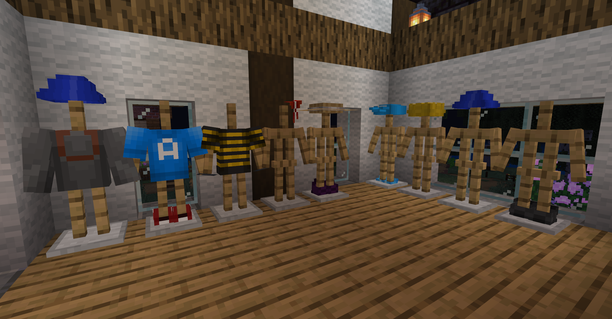
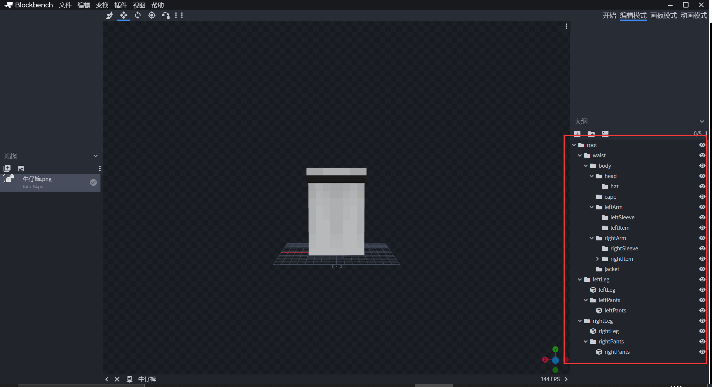
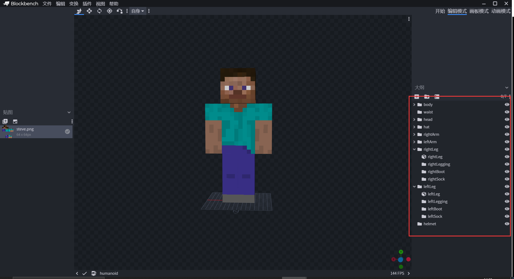

--- 
front: https://nie.res.netease.com/r/pic/20210730/ee109f39-8987-46e0-9fe7-40ebb23060fa.png 
hard: Advanced 
time: 25 minutes 
--- 
# Add new costumes through attchables and custom items 

Next, add a variety of decorative equipment to the map so that players can buy and freely match; the equipment is divided into four parts: head, body, legs, and feet; both the Chinese version of the custom items and the Microsoft 1.16+ custom items can be made, and this section will demonstrate both methods. 

 

## Use the Chinese version to make custom items 

Create a new json file in **netease_items_beh** under the behavior pack and add behavior components to the custom items: 

```json 
{ 
"format_version": "1.10", 
"minecraft:item": { 
"description": { 
"identifier": "farm:denim", 
"register_to_create_menu":true, 
"custom_item_type": "armor" //Custom item type: armor 
}, 
"components": { 
"netease:armor":{ //Define the item as armor 
"defense": 1, //Defense value 
"enchantment":1, //Enchantment ability 
"armor_slot":2 //Armor slot (0-helmet, 1-chest, 2-leggings, 3-shoes) 
} 
} 
} 
} 
``` 

Also create a new json file in **netease_items_res** under the resource pack to define the icon of this custom item: 

```json 
{ 
"format_version": "1.10", 
"minecraft:item": { 
"description": { 
"identifier": "farm:denim", 
"category": "Equipment" //Category in the creation column: Equipment 
}, 
"components": { 
"minecraft:icon": "farm:denim" //Custom item icon, corresponding to item_texture file 
} 
}

} 
``` 

After creating a custom item, continue to create a json file in the **attachables** file of the resource pack to define the model, texture, etc. of the custom equipment: 

```json 
{ 
"format_version": "1.8.0", 
"minecraft:attachable": { 
"description": { 
"identifier": "farm:denim", 
"materials": { 
"default": "armor", 
"enchanted": "armor_enchanted" 
}, 
"textures": { //Texture 
"default": "textures/models/denim", //Normal state 
"enchanted": "textures/misc/enchanted_item_glint" //With enchantment 
}, 
"geometry": { 
"default": "geometry.denim" //Model 
}, 
"scripts": { 
"parent_setup": "variable.leg_layer_visible = 0.0;" //Define the part of the equipment 
//variable.helmet_layer_visible Helmet 
//variable.chest_layer_visible Chest 
//variable.leg_layer_visible Leggings 
//variable.boot_layer_visible Boots 
}, 
"render_controllers": [ "controller.render.armor" ] //Rendering controller 
} 
} 
} 
``` 

## Use Microsoft custom items to make 

The json file in **attachables** does not need to be modified, it is the same as the Chinese version; the json file of Microsoft custom items is placed in **items**: 

```json 
{ 
"format_version": "1.16.100", 
"minecraft:item": { 
"description": { 
"identifier": "farm:denim_new", 
"category": "equipment" 
}, 
"components": { 
"minecraft:creative_category": { //Category in the creative column: Equipment 
"parent": "itemGroup.name.equipment"

}, 
"minecraft:icon": { //Custom item icon, also corresponds to item_texture file 
"texture": "farm:denim" 
}, 
"minecraft:enchantable": { //Enchantment level 
"value": 1, //value 
"slot": "armor_legs" //Enchanted equipment type (legs) 
}, 
"minecraft:armor": { 
"protection": 1 //Defense value 
}, 
"minecraft:wearable": { //Define item wearable 
"slot": "slot.armor.legs" //Equipped on the grid of the leg 
} 
} 
} 
} 
``` 

Microsoft's custom item creation bar category and custom item icon are placed in the behavior pack file, no need to add it separately in the resource pack; 

## Models of costume equipment 

Some parts of the equipment model need special attention, because when the player walks and turns the perspective, each part has different movements, and the equipment on the body also needs to move with the parts, so the skeleton of the equipment model must be set well. Take **blockbench** as an example: 

 

 

Many group names (Group) of the equipment model and the original Steve model are the same. The blocks of this jeans model are under leftLeg and rightLeg, corresponding to the left leg and right leg respectively. The group name here is the skeleton bound to Steve; 

What will happen if we modify the group name of rightleg at will? 

 

The equipment of the left leg moves with the player's leg, but the equipment of the right leg is fixed in place, so the skeleton binding is very important. It is recommended that the equipment models are strictly named, which is more intuitive and efficient. 

