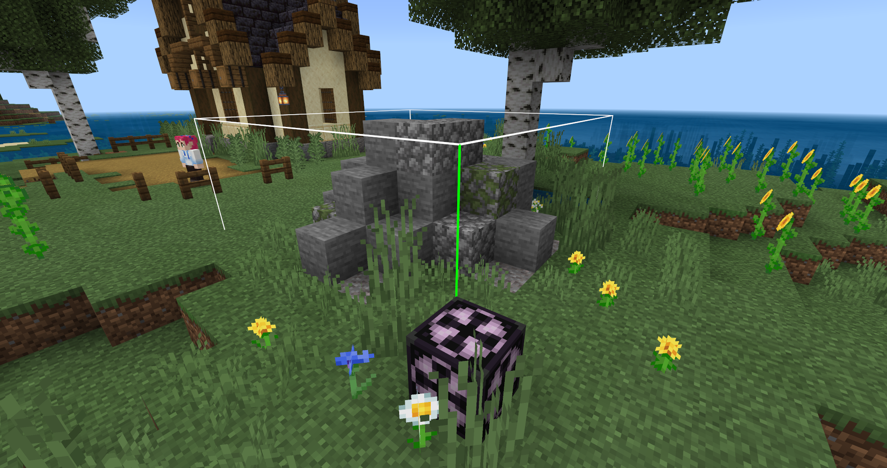

--- 
front: https://nie.res.netease.com/r/pic/20210730/ee109f39-8987-46e0-9fe7-40ebb23060fa.png 
hard: Advanced 
time: 50 minutes 
--- 
# Add gameplay guidance during the conversation and chat process 

If the guidance is only dialogue and chat, the process will be boring and it will not be able to "guide" the players well. Some players will not even read the dialogue at all. Therefore, we need to insert gameplay that requires actual operation in the dialogue so that players can gradually understand the content of the map. 

In dialogue 4/6, give the player plant seeds and specify the player to plant on farmland: 

```python 
leveldatacomp = serverApi.GetEngineCompFactory().CreateExtraData(serverApi.GetLevelId()) 
class FarmServerSystem(ServerSystem): 
def __init__(self, namespace, systemName): 
ServerSystem.__init__(self, namespace, systemName) 
# Listen for PlayerAttackEntityEvent 
self.ListenForEvent(serverApi.GetEngineNamespace(), serverApi.GetEngineSystemName(), "PlayerAttackEntityEvent", 
self, self.PlayerAttack) 
# Listen for ItemUseOnAfterServerEvent 
self.ListenForEvent(serverApi.GetEngineNamespace(), serverApi.GetEngineSystemName(), 
"ItemUseOnAfterServerEvent", self, self.Item_Use) 

# NPCid obtained in advance 
self.guide_id = "-481036336358" 
# Create a variable to control the dialogue stage 
self.guide_dialogue = {} 
# Variable to store items 
self.guide_itemDict = [ 
{ 
'name': 'minecraft:farmland', 
'aux': 0 

}, 
{ 
'itemName': 'farm:spinach_seed', 
'count': 1, 
'enchantData': '', 
'auxValue': 0, 
'customTips': '', 
'extraId': '', 
'userData': {}, 
} 

] 

# Event trigger function 
def PlayerAttack(self, args): 
# The player id obtained by the event

self.playername = args["playerId"] 
# Create commands, blocks, and items 
commandcomp = serverApi.GetEngineCompFactory().CreateCommand(serverApi.GetLevelId()) 
blockcomp = serverApi.GetEngineCompFactory().CreateBlockInfo(serverApi.GetLevelId()) 
itemcomp = serverApi.GetEngineCompFactory().CreateItem(self.playername) 
# The creature id obtained by the event 
entityid = args["victimId"] 
# If the creature id obtained by the event is consistent with the NPC id obtained in advance 
if entityid == self.guide_id: 
# Get player_guide data 
guide_data = leveldatacomp.GetExtraData('player_guide') 
# If there is no such data, set one 
if not guide_data: 
leveldatacomp.SetExtraData('player_guide', self.guide_dialogue) 
else: 
# If there is, pass guide_data to self.guide_dialogue 
self.guide_dialogue = guide_data 
# If self.guide_dialogue={} (it means the first time clicking this NPC) 
if self.guide_dialogue == {}: 
# ··· 
elif self.guide_dialogue["dialogue"] == 0: 
# ··· 
elif self.guide_dialogue["dialogue"] == 1: 
# ··· 
elif self.guide_dialogue["dialogue"] == 2: 
commandcomp.SetCommand( 
"execute @a ~ ~ ~ tellraw @a {\"rawtext\":[{\"text\":\" §6§l【Family】 §r§fIn order to let you adapt, I will first take you to get familiar with the life of the seaside farm and try to plant some plants.§6[4/6]\"}]}") 
commandcomp.SetCommand("execute @a ~ ~ ~ /playsound random.orb @a ~ ~ ~ 3 1 3") 
self.guide_dialogue["dialogue"] = 3 
# Set the coordinates to farmland (the first one in the self.guide_itemDict variable) 
blockcomp.SetBlockNew((14, 64, 188), self.guide_itemDict[0], 0, 0) 
# Generate particles at the coordinates 
commandcomp.SetCommand("particle minecraft:villager_happy 14 66 188") 
# Give the player items (the second one in the self.guide_itemDict variable) 
itemcomp.SpawnItemToPlayerInv(self.guide_itemDict[1], self.playername, ) 
# Store the new player_guide 
leveldatacomp.SetExtraData('player_guide', self.guide_dialogue) 

# Triggered when the player uses an item on a block 
def Item_Use(self, args): 
# Create a command interface 
commandcomp = serverApi.GetEngineCompFactory().CreateCommand(serverApi.GetLevelId()) 
# Get the coordinates, name, player id and world id of the block through the event 
x = args['x'] 
y = args['y'] 
z = args['z'] 
blockname = args['blockName'] 
playerid = args['entityId'] 
worldid = args['dimensionId'] 
# Create block information and world interface

blockinfocomp = serverApi.GetEngineCompFactory().CreateBlockInfo(playerid) 
gamecomp = serverApi.GetEngineCompFactory().CreateGame(serverApi.GetLevelId()) 
# If the block name is farmland and the coordinates are at the set position (indicating that the player has completed the planting guidance task) 
if blockname == "minecraft:farmland" and (x, y, z) == (14, 64, 188): 
# Uninstall monitoring 
self.UnListenForEvent(serverApi.GetEngineNamespace(), serverApi.GetEngineSystemName(), 
"ItemUseOnAfterServerEvent", self, self.Item_Use) 
# Dialogue 
commandcomp.SetCommand( 
"execute @a ~ ~ ~ tellraw @a {\"rawtext\":[{\"text\":\" §6§l【家人】 §r§fNext, try to transform the building and go to the resource next to it to dig some stone. §6[5/6]\"}]}") 
# Sound effect 
commandcomp.SetCommand("execute @a ~ ~ ~ /playsound random.orb @a ~ ~ ~ 3 1 3") 
# Give the player a stone pickaxe that can destroy stone (the item for the next guide task) 
commandcomp.SetCommand("/give @s stone_pickaxe 1 0 {\"minecraft:can_destroy\": {\"blocks\":[\"stone\"]}} ") 
# Generate a structure (the resource for the next guide task) 
gamecomp.PlaceStructure(None, (14, 65, 202), "design:resource", 0) 
# Generate a sign 
commandcomp.SetCommand("setblock 13 65 186 standing_sign 12") 
# Modify the text of the sign 
blockinfocomp.SetSignBlockText((13, 65, 186), " Click to upgrade the small lake Cobblestone x1") 
# Generate particles 
commandcomp.SetCommand("particle minecraft:villager_happy 13 67 186") 
# Modify variables 
self.guide_dialogue["dialogue"] = 4 

``` 

After adding the guide task, the player will receive this "task" during the dialogue: 

 

Continue to add guide tasks, so that players can click the sign after collecting cobblestones to transform the small pond and complete the guidance; 

Before this, we need to make the transformed building and then save it using the structure block: 

 

```python 
leveldatacomp = serverApi.GetEngineCompFactory().CreateExtraData(serverApi.GetLevelId())
class FarmServerSystem(ServerSystem):
    def __init__(self, namespace, systemName):
        ServerSystem.__init__(self, namespace, systemName)
        #Listen to the PlayerAttackEntityEvent event
        self.ListenForEvent(serverApi.GetEngineNamespace(), serverApi.GetEngineSystemName(), "PlayerAttackEntityEvent",
                            self, self.PlayerAttack)
        # Listen to the ItemUseOnAfterServerEvent event
        self.ListenForEvent(serverApi.GetEngineNamespace(), serverApi.GetEngineSystemName(),
                            "ItemUseOnAfterServerEvent", self, self.Item_Use)
        # Listen to the ServerBlockUseEvent event
        self.ListenForEvent(serverApi.GetEngineNamespace(), serverApi.GetEngineSystemName(), 'ServerBlockUseEvent',

self, self.Upgrade) 

#··· 

def PlayerAttack(self, args): 
#··· 

def Item_Use(self, args): 
#··· 

# Function triggered by player clicking on block 
def Upgrade(self, args): 
# Variables to store required items 
stone_block = {"minecraft:cobblestone": 1} 
# Block name and player id obtained by event 
blockname = args['blockName'] 
playerid = args['playerId'] 
# Related interfaces needed to create logic 
blockinfocomp = serverApi.GetEngineCompFactory().CreateBlockInfo(playerid) 
commandcomp = serverApi.GetEngineCompFactory().CreateCommand(serverApi.GetLevelId()) 
gamecomp = serverApi.GetEngineCompFactory().CreateGame(serverApi.GetLevelId()) 
# If the clicked block is a sign 
if blockname == "minecraft:standing_sign": 
# Get the text of the sign 
text = blockinfocomp.GetSignBlockText((13, 65, 186)) 
# If the text is the same 
if " Click to upgrade the small lake Cobblestone x1" in text: 
# Get the player's backpack items 
item_comp = serverApi.GetEngineCompFactory().CreateItem(playerid) 
item_dict_list = item_comp.GetPlayerAllItems(serverApi.GetMinecraftEnum().ItemPosType.INVENTORY) 
# Loop through the player's backpack according to the slot 
for index, item_dict in enumerate(item_dict_list): 
# If it is empty, continue to the next loop 
if item_dict is None: 
continue 
# If the item name in the item information dictionary is in the variable 
if item_dict["newItemName"] in stone_block: 
# Get the required number of items 
item_count = item_dict["count"] 
# Reduce the number of items in this slot by 1 
item_comp.SetInvItemNum(index, item_count - 1) 
# Replace the sign with air 
commandcomp.SetCommand("setblock 13 65 186 air") 
# Place the structure at the coordinate position 
gamecomp.PlaceStructure(None, (5, 63, 186), "farm:rockery", 0) 
# Dialogue 
commandcomp.SetCommand( 
"execute @a ~ ~ ~ tellraw @a {\"rawtext\":[{\"text\":\" §6§l【家人】 §r§fGreat! Next take a boat to the island to find the librarian, he will help you. §6[6/6]\"}]}") 
# Generate a boat next to the island dock 
self.CreateEngineEntityByTypeStr("farm:guide_boat",(35,62,168),(0,0),0)

# Sound effect 
commandcomp.SetCommand("execute @a ~ ~ ~ /playsound random.orb @a ~ ~ ~ 3 1 3") 
# Store the player ID who completed the guide 
leveldatacomp.SetExtraData("player_id", playerid) 
# Update the variable that controls the dialogue stage 
self.guide_dialogue["dialogue"] = 5 
# Uninstall the listener of this event 
self.UnListenForEvent(serverApi.GetEngineNamespace(), serverApi.GetEngineSystemName(), 
'ServerBlockUseEvent', self, self.Upgrade) 
# Store the new player_guide 
leveldatacomp.SetExtraData('player_guide', self.guide_dialogue) 
break 

``` 

At this point, a relatively complete novice guide level has been created: 

 

After completing the guide, you cannot leave the novice island yet, so we need to make it so that players can leave here and go to a new island. 

