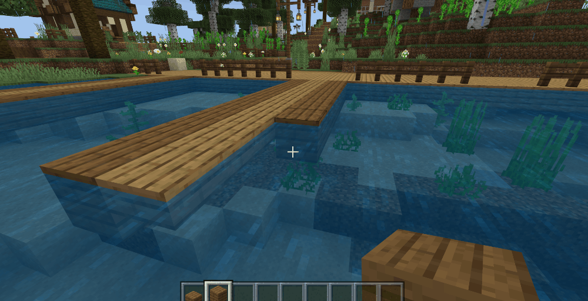
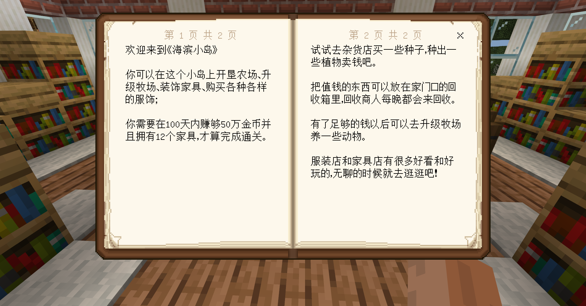

--- 
front: https://nie.res.netease.com/r/pic/20210730/ee109f39-8987-46e0-9fe7-40ebb23060fa.png 
hard: Advanced 
time: 40 minutes 
--- 
# Make a boat to take the player away from the novice island 

After completing the novice guide, the player needs to leave the island by boat. First, make a boat that can float on the water and has a pathfinding component: 

```json 
{ 
"format_version":"1.16.0", 
"minecraft:entity":{ 
"description":{ 
"identifier":"farm:guide_boat", 
"is_spawnable":true, 
"is_summonable":true, 
"is_experimental":false 
}, 
"components": { 
"minecraft:buoyant": { //Make the entity float on the water like a boat 
"apply_gravity": true, 
"base_buoyancy": 1.0, 
"simulate_waves": true, 
"big_wave_probability": 0.03, 
"big_wave_speed": 10.0, 
"drag_down_on_buoyancy_removed": 0, 
"liquid_blocks": ["water"] 
}, 

"minecraft:underwater_movement": { //Speed of movement in water 
"value": 0.25 
}, 
"minecraft:navigation.walk": { //Pathfinding component (will not sink to the bottom) 
"can_sink": false 
}, 
"minecraft:rideable": { //Player can ride the entity 
"seat_count": 1, 
"family_types": ["player"], 
"interact_text": "action.interact.enter_boat",
				"seats": {
					"position": [0, 0.5, 0]
				}
			},

            "minecraft:follow_range": {
                "value": 64,
                "max": 64
          },

"minecraft:health": { 
"value": 10, 
"max": 10 
}, 
"minecraft:movement": { 
"value": 0.25 
}, 
"minecraft:movement.basic": {}, 
"minecraft:collision_box": { 
"width": 1, 
"height": 1 
}, 
"minecraft:physics": {} 
}, 
"component_groups":{ 
"boat_finding":{ //Component groups added by py, so that the boat can find a specific block and move to the block position 
"minecraft:behavior.move_to_block": { 
"priority": 0, 
"tick_interval": 1, 
"start_chance": 1.0, 
"search_range": 64, 
"search_height": 10, 
"goal_radius": 1.0, 
"stay_duration": 999.0, 
"target_selection_method": "nearest", 
"target_offset": [ 
0, 
0, 
0 
], 
"target_blocks": [ //Searching blocks 
"minecraft:double_wooden_slab:1" 
], 
"on_reach": [ //Event triggered by reaching nearby 
{ 
"event": "reach_boat", 
"target": "self" 
} 
] 
} 

} 

}, 
"events":{ 
"start_boat":{ //Event for adding component group 
"add":{ 
"component_groups":["boat_finding"] 
} 
},

"reach_boat":{ //The event triggered by the boat reaching the destination, py will listen to this event 
} 
} 
} 
} 
``` 

In "minecraft:behavior.move_to_block", set the block that the boat is looking for to **"minecraft:double_wooden_slab:1"**. This block is a double-layer spruce half-brick, so we need to make some simple modifications to the map, change the outermost spruce plank of the dock to a double-layer spruce half-brick, which looks exactly the same, and allows the boat to find this block to go to the dock: 

 

After the player completes the guidance task, the boat entity will be created. You need to use py to detect the components of the boat after the player gets on the boat and listen to the event of the boat reaching the destination: 

```python 
leveldatacomp = serverApi.GetEngineCompFactory().CreateExtraData(serverApi.GetLevelId())
timecomp = serverApi.GetEngineCompFactory().CreateTime(serverApi.GetLevelId())
class FarmServerSystem(ServerSystem):
    def __init__(self, namespace, systemName):
        ServerSystem.__init__(self, namespace, systemName)
        # Listen to the EntityStartRidingEvent event
        self.ListenForEvent(serverApi.GetEngineNamespace(), serverApi.GetEngineSystemName(),
                            "EntityStartRidingEvent", self, self.Start_Gam
                           )
        #Listen to the EntityDefinitionsEventServerEvent event
        self.ListenForEvent(serverApi.GetEngineNamespace(), serverApi.GetEngineSystemName(),
                            'EntityDefinitionsEventServerEvent',
                            self, self.EntityEvent)
        # ··· 

def Start_Game(self, args): 
# Get the player id and boat id through the event 
self.start_playerid = args["id"] 
boatid = args["rideId"] 
# Get data player_guide 
self.guide_dialogue = leveldatacomp.GetExtraData("player_guide") 
# If the dialogue value of guide_dialogue is equal to 5 (indicating that the player has completed the novice guide) 
if self.guide_dialogue is equal to 5["dialogue"] == 5: 
# Create a component that triggers entity events 
entityeventcomp = serverApi.GetEngineCompFactory().CreateEntityEvent(boatid) 
# Trigger the "start_boat" event of the boat 
result = entityeventcomp.TriggerCustomEvent(boatid, "start_boat") 

def EntityEvent(self,args): 
# Get the event name triggered by the entity 
eventname = args['eventName'] 
# Return if the event name is not "reach_boat" 
if eventname != "reach_boat": 
return 
# Get the id of the person being ridden (boat) 
entityid = args['entityId']

# Get the id of the player on the boat 
rider_id = serverApi.GetEngineCompFactory().CreateRide(entityid).GetEntityRider() 
# Execute the function to create data and pass the player id as a parameter 
self.start_game_data(rider_id) 
# Create an interface for teleporting players 
playertpcomp = serverApi.GetEngineCompFactory().CreatePos(self.start_playerid) 
# Teleport the player to the coordinate position 
playertpcomp.SetPos((55, 63, 131)) 
# Destroy the boat 
self.DestroyEntity(entityid) 
# Reset the world time to 0 
timecomp.SetTime(0) 

# The function triggered by the end of the novice guide and the start of the game 
def start_game_data(self, playerid): 
# Set the initial data: the player's money is 100 
leveldatacomp.SetExtraData("player_coin", 100) 
# Set initial data: player furniture is 0 
leveldatacomp.SetExtraData("player_furniture", 0) 
# Store initial data in event variable and send event to client to create data ui 
event = {"playerid": playerid, "player_data_coin": leveldatacomp.GetExtraData("player_coin"), 
"player_data_furniture": leveldatacomp.GetExtraData("player_furniture")} 
self.NotifyToClient(self.playername, "create_data_ui", event) 

``` 

 

Now, "Seaside Island" has a complete novice guide. Players can start the normal game after boarding the new island by boat. Of course, we can continue to add guides to make the gameplay clearer for players, such as placing a guide book in the library for players to read. 

 

