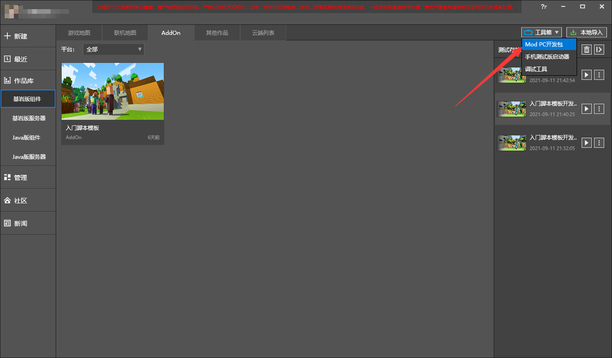
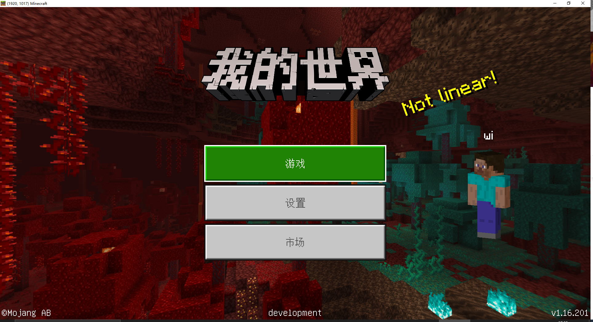

--- 
front: https://nie.res.netease.com/r/pic/20210730/ee109f39-8987-46e0-9fe7-40ebb23060fa.png 
hard: Advanced 
time: 15 minutes 
--- 
# Use code hot update to improve development efficiency 

When we encounter code-related problems during the development process, we don’t need to exit the game before making changes. After modifying the code in the game and saving it, click on the script test log to see "Reloading". This is the code hot update reloading the py file, so using this function can greatly improve development efficiency. 

 

If we have to restart **development and testing** to modify some textures and models, there is also a relative solution: 

 

We no longer click on the development and testing of the work as usual, but click on the MOD PC development package in the toolbox in the upper right corner of the editor to open the client. After entering, you can see the archive created by the development and testing function. You only need to enter and exit here, without completely closing the game and then restarting the development and testing function. 

 

