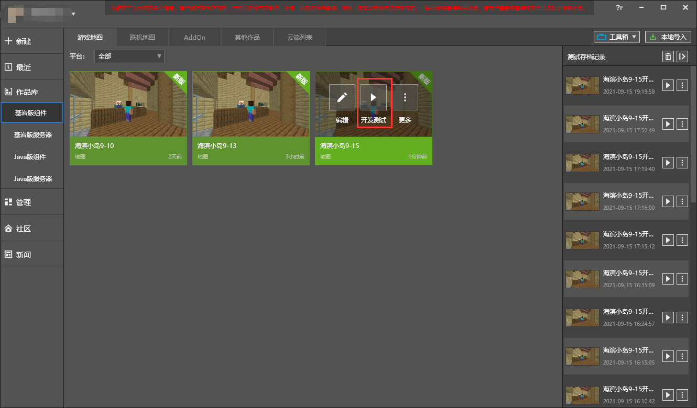
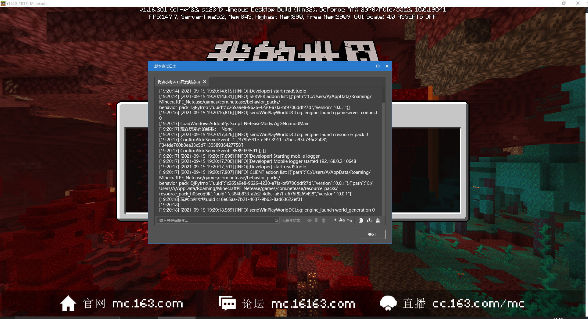

--- 
front: https://nie.res.netease.com/r/pic/20210730/ee109f39-8987-46e0-9fe7-40ebb23060fa.png 
hard: Advanced 
time: 20 minutes 
--- 
# Use the editor's development and testing function 

<iframe src="https://cc.163.com/act/m/daily/iframeplayer/?id=6152bac9b647e504b523d39c" height="600" width="800" allow="fullscreen" /> 

During the development process, various strange problems are inevitable, and in order to solve these problems, we need to find them first; there is a development and testing function in the editor's work box, we can click to enter the game test. 

 

Along with the game, the script test log window is also opened. Through this, we can get a lot of feedback, which helps us to judge the problem. During the development and testing process, paying close attention to the log can find and solve the bugs in the first time. 

 

## Conventional Python error handling 

When an error occurs in a python file, the log usually reports an error. We can check and solve the problem based on the error. 

This is a regular python error. The second to last line has pointed out the problem. In the Create_Shop_UI function on line 404, the last line also prompts the problem: Attribute error: There is no attribute furniture_shop_item_button_tex in the FarmClientSystem project 

 

So, we find the Create_Shop_UI function in FarmClientSystem: 

```python 
class FarmClientSystem(ClientSystem): 

def __init__(self, namespace, systemName): 
super(FarmClientSystem, self).__init__(namespace, systemName) 
self.furniture_shop_item_button_text = [ 
#··· 
] 
# ··· 

def Create_Shop_UI(self,event): 
# ··· 
# Line 404, the name of the furniture_shop_item_button_text variable is wrong (a t is missing) 
self.ui.item_button_text = self.furniture_shop_item_button_tex 
``` 

Troubleshoot problems based on this rule, and common Python errors can be solved quickly! 
