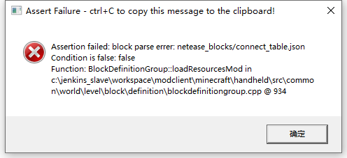

--- 
front: https://nie.res.netease.com/r/pic/20210730/ee109f39-8987-46e0-9fe7-40ebb23060fa.png 
hard: Getting Started 
time: 15 minutes 
--- 
# Problems and solutions when using JSON 

When there is an error in the JSON file, an error may be reported when entering the game test, or the game may be successfully entered but the content related to the error will disappear, and sometimes it may even directly cause the game to crash. 

The most common and fatal problem is format errors. Conventional editors will have prompts when errors occur, such as: vscode: 

 

Some online JSON format verification websites can also detect the format, which is very convenient: 

 

The second is the error window that pops up when entering the game: 

 

JSON errors will also have some problem prompts: "Node analysis failed: netease_solit", we can find the problem based on the error information; and JSON errors are generally not just one, for example, after clicking OK on this error, a new error will pop up: 

 

"block parse errer:netease_blocks/connect_table.json", this error prompts the specific json file, so we go to find the netease_solit node in this file: 

```json 
{ 
"format_version": "1.10.0", 
"minecraft:block": { 
"description": { 
"identifier": "farm:connect_table", 
"register_to_creative_menu": true, 
"is_experimental": false 
}, 
"components": { 
"minecraft:block_light_absorption":{ 
"value": 0 
}, 
"netease:render_layer": { 
"value": "alpha" 
}, 
"netease:solit": { //Error node (wrong name, should be netease:solid, so the engine cannot recognize this non-existent component) 
"value": false 
}, 
	  "netease:connection": {
		"blocks": ["farm:connect_table"]
	  }

} 
} 
} 
``` 

This kind of pop-up error can be copied by pressing ctrl+C for easy recording. 

