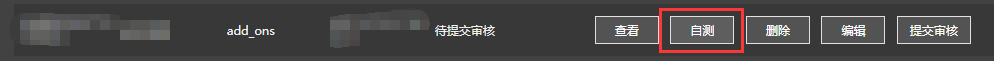
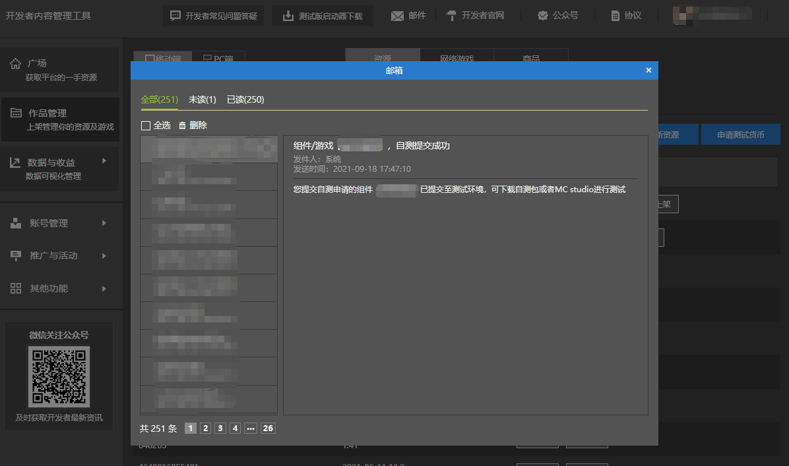
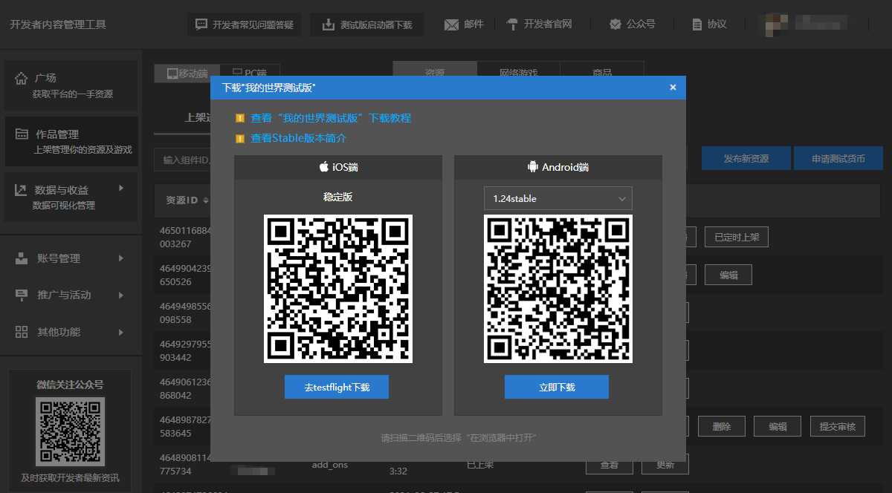
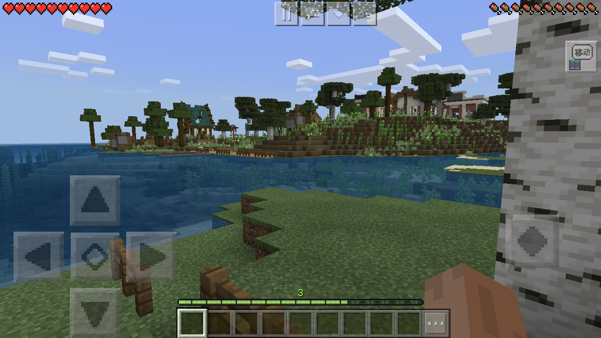

--- 
front: https://nie.res.netease.com/r/pic/20210730/ee109f39-8987-46e0-9fe7-40ebb23060fa.png 
hard: Getting Started 
time: 10 minutes 
--- 
# Upload your work to the cloud 

Click **Publish New Resource** on the developer content management platform to upload a new work. After filling in basic information and saving, you can see the **Self-Test** function. Click to submit the self-test; 

 

If you receive an email showing that the self-test submission was successful, you can do it. 

 

## Download the self-test package and test it on your phone 

Click **Download the beta launcher** on the top of the developer content management platform, and download the test software on your phone according to the prompts and tutorials. 

 

After downloading, open the software and log in to your account. You can find the work you just submitted for self-test in the resource center. Download it and enter the game to actually test it! 

 

