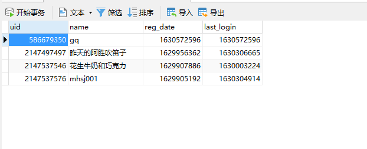
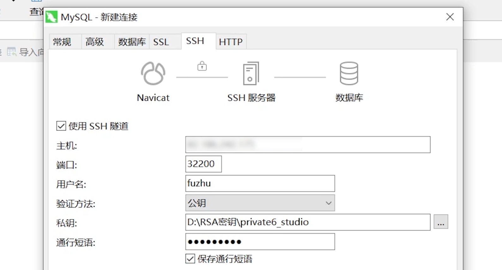

# Database concept 

In the development of server plug-ins, most data will be stored in the database. 

## Introduction 

In the development of many server software, the database plays a very important role in data storage and filtering, and the development of Apollo plug-ins is no exception. 

Apollo currently supports 3 databases, MySQL, Redis and MongoDB. They each have their own characteristics, which will be introduced in turn below. 

### MySQL 

MySQL is a relational database, and its data storage format is very similar to the commonly used Excel. 

In each MySQL data table, there are pre-set columns to represent the type and name of the data in this column. The combination of data in each column is called a row. Data in the same row can be selected together. 

For a better understanding, here is an example of comparing Excel and MySQL. 

 

As shown in the figure above, this is an Excel table, which needs to record 4 types of data, namely **Player UID, Player Name, Last Login Time, Registration Time**. These are the columns of this data table. 

We need to record every player in this table, so all the data of a player will occupy one row. 

It is shown in the MySQL data table as shown in the figure below. 

 

In actual applications, we can find the player's registration time (first login time), last login time and player name through uid. 

### Redis 

Redis is a Key-Value database that can be both memory-based and persistent. 

This database is mainly used to store some values that need to be changed frequently in Apollo plug-in development. 

The operation process is very similar to dict in Python, so no examples will be given here. 

For example, the online statistics of players - when a player enters the server, it is necessary to operate the database and modify the total online +1. Similarly, when exiting, it is necessary to operate the database and modify the total online -1. 

### MongoDB 

MongoDB is a database between relational databases and non-relational databases. 

It can easily store commonly used dict or json objects in Python into the database, and easily filter and query certain parameters. 

Taking the player information above as an example, if a player's json object is ```{"uid":1,"name":"Player 1","reg_date":123,"last_login":123}``` 

Then insert it into the database, and you can query the entire json information of the player through the condition ```{"uid":1}```. 


Developers can choose to use different databases according to their own habits and actual purposes. 

## Front-end tools 

Here, we will take Navicat as an example to show you how to use the MySQL database connected to the server. The same applies to other database connections. 

Navicat official website link: https://www.navicat.com.cn/ 

### Video tutorial 

<iframe src="https://cc.163.com/act/m/daily/iframeplayer/?id=6181002648e2749089200cbe" height="600" width="800" allow="fullscreen" /> 

### Prepare content 

- Navicat database management software that supports MySQL 
- RSA key for machine connection 
- Make sure the current IP is in the server whitelist 

### Operation steps 

1. First, open the Navicat software, click the connection button in the upper left corner, and select MySQL. 

 

2. In the "General" tab, enter the connection name (arbitrary, used to distinguish the connection), username *minecraft*, password *minecraft* (the above are all default passwords). 

 

3. In the "SSH" tab, check Use SSH Tunnel, fill in the host, port *32200*, username *fuzhu*, verification method *public key*, and select the private key path. For the passphrase, enter the password you entered when creating the RSA key. Check Save passphrase and save. 

 

4. You can then see your newly created connection in the left area. Double-click to connect. 

 

