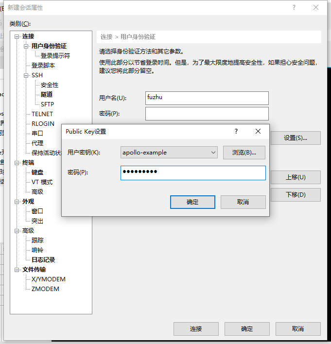

# Xiaoxiaoyun connection 

Before reading this tutorial, you need to install XShell and XFtp first. 

XShell and XFtp both have free personal versions, which can be downloaded from the official website, link: https://www.netsarang.com/zh/free-for-home-school/ 

## Xiaoxiaoyun 

Xiaoxiaoyun is a cloud server, on which the Debian operating system and Apollo operating environment are pre-installed. 

The Debian operating system is different from the common Windows operating system. Debian is a Linux system designed for servers, with high stability, and generally does not install a graphical operating interface, requiring users to enter command line commands to operate the system. 

The following will explain how to apply for and use Xiaoxiaoyun. 

## Create a key 

### Video tutorial 

<iframe src="https://cc.163.com/act/m/daily/iframeplayer/?id=6180ffe7b8a81f8fa07ed443" height="600" width="800" allow="fullscreen" /> 

### Text tutorial 

Before applying for a server, you need to first prepare the RSA key used to connect to the server and set a password for it. The steps are as follows. 

1. Open XShell and find the menu bar. Click **Tools->New User Key Generation Wizard** in sequence 

 

2. Select RSA as the key type, and the default length is 2048 bits 

 

3. Enter a key name that is easy to distinguish and set a password for the key. This password needs to be remembered. If you lose it, you can only recreate the key and **cannot retrieve it**! 

 

4. Click Finish to complete the key creation. 

5. Select the private key you just created, click Export, and enter the password in the dialog box. Store the private key file for the convenience of the subsequent Studio configuration. 

 

6. The next step is to export the public key and upload it to the developer platform. Select the key you just created and click Properties. 

 

7. Switch to the public key selection card, click Save as file, and upload it to the developer platform. 

 
## Get whitelisted websites

Before accessing the development machine, you need to obtain the whitelist first. 

Open the browser and enter http://temp-white-list.mc.netease.com:9999/?machine=development machine IP address 

For example, if your development machine IP is 42.186.1.1, access the URL http://temp-white-list.mc.netease.com:9999/?machine=42.186.1.1 in the browser 

The effect after access is as follows, and you can connect to the server later. 

 

## Private key usage 

### Video tutorial 

<iframe src="https://cc.163.com/act/m/daily/iframeplayer/?id=6180ffa948e2749089200cba" height="600" width="800" allow="fullscreen" /> 

### SSH 

SSH connection is one of the main ways to remotely connect to and manage Linux servers. The following will introduce the basic usage of XShell to connect to Xiaoxiao Cloud. 

1. Click the New button in the upper left corner of XShell. 

 

2. Enter the development machine address and port in the pop-up interface. The name is only used for distinction and can be entered arbitrarily. 

 

3. In the tree menu on the left, find **Connection->User Authentication**. Fill in the user name, uncheck **Password** in the method, check and select **Public Key**. 

 

4. Click Settings, select the user key created previously, and enter the password. 

 

5. Click OK, double-click the connection just created in the list on the left, and you can log in to the server via SSH. If it is the first time to log in, you need to accept the host key, click Accept and Save. 

 

The above is only the operation of XShell, and the same is true for XFtp. The difference is that XShell accesses the server command line console, while XFtp accesses the server file directory. 

The figure below is a schematic diagram of XFtp after connection. 

 

### Studio 

The following will introduce how to configure the private key in Studio.

1. Log in to Studio, and in **New**, select **Bedrock Edition Network Server**. Create a server of any type. This tutorial uses a blank network server as an example. 

2. Select the private key file exported in XShell before and fill in the password. 

 

3. Scroll to the bottom of **Server Settings** and fill in the development machine IP address in the text box of the machine list. If the configuration is correct and there is a whitelist, the **Finish** button will light up. Click Finish to complete the configuration. 

 

