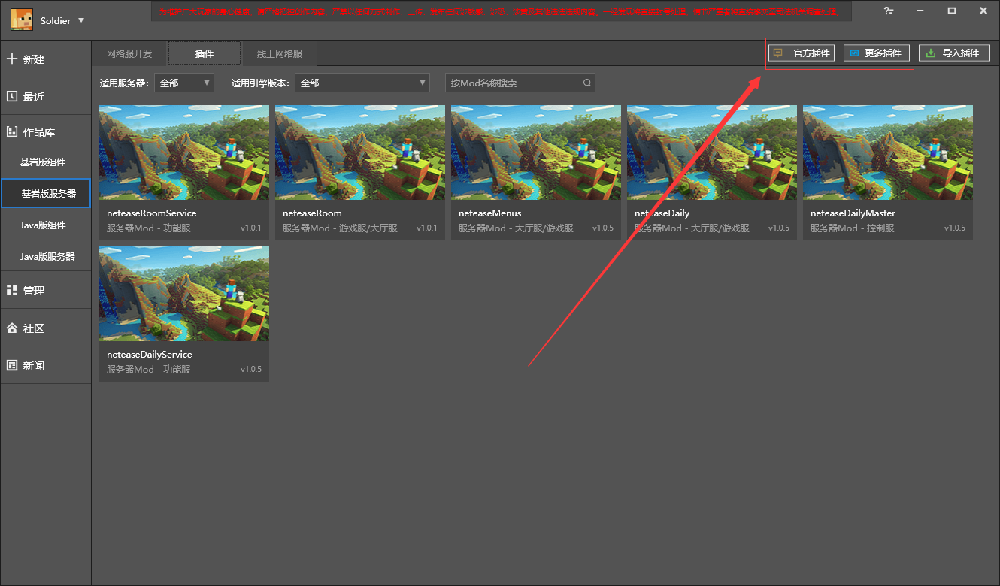
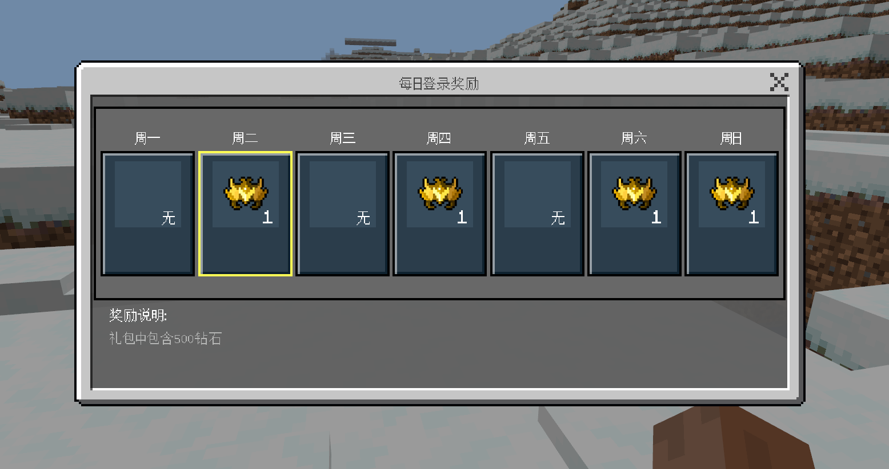
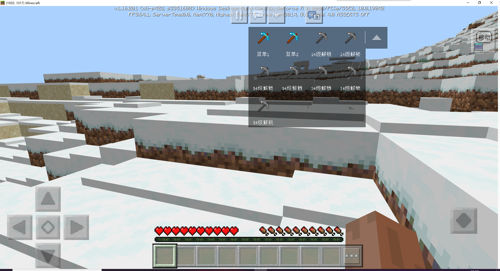

# Plug-in download 

This section will show the usage process of official plug-ins and third-party plug-ins for readers to understand. 

## Download entrance 

Under the plug-in tab of the Bedrock Edition network server, you can see the official plug-in and more plug-in buttons in the upper right corner. 

 

Currently, official plug-ins and third-party plug-ins cover most types. Including but not limited to: 

- Chat 
- Tools 
- World management 
- Economy 
- Mechanism 

In the future, the official will continue to upload more official plug-ins, support and cultivate more third-party developers, expand the plug-in library, and lower the threshold for Apollo to open a server. 

## Plug-in display 

### neteaseDaily 

This plug-in brings the function of daily login rewards to the server. 

The effect is shown in the figure. 

 

### neteaseMenus 

This plug-in provides a shortcut menu function for the server. 

The effect is as shown in the figure. 

