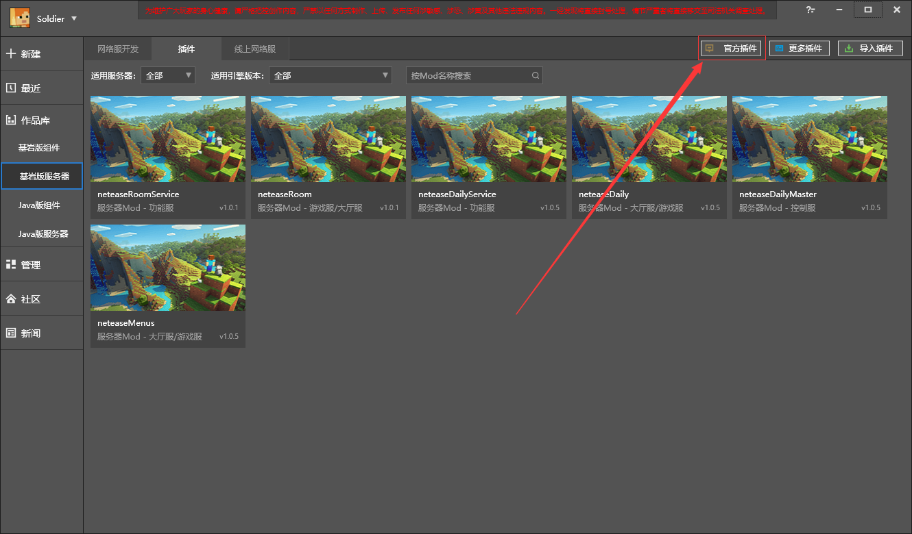
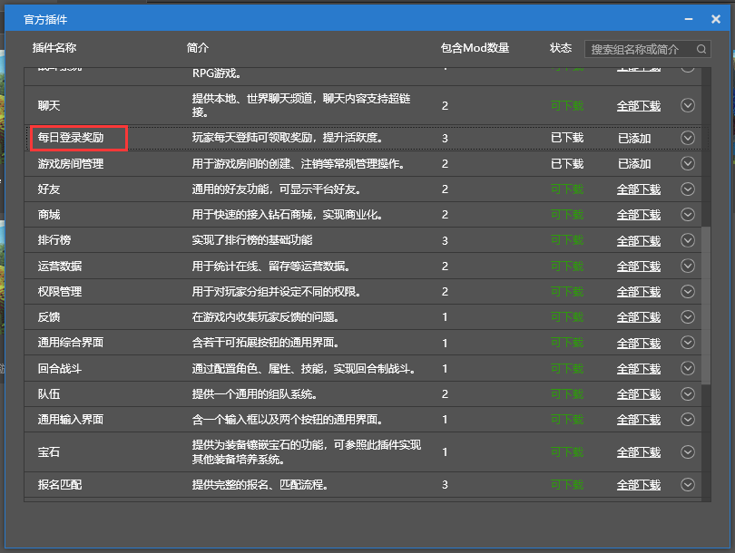
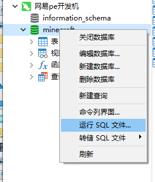
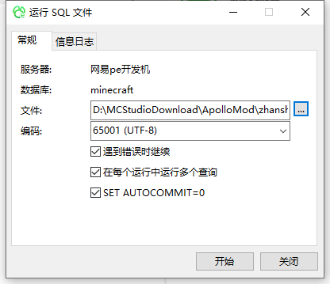
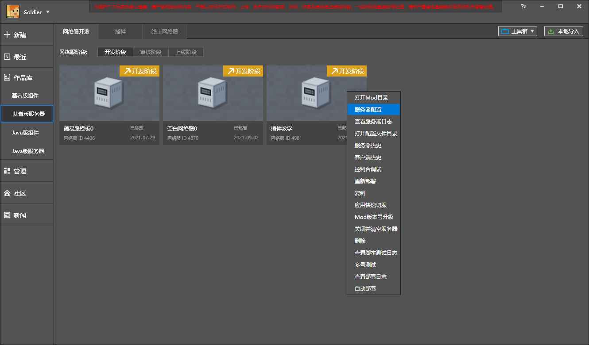
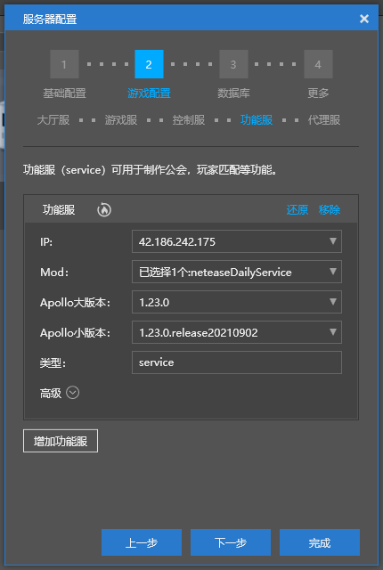
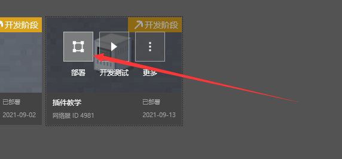

# Apply plugins 

This section will take the official plugin daily login rewards as an example to introduce how to apply plugins in the Apollo framework. 

## Video tutorial 

<iframe src="https://cc.163.com/act/m/daily/iframeplayer/?id=618100dc75882ab49553e983" height="600" width="800" allow="fullscreen" /> 

## Text tutorial 

1. Open the Studio Bedrock Edition Network Service tab. 

2. Click on the official plugin 

 

3. Click on the official plugin, find the daily login rewards, click to download all, and the effect after clicking is as shown in the figure. 

 

4. Close the official plugin interface, find neteaseDailyService, click More, open the directory, and copy the mod.sql file. 

 

5. Connect to the development machine in Navicat and the database minecraft. 

6. Right-click the minecraft database and click Run sql file. 

 

7. Select the file, paste the mod.sql file, and click Start. 

 

8. Close the interface and return to Studio. In Network Service Development, find the network service you created. Right-click and select Server Configuration.

 

9. Game Configuration->Lobby Server->Mod check neteaseDaily; Control Server->Mod check neteaseDailyMaster; If there is no functional server according to the blank template created by the tutorial, add a functional server and check neteaseDailyService in Mod. Click Finish. 

 

10. Move the mouse to the network server and click Deploy. 

 

11. After the deployment is complete, click Development and Testing. You can enter the game. 

To realize the functions of this mod, you need to call the interface, which will be explained later. You can also follow the [video](#video tutorial) to try it. For the effect diagram, see [plugin download](./1-plugin download.html). 

