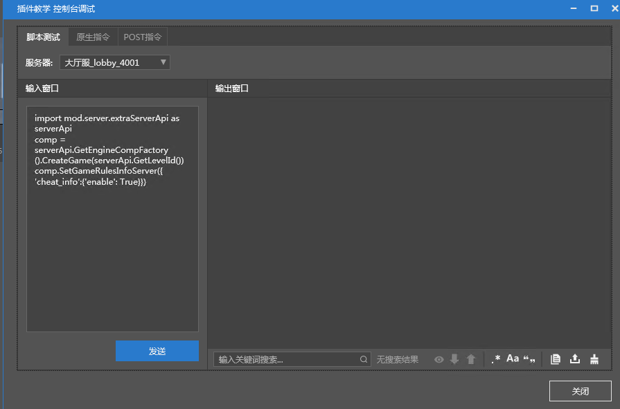

# OP permissions 

This section will introduce how to set OP permissions for specified players in Apollo to facilitate subsequent testing. 

1. Right-click the network server and select Console Debug. 

 

2. Under the script test, select the server (here takes lobby as an example), enter the following code, and click Send. 

```python 
import mod.server.extraServerApi as serverApi 
comp = serverApi.GetEngineCompFactory().CreateGame(serverApi.GetLevelId()) 
comp.SetGameRulesInfoServer({'cheat_info':{'enable': True}}) 
``` 

**This will enable cheating in Apollo's sub-servers, so that OP can use cheating commands. Otherwise, even if you have OP permissions, the execution of OP commands will be blocked by the server. ** 

 

3. Under the native command, select the server (here takes lobby as an example), and enter ```op player name```. 

 

After completing the above operations, you can use cheat commands in the game. 

## Notes 

However, the above operations will become invalid after redeployment. You can make your own plug-in later and execute the above code when the server starts to keep the cheat mode turned on. 

