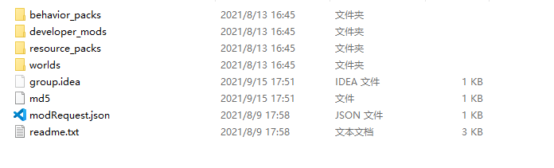

# Knowledge point analysis 

This section will strengthen the understanding of the concept through the analysis of official plug-ins. 

## File structure 

Follow the following process to find the folder of neteaseDaily installed in the previous example. 

1. Bedrock Edition server 
2. Plug-in 
3. neteaseDaily 
4. Right click and open the directory 

In the pop-up folder, you can see that there are 4 folders under the plug-in directory. 

 

Then behavior_packs contains the client mod sent to the player's device; developer_mods contains the mod running on the server; resource_packs contains the client's resource files, which will also be sent to the player's device; worlds is the map information of the mod. 

If you forget this part, you can click [here](../3-plug-in knowledge advanced/3-plug-in folder structure.html) to review it. 

## Callback 

Callback is a very common technique in programming. It is also often used in the development of ModSDK and Apollo plug-ins. 

For example, it is used in ListenForEvent when listening to events. 

For example, in the statement below, self.OnServerChat is a callback function. After the ListenForEvent function is called, the engine will save it and call this function when ServerChatEvent is triggered. 

```python 
self.ListenForEvent(serverApi.GetEngineNamespace(), serverApi.GetEngineSystemName(), 'ServerChatEvent', self, self.OnServerChat) 
``` 

In Apollo development, callback functions are also often used, such as in neteaseDaily. 

Open ```developer_mods/neteaseDailyDev/neteaseDailyScript/dailyServerSystem.py```. In this file, you can see that after RequestToService, the DailyServerRender function is called as the callback function. 

```python 
def OpenDailyReward(self, uid): 
""" 
Let a player open the daily login reward interface 
""" 
stamp = time.time() 
print 'OpenDailyReward', uid, stamp 
playerId = netgameApi.GetPlayerIdByUid(uid) 
if not playerId: 
print 'can not get playerId by uid: %s' % uid 
return 
if self.mRewards is None: 
logout.warning('The daily login reward interface cannot be opened because there is no available reward configuration')

return 
if stamp < self.mRewards[0][0]: 
print 'not yet', self.mRewards[0][0] 
return 
self.RequestToService( 
dailyConst.ModName, 
dailyConst.DisplayDailyRewardEvent, 
{'uid': uid, 'stamp': stamp}, 
lambda rtn, data: rtn and self.DailyServerRender(playerId, dailyConst.DisplayDailyRewardEvent, data) 
) 
``` 

## Functional server 

The functional server connects to all servers and databases, can obtain information from all servers, and can handle some full-server operations. 

For example, in the chat plug-in, if you send a message in the local channel, you don't need to forward it through the functional server, but if you want to send a message in the world channel, you need to forward it in the functional server and send the message to all lobby servers and game servers. 

For specific codes, you can download the official chat plug-in neteaseChatService to view it. 

## Database 

In the official plug-in cloud player information plug-in, neteaseCloud, find the mod.sql file. 

This file is the MySQL data table structure of the plug-in. The file is as follows: 

```sql 
-- #############################version1.0.0#################### 
-- Cloud Backpack 
CREATE TABLE IF NOT EXISTS `neteaseCloudItems` ( 
`_id` INT UNSIGNED NOT NULL auto_increment COMMENT 'Unique ID, auto-increment', 
`uid` BIGINT UNSIGNED NOT NULL COMMENT 'Player uid', 
`cloud_items` varchar(10000) NOT NULL DEFAULT '' COMMENT 'Record cloud backpack content', 
PRIMARY KEY (_id) COMMENT 'Primary key', 
INDEX `uid_idx` (`uid`) COMMENT 'Index' 
)ENGINE=InnoDB DEFAULT CHARSET=utf8mb4; 
-- #############################version2.0.0##################### 
alter table neteaseCloudItems add column apply_tag varchar(20) not null default ""; 
ALTER TABLE neteaseCloudItems ADD INDEX apply_tag_index (`apply_tag`, `uid`); 
``` 

The sql file is written using SQL statements, which requires certain SQL knowledge. You can visit the link below to learn more. 

https://www.w3school.com.cn/sql/index.asp 

This data table stores the player's backpack information and uid. The server can easily use the uid to find the corresponding backpack information.