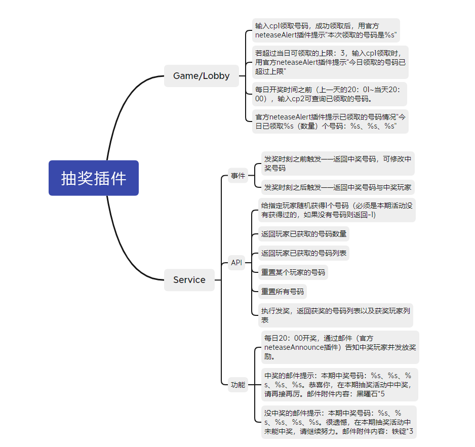
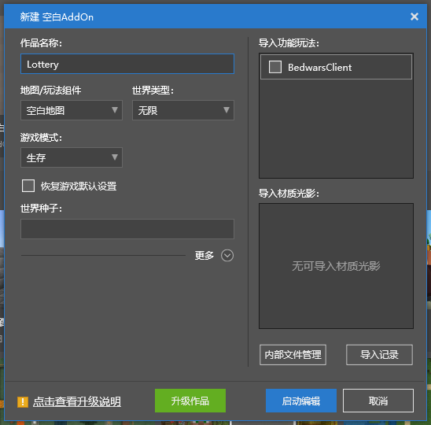

# Plug-in Writing - Production (Part 1) 

## Requirements Analysis 

As mentioned before, Apollo plug-ins have 3 different types. Before we start writing, we first need to think about which requirements can run on which type of server. 

The structure diagram is as follows 

 

### Game/Lobby 

- Enter cp1 to claim the number. After successfully claiming, use the official neteaseAlert plug-in to prompt "The number you received this time is %s" 

- If the upper limit of the number that can be claimed on the day is exceeded: 3, when entering cp1 to claim, the official neteaseAlert plug-in prompts "The number you received today has exceeded the upper limit" 

- Before the daily lottery time (20:01 of the previous day to 20:00 of the current day), enter cp2 to query the number you have received. 
- The official neteaseAlert plugin prompts the status of the numbers that have been collected "Today %s (number) numbers have been collected: %s, %s, %s" 

> Why chat input-related monitoring needs to be done on the Game/Lobby server 

Because players will only be online on Game/Lobby, players' chat information can only be monitored on these two servers. 

### Service 

- The lottery is opened at 20:00 every day, and the winning players are notified and rewards are issued via email (official neteaseAnnounce plugin). 
- Winning email reminder: The winning numbers for this period: %s, %s, %s, %s, %s. Congratulations, you won the prize in this lottery, please keep up the good work. Email attachment content: Obsidian*5 
- Email reminder for those who did not win: The winning numbers for this period: %s, %s, %s, %s, %s. Unfortunately, you did not win the prize in this lottery, please keep up the good work. Email attachment content: Iron ingot*3 
- Server API - Give the specified player a random number (must be one that has not been obtained in this activity, if there is no number, return -1) 
- Server API - Return the number of numbers the player has obtained 
- Server API - Return the list of numbers the player has obtained 
- Server API - Reset a player's number 
- Server API - Reset all numbers 
- Server API - Execute the award, return the list of winning numbers and the list of winning players 
- Triggered before the award time - Return the winning number, which can be modified 
- Triggered after the award time - Return the winning number and the winning player 

> Why "The award will be held at 20:00 every day, and the winning players will be notified and the rewards will be issued by email (official neteaseAnnounce plug-in)." needs to be done on the Service server 

Because the award needs to be operated in a unified manner, and it is impossible for all players to be in the same Game/Lobby, data processing can be handled in a unified manner on the Service, which is more convenient. 

### Master 

None 

# Development query and reference link 

### Mod SDK 

If you are not familiar with the game-related SDK, you can check here.

- Interface: <a href="../../../mcdocs/1-ModAPI/Interface/General/Index.html" rel="noopenner"> Link </a> 
- Event: <a href="../../../mcdocs/1-ModAPI/Event/World.html" rel="noopenner"> Link </a> 

### Apollo 

If you have any questions about Apollo's dedicated interface, you can check here. 

- <a href="../../../mcdocs/2-Apollo/4-SDK/1-Lobby and Game Service Event.html" rel="noopenner"> Link </a> 

### Apollo Plugin Address 

Here you can view the plugins that have been made and understand their respective functions. 

- Official plugin: <a href="../../../mcdocs/2-Apollo/5-Official plugin introduction.html" rel="noopenner"> link</a> 
- Third-party plugin: <a href="../../../mcdocs/2-Apollo/6-Third-party plugin introduction.html" rel="noopenner"> link</a> 

# Code writing 

First, click Create a new blank Addon, and fill in the name of the work as Lottery as an example 

 

Click Start Editing to open the editor. However, the purpose of creating a project is to quickly generate an Apollo plugin template, so just close the editor window after it pops up. 

Then in the Bedrock Edition component, find the AddOn named Lottery that we just created, right-click and select, and click Convert to Server Mod. 

 

In the pop-up window, the options do not need to be modified specifically, just click Convert. 

Then in the Bedrock Edition server plugin, find the Lottery you just created and right-click to open the directory. Because we have previously classified the requirements and summarized the plugins required for Game/Lobby and Service servers, we copy the folder and rename it to meet the specifications. Here we copy a copy of Lottery and rename it to soldierLottery, and then rename the original folder to soldierLotteryService. 

After the operation is completed, the folder should look like the screenshot. 

 

