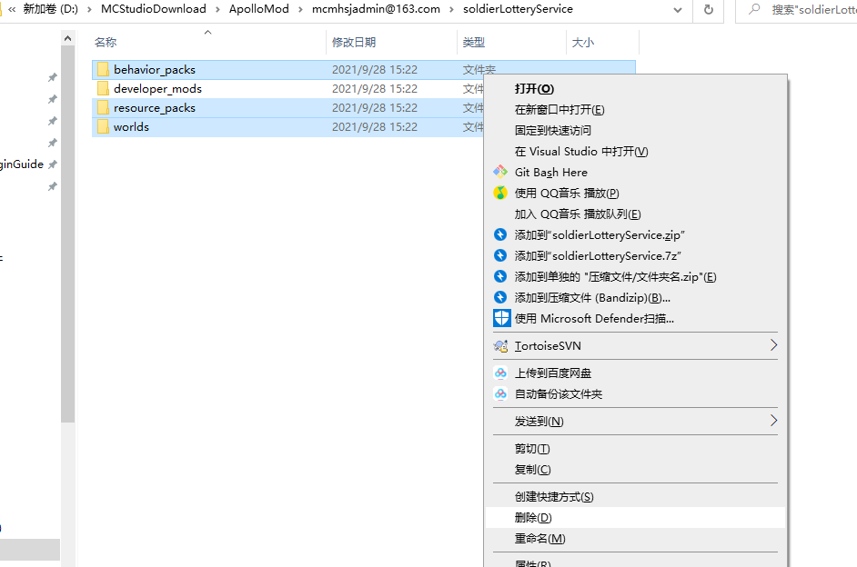

# Plugin Writing - Production (Part 2) 

## Service Writing 

Based on the previous understanding of Service, there should only be a developer_mods folder in Service. Since our current soldierLotteryService folder is copied from Game/Lobby, you need to manually delete the useless folders. Leave only the developer_mods folder and delete the folder selected in the figure below. 

 

Then we renamed the Lottery folder in soldierLotteryService/developer_mods to soldierLotteryDev according to the official plugin specification. 

Here we use IntelliJ IDEA (the same applies to PyCharm) as an example to introduce the writing of plugin code. 

After entering IDEA, open the soldierLotteryService project, find mod.json, and modify it according to the official specification. The modified mod.json is for reference. It should be noted that support_server_type needs to be changed to service, otherwise it cannot be deployed on the Service server. 

```json 
{ 
"netgame_mod_name": "soldierLotteryDev", 
"netgame_mod_version": "1.0.0", 
"min_app_version": "1.23.0.release20210722", 
"author": "Soldier", 
"module_names": "soldierLottery", 
"support_server_type": [ 
"service" 
], 
"group": "soldierLottery" 
} 
``` 

Then we can start writing code. The structure of the entry modMain of the Service server is very similar to that of a general Mod. After creating a consts.py to store some constants, you can refer to the code below to write. 

modMain.py

```python
#coding=utf-8
from mod.common.mod import Mod
import mod.server.extraServiceApi as serviceApi

from soldierLotteryScripts.consts import ModName, ModVersion, ServiceSystemName, ServiceSystemClsPath


@Mod.Binding(name=ModName, version=ModVersion)
class SoldierLotteryService(object):
    @Mod.InitService()
    def InitService(self):
        serviceApi.RegisterSystem(ModName, ServiceSystemName, ServiceSystemClsPath)
        print "SoldierLotteryService started"

    @Mod.DestroyService()
    def DestroyService(self):
        print "SoldierLotteryService uninstall"


``` 

lotteryServiveSystem.py 

```python 
# coding=utf-8 
from mod.server.system.serviceSystem import ServiceSystem 

from soldierLotteryScripts.mysqlManager import MysqlManager 

class LotteryServiceSystem(ServiceSystem): 

def __init__(self, namespace, systemName): 
ServiceSystem.__init__(self, namespace, systemName) 
``` 

Then we can start writing MySQL database related code. 

Before writing database code, we first need to design the data table structure. Analyzing the requirements, we can conclude that the plug-in requires two data tables, one for storing lottery information and the other for storing player information. 

### Lottery information table 

Mainly need to record lottery id, whether the lottery has been drawn 

 

Because in this table we only need to use id to set whether the lottery has been drawn, and id is the primary key and has its own index. So there is no need to create an index. Just copy the SQL to mod.sql after designing it. 

```sql 
CREATE TABLE `soldierLotteryState` ( 
`id` int(10) UNSIGNED NOT NULL AUTO_INCREMENT COMMENT 'Auto-increment ID, lottery ID', 
`finish` int(1) UNSIGNED NOT NULL COMMENT 'Has the lottery been drawn', 
PRIMARY KEY (`id`) 
); 
``` 

### Player information table 

Mainly need to record player uid, lottery id held by the player, and corresponding lottery number 

You can use Navicat to design a data table as shown below. It should be noted that the type of player uid must be **unsigned int**, expressed as ```UNSIGNED INT``` in the sql command, and cannot be int. 

 

Since the function needs to query the numbers owned by the player with the specified lottery ID, and the player and lottery columns need to be retrieved at the same time, we need to add indexes to them to improve the subsequent search speed. 

The index is added as shown in the figure below. (The knowledge required for the index is relatively high. If you don’t understand it, you can learn it in the MySQL related tutorial. Here we simply understand that we need to add an index to the column that needs to be retrieved) 


 

Then copy the SQL in the SQL preview, modify the table name, and paste it into mod.sql. 

```sql 
CREATE TABLE `soldierLotteryPlayer` ( 
`id` int UNSIGNED NOT NULL AUTO_INCREMENT COMMENT 'Auto-increment ID', 
`player` int UNSIGNED NOT NULL COMMENT 'Player UID', 
`lottery` int(10) NOT NULL COMMENT 'Lottery ID', 
`number` int(10) NOT NULL COMMENT 'Lottery number held by the player', 
PRIMARY KEY (`id`), 
INDEX `player_lottery`(`player`, `lottery`) USING BTREE COMMENT 'Index of player uid and lottery id' 
); 
``` 

### Data interface 

After designing the data table, you can write the data-related interfaces that may be used according to your needs. 

Here we write one by one according to the interface, and show part of the code of ```mysqlManager.py``` below. 

```python 
# coding=utf-8 
import random 
from collections import OrderedDict 

from apolloCommon import mysqlPool 

from soldierLotteryScripts import consts 

class MysqlManager(object): 
""" 
MysqlManager is mainly used to manage database data 
Provides functions to quickly obtain player data 
""" 

def __init__(self, serviceSystem): 
self.mServiceSystem = serviceSystem 
print "Initialize MySQL database connection" 
mysqlPool.InitDB(10) 
self.mPlayerCache = {} # Player data cache 
self.mStateCache = OrderedDict() # Lottery state cache 
self.mLotteryNumbers = {} # Lottery number cache 
self.CacheLotteryStates() 
self.CacheAllNumbers() 

def Destroy(self): 
mysqlPool.Finish() 
print "Close MySQL connection"


def GetPlayerCache(self, uid): 
""" 
Get the player cache. If there is no cache, get it from the database and return None 
:param uid: 
:return: 
""" 
cache = self.mPlayerCache.get(uid) 
if cache is not None: 
return cache 

def callback(uid, result): 
data = {} 
if result: 
for line in result: 
tmp = data.get(line[0], []) 
tmp.append(line[1]) 
data[line[0]] = tmp 
print "The data of cache player {} is {}".format(uid, data) 
self.mPlayerCache[uid] = data 

sql = "SELECT `lottery`,`number` FROM `{}` WHERE `player` = %s;".format(consts.LotteryPlayerTable) 
mysqlPool.AsyncQueryWithOrderKey("cache_player_{}".format(uid), sql, (uid,), 
lambda result: callback(uid, result)) 
return None 

def RemovePlayerCache(self, uid): 
""" 
Remove player cache, triggered when exiting 
:param uid: player UID 
:return:None 
""" 
cache = self.mPlayerCache.get(uid) 
if cache is None: 
# Because players who have obtained cache data normally have stored cache as {}, it cannot be None. So if it is None here, it will not be processed 
return 
del self.mPlayerCache[uid] 
``` 

It is important to note from this string of code that all data is processed in a cached manner. That is, when a player joins the game, data is obtained from MySQL and cached; when a player exits the game, if the player's data has changed, it is stored in the database and the cache is deleted; if there is no change, the cache is deleted directly. 

In addition, when executing SQL commands, it is necessary to make the **OrderKey** of each operation unique as much as possible, so that SQL commands can be executed concurrently to improve efficiency. 

### Sending emails 

In the requirements, one of them is to use the official email plug-in to send rewards. So we first need to download the official email plug-in and check its introduction. 

The introduction can be found in the right-click menu of the plug-in after downloading it from the official plug-in page. 

In the introduction, you can find the interface for sending emails


> (7) Send private emails to a group of players with a specified uid (functional use) 
> Function: OutSendMailToMany(touids, title, content, itemList=[], expire=None, srcName="") 
> Parameters: 
> touids:list(int), list of player unique IDs 
> title:str, email title 
> content:str, email body 
> itemList:list(dict), list of attachment items, the format is the same as the general [item information dictionary] (refer to the dictionary for stuffing items into the backpack in ModSDk), and additionally supports the [durability] keyword to define durability. In addition, if used with the economic plug-in, it also supports currency, the format is: 
> itemType is "currency" to indicate the currency type, itemName corresponds to the dough_id configuration in the economic plug-in mod.json, icon corresponds to the dough_icon configuration in the economic plug-in mod.json, and count indicates the amount of currency. 
> expire:int, email validity period, in seconds 
> srcName:str, email sender name 
> Example: 
> import server.extraServiceApi as serviceApi 
> itemDict = { 
> 'itemName': 'minecraft:bow', 
> 'count': 1, 
> 'enchantData': [(19, 1),], 
> 'auxValue': 0, 
> 'customTips':'§c new item §r', 
> 'extraId': 'abc' 
> } 
> currencyDict = { 
> 'itemName' : 'RMB', 
> 'itemType' : 'currency', 
> 'icon' : 'textures/ui/netease_trade/icon03@3x.png', 
> 'count' : 3 
> } 
> mailSystem = serviceApi.GetSystem("neteaseAnnounce", "neteaseAnnounceService") 
> mailSystem.OutSendMailToMany([123,234], "Welcome Newcomer", "Welcome to log in for the first time, the development team will give you a bow", [itemDict, currencyDict], 86400, "Development Team") 

We can refer to the introduction to write the code for sending reward emails. 

### Communication 

If the interface we wrote on the Service needs to be called by Game/Lobby, communication between servers is required. The example below implements the interface request. The corresponding code file is ```lotteryServiceSystem.py```. 

```python
class LotteryServiceSystem(ServiceSystem):

    def __init__(self, namespace, systemName):
        ServiceSystem.__init__(self, namespace, systemName)
        self.mMysqlManager = MysqlManager(self)
        self.RegisterRpcMethodForMod(consts.GetPlayerRandomNumber, self.OnGetPlayerRandomNumber)

    def OnGetPlayerRandomNumber(self, serverId, callbackId, args):
        player = args["player"]
        lottery = self.mMysqlManager.GetUnfinishedLottery()
        if lottery == -1:
            eventData = {
                "code": 1,

"msg": -1 
} 
else: 
eventData = { 
"code": 0, 
"msg": self.mMysqlManager.GetPlayerRandomNumber(player, lottery) 
} 

self.ResponseToServer(serverId, callbackId, eventData) 
``` 

### Code Download 

Only part of the code is shown in the tutorial, all the code can be downloaded here. 

[Lottery plug-in - service part](https://g79.gdl.netease.com/pluginguide04-06.zip) 

Then we can deploy and test it! 

