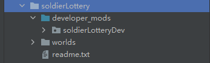

# Plugin Writing - Production (Part 2) 

### Game/Lobby Writing 

Next, we will start to make the plugin for Game/Lobby. We will change the name of the folder soldierLottery according to the official specifications. And create a script folder to start writing scripts. 

At the same time, since our plugin does not require behavior packs and resource packs, delete the corresponding folders. 

The folder name after the name change is as follows 

 

Then start to write the part of Game/Lobby and Service communication. The basic part will not be explained too much. 

**The following are all codes in ```lotteryServerSystem.py```** 

```python 
def GetPlayerRandomNumber(self, uid, callback): 
""" 
Get a random lottery number for the player 
:param uid: player UID 
:param callback:int parameter unique, random lottery number, request failure value is -1 
:return: 
""" 
self.RequestToServiceMod(ServiceServerType, GetPlayerRandomNumber, {"player": uid}, 
lambda suc, args: callback(args["msg"]) if suc else callback(-1)) 
``` 

For example, this interface can be called to apply for a random lottery number for the player, and then the number is taken into the parameters of the callback function and called. The corresponding code on the service side can be found at the end of the previous section. 

At the same time, we also need to monitor players joining and leaving, and determine whether to notify the Service server to process the cache based on whether the server is transferred. 

```python 
def OnJoin(self, args): 
playerId = args["id"] 
uid = args["uid"] 
self.idUidMap[playerId] = uid 
if not args["isTransfer"]: 
print "Player {} joins, cache".format(uid) 
self.CachePlayer(uid) 

def OnLeave(self, args): 
playerId = args["id"] 
uid = args["uid"] 
del self.idUidMap[playerId] 
if not args["isTransfer"]: 
print "Player {} exits, delete cache".format(uid) 
self.SavePlayer(uid) 

def CachePlayer(self, uid):

def callback(suc, args): 
print "Cache player: suc:{} ,args:{}".format(suc, args) 

self.RequestToServiceMod(ServiceServerType, PlayerJoin, {"player": uid}, callback) 

def SavePlayer(self, uid): 
def callback(suc, args): 
print "Save player: suc:{} ,args:{}".format(suc, args) 

self.RequestToServiceMod(ServiceServerType, PlayerLeave, {"player": uid}, callback) 
``` 

Then listen to the chat event to determine whether the player enters cp1, cp2, and write the corresponding logic. 

```python 
def OnServerChat(self, args): 
playerId = args["playerId"] 
message = args["message"] 
uid = self.idUidMap[playerId] 
if message == "cp1": 
args["cancel"] = True 

def callback(number): 
if number != -1: 
self.alertSystem.Alert(playerId, '§fThe number you received this time is §a{}'.format(number), 3) 
else: 
self.alertSystem.Alert(playerId, '§fThe number you received today has exceeded the upper limit', 3) 

self.GetPlayerRandomNumber(uid, callback) 

elif message == "cp2": 
args["cancel"] = True 

def callback(numbers): 
if numbers is None: 
self.alertSystem.Alert(playerId, '§cFailed to obtain, please try again later', 3) 
return 
size = len(numbers) 
if size == 0: 
self.alertSystem.Alert(playerId, '§cYou haven't claimed any number yet', 3) 
else: 
self.alertSystem.Alert(playerId, '§cYou have claimed {} numbers today: {}'.format(size, self.FormatNumbers(numbers)), 3) 

self.GetPlayerNumbers(uid, callback) 
``` 

Here, the neteaseAlert plug-in is called to send prompts. We can download neteaseAlert from the official plug-in library and check readme.txt to find the interface document we need. 

> (1) The server pops up a prompt to a player, with a maximum of five lines of content displayed 
> Function: Alert(playerId, text, seconds, xratio, yratio, priority)

> Parameters: 
> playerId: playerId of the player 
> text: content to be prompted 
> seconds: the number of seconds the content is displayed. If not passed, the default_show_time setting of mod.json is used 
> xratio: the ratio of the center of the prompt background frame to the horizontal axis of the main screen, a decimal between 0-1, if not passed, the default_xratio setting of mod.json is used 
> yratio: the ratio of the center of the prompt background frame to the vertical axis of the main screen, a decimal between 0-1, if not passed, the default_yratio setting of mod.json is used 
> priority: message display priority, the larger the value, the greater the priority. When the priority is greater than 0, the messages are sorted by priority and displayed in order; when the priority is less than 0, the current message is overwritten and the previously saved messages are cleared. The default priority is -1 
> Example: 
> import server.extraServerApi as serverApi 
> alertSystem = serverApi.GetSystem("neteaseAlert", "neteaseAlertDev") 
> alertSystem.Alert(playerId, '§cThe stall block can only be placed in the specified stall area.', 2, 0.5, 0.8, 50) # The midpoint of the prompt box is located at (horizontal size of the horizontal screen * 0.5, vertical size of the horizontal screen * 0.8) 

### Code download 

Only part of the code is shown in the tutorial, and all the code can be downloaded here. 

[Lottery plugin - lobby/game part](https://g79.gdl.netease.com/pluginguide04-05.zip) 

Then we can deploy and test it! 

