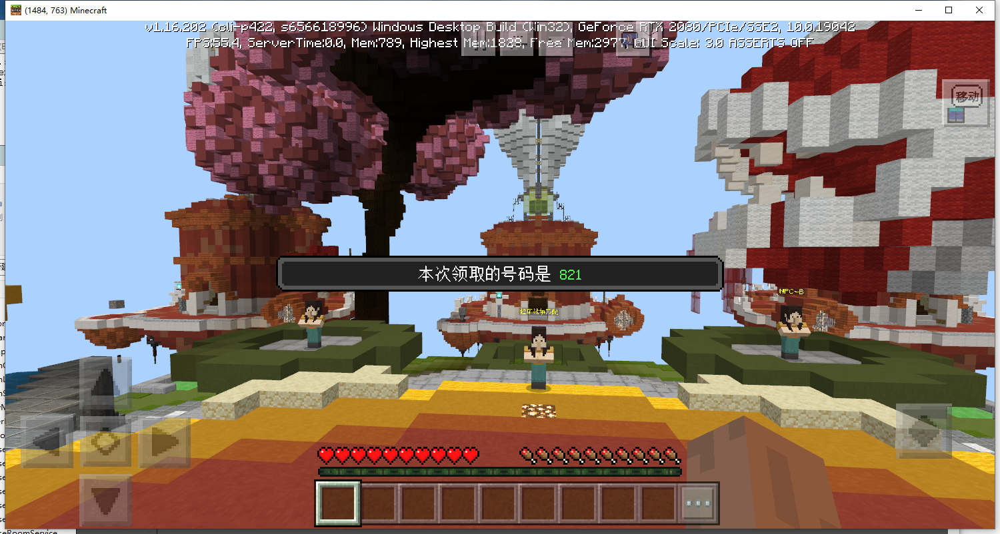
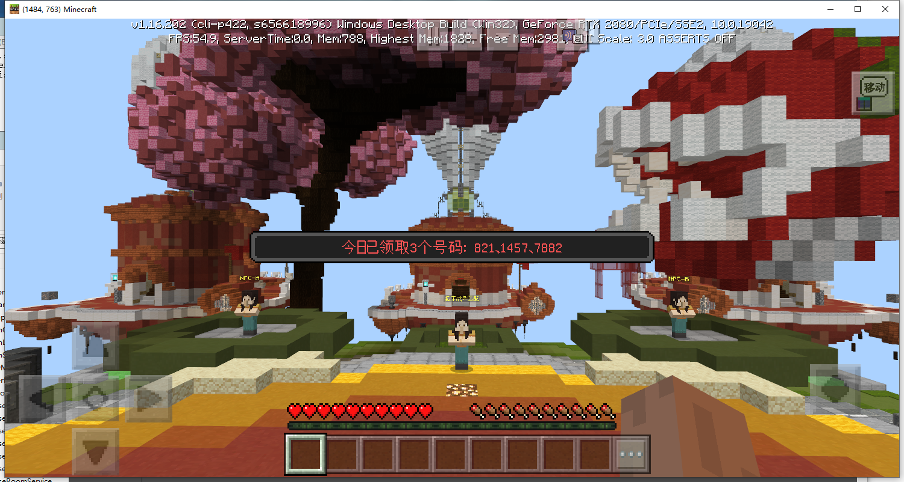
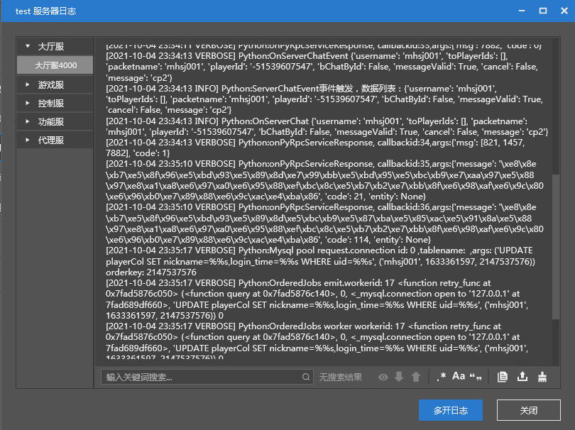
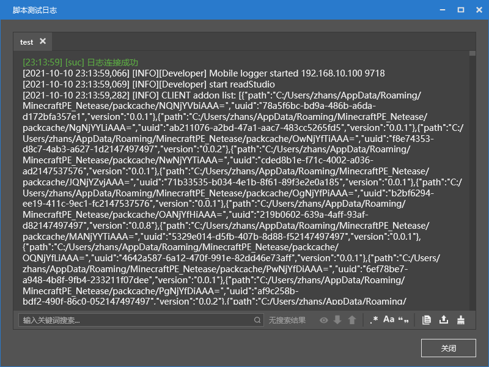
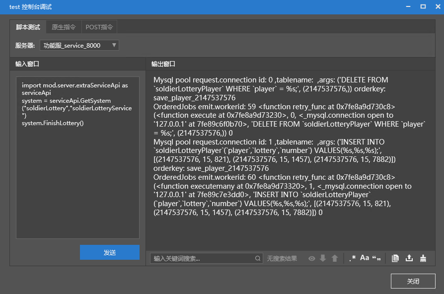
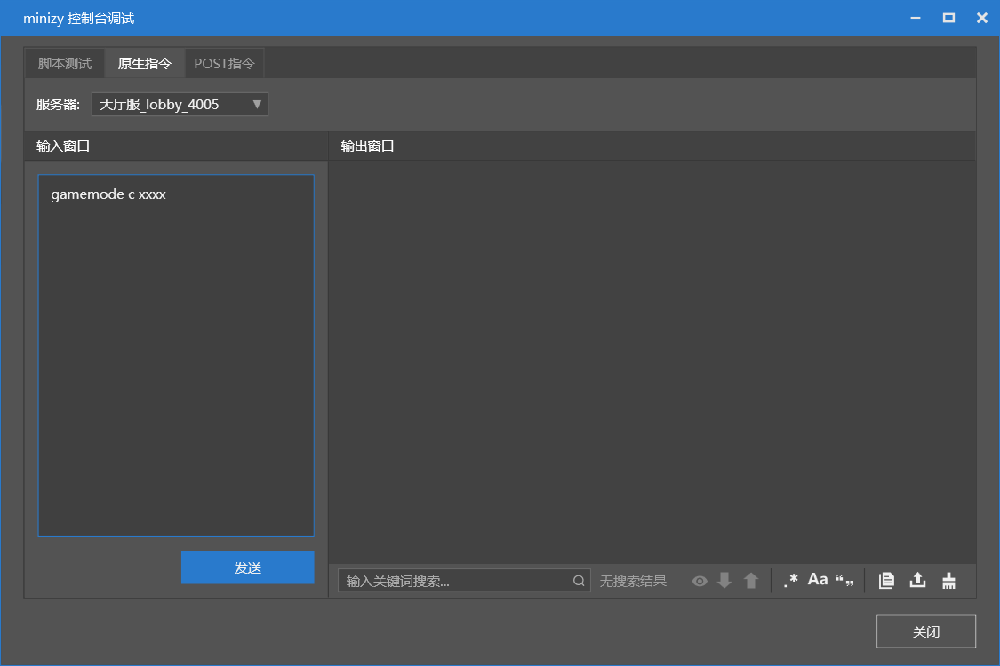
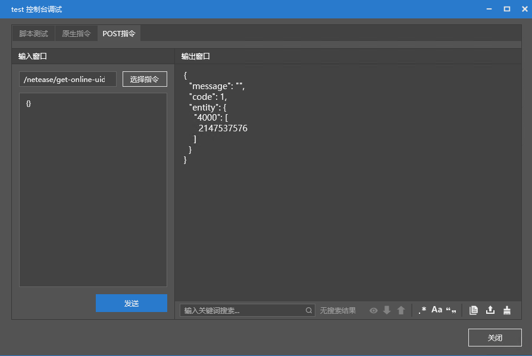

# Plug-in Writing - Testing 

After writing the plug-in, you can deploy and test it. 

Use the plug-in code downloaded from [Plug-in Writing - Production (Part 2)](./5-Plug-in Writing - Production (Part 2).html#Code Download) and [Plug-in Writing - Production (Part 3)](./6-Plug-in Writing - Production (Part 3).html#Code Download) to deploy and test it along with the tutorial. 

## Deployment process 

1. Execute mod.sql 
2. Check the relevant plug-ins in the configuration items 
3. Execute deployment 
4. Start the game and check the effect 

The deployment process has been discussed before. If you have forgotten it, you can [click me](../2-First Look at Plug-ins/2-Apply Plug-ins.html) to review it. 

In the step of checking the relevant plug-ins, because we use multiple official plug-ins, please make sure to check them all. 

The plug-ins that need to be checked for different types of servers are listed below. 

### Game/Lobby server 

- neteaseAlert 
- neteaseAnnounce 
- soldierLottery 

### Master server 

- neteaseAnnounceMaster 

### Service server 

- neteaseAnnounceService 
- soldierLotteryService 

> It should be noted that, since the requested service server type in the sample plug-in is fixed to "service", please fill in "service" in the type when configuring the Service server. 
> 
> If you need to modify, you can modify ServiceServerType in consts.py. 

After the settings are completed, click Deploy to deploy. 

Then you can enter the game to test the effect. 

### Effect test 

Enter cp1 in the chat box to receive the number 

 


Enter cp2 in the chat box to view the number you have received 

 

## Debugging tools and function display 

### Server log 

In the developer tool, right-click the server to see the option to view the server log. 

Click to view the logs of all servers. 

In server script development, use the ```print "msg"``` statement to print the log information. 

 

### Script log 

The script log is the client log. It will appear after the client is started. The interface is as shown. 

In client script development, use the ```print "msg"``` statement to print the log information. 

 

If you need to reopen it after closing it, you can right-click the server and click "View script test log" to reopen it. 

### Console debugging 

Console debugging is divided into three tabs: script, native command, and POST command. 

#### Script 

Execute the python script on the specified server. 

For example, in this sample plugin, execute the following code in the Service server to force the lottery to be opened. 

```python 
import mod.server.extraServiceApi as serviceApi 
system = serviceApi.GetSystem("soldierLottery","soldierLotteryService") 
system.FinishLottery() 
``` 

 

#### Native command 

Native command is the command that comes with Minecraft, which can execute op, gamemode and other similar commands. 

 


#### Post command 

Post command is the HTTP command provided by the Master server. You can select or enter the command you need to execute in the panel, such as viewing the online player list. 

