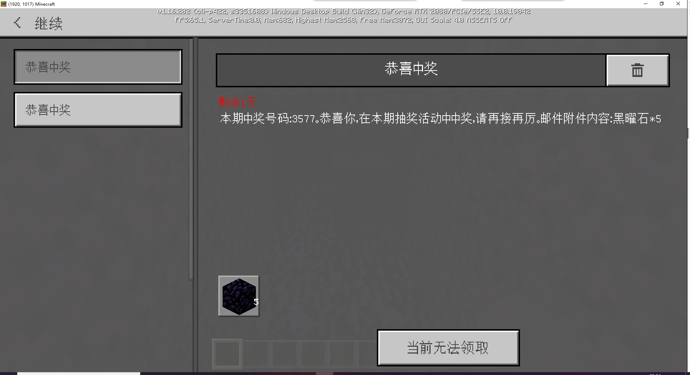

# Plugin secondary development 

In this section, we will modify the previously written plugin and perform secondary development on it. 

## Requirements 

Use the previous lottery plugin to transform a treasure hunting plugin. 

> The treasure hunting time is from 20:01 the previous day to 20:00 the current day. Players have a 10% chance of getting 1 number by destroying a dirt block, and each player can get up to 3 numbers per day. The prize is drawn at 20:00 every day, and the winning players are notified and awarded via email (included in the official neteaseAnnounce plugin). 

- Abandon the function of inputting cp1 to receive numbers in the original plugin 
- Players can destroy dirt blocks in the game server, and there is a 10% chance of getting a number. If they succeed, use the official neteaseAlert plugin to prompt "The number received this time is %s" 
- The reward number is reset after the daily prize drawing, and players can get the number again by destroying dirt blocks. 
- If the upper limit of the number that can be received on the day is exceeded: 3, you can no longer get the number by digging dirt blocks. 
- Before the daily lottery draw (20:01 on the previous day to 20:00 on the current day), enter cp2 to check the numbers you have received. 
- The official neteaseAlert plug-in prompts the status of the numbers you have received "%s (number) numbers have been received today: %s, %s, %s" 
- If the player gets the number 6666, he can get the special prize when the prize is issued. 
- 5 numbers are randomly drawn from 1 to 10000 as the winning numbers for this period. (The drawn numbers do not include 6666) 
- Email reminder for the winner of the special prize: Congratulations on winning the special prize for this period! Email attachment content: Emerald*100 
- No player won the special prize this period - the winning numbers for this period are: %s, %s, %s, %s, %s. Congratulations, you won the prize in this lottery, please keep up the good work. Email attachment content: Obsidian*5 
- A player won the special prize this period - the special prize for this period was won by %s. In addition, the winning numbers for this period are: %s, %s, %s, %s, %s. Congratulations, you won the prize in this lottery, please keep up the good work. Email attachment content: Obsidian*5 
- No player won the special prize this period - the winning numbers for this period are: %s, %s, %s, %s, %s. Unfortunately, you did not win the prize in this lottery, please keep up the good work. Email attachment content: Iron ingot*3 
- A player won the special prize this period - the special prize for this period was won by %s. In addition, the winning numbers for this period are: %s, %s, %s, %s, %s. Unfortunately, you did not win the prize in this lottery, please keep up the good work. Email attachment content: Iron ingot*3 
- Players who did not receive any numbers on the day do not need to send emails. 

## Production 

### Modification 

According to the requirements, we first need to delete the relevant monitoring of cp1. 

Then monitor the event of destroying the dirt block to complete the logic of obtaining the number.

And modify the logic of the lottery to determine whether any player has won the super prize. 

### Notes 

Since we need to filter the lottery and number columns in the data table at the same time to find out whether any player has won the super prize. 

The previous index did not cover these two columns, so we need to update mod.sql and add an index. 

The SQL statement is as follows 

```sql 
# Add index 
ALTER TABLE `soldierLotteryPlayer` 
ADD UNIQUE INDEX `lottery_number`(`lottery`, `number`) USING BTREE COMMENT 'Index of lottery id and lottery number'; 
``` 

### Download


The plugin download address after modifying the relevant code: 

[Secondary development of lottery plugin](https://g79.gdl.netease.com/pluginguide04-08.zip) (including service and lobby/game parts). 

## Test 

Dig the soil in the game server and you can see that there is a probability of successfully receiving the number. 

 

Test the lottery, which is consistent with expectations 

 

