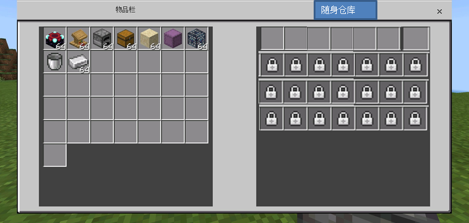

## Sample Document: Portable Warehouse Plugin 

### 1. Functional Description 

​ 1) Click the interface entrance to open the portable warehouse. (As an example of this requirement, the entrance can be opened through the official main menu plug-in) 
​ 2) The number of columns in the warehouse is fixed to 7, and the number of rows can be dynamically adapted to a maximum of 32 rows. The part exceeding the display is realized by turning pages or scrolling. 
​ 3) The interface diagram of the portable warehouse can be referred to the figure below. 
​ a. The warehouse grid configured as the initial row is unlocked. The remaining grids are locked. 
​ b. Click any locked grid to pop up a secondary confirmation pop-up window. The pop-up window content is obtained through the unlock prompt configuration of this row. 
​ c. If the above pop-up window is selected to confirm, but the items and currency are insufficient, the official plug-in neteaseAlert will be used to pop up a window prompting "Insufficient items or currency required for unlocking!" 
​ d. If the above pop-up window is selected to confirm and the items and currency are sufficient, the corresponding items and currency will be deducted and the next row of grids will be opened. Use the official plugin neteaseAlert to pop up a window 
​ Prompt "Successfully unlocked the warehouse grid in row %s" 

 

### 2. Configuration instructions 

​ 1) The initial number of rows in the portable warehouse, the minimum value is 0. 
​ 2) The maximum number of rows in the portable warehouse. 
​ 3) Unlocking consumption of non-initial rows: supports two forms of items + currency, in which the currency needs to use the official economic plugin as a pre-installed. If the unlock configuration is set to -1, the developer will unlock according to his own judgment. 
​ Configuration example: 
​ Initial number of rows 0 
​ Maximum number of rows 10 
​ Unlock configuration [row range]: (currency dough_id, currency quantity, [(item 1 identifier: aux, item quantity 1), (item 2 identifier: aux, item quantity 2),...],"This row unlock prompt") 

### 3. API requirements 

​ 1) Server API: A certain uid player opens the portable warehouse. 
​ 2) Server API: Set the number of rows unlocked in the portable warehouse of a certain uid player. (If 3 rows are currently unlocked, call this API, and the number of unlocked rows is set to 3, then the 4th to 6th rows will be unlocked) 
​ 3) Server API: Query the number of rows unlocked in the portable warehouse of a certain uid player. 
​ 4) Server API: Delete an item in a certain grid in the warehouse. 
​ 5) Server API: Delete all items in the warehouse. 

### 4. Event requirements 

​ 1) Server-side event: thrown when clicking any locked state grid, parameters include: player uid, 
​ 2) Server-side event: thrown when successfully unlocked, parameters include: player uid, current unlocked row number set 

### 5. Operation instructions 

​ 1) A player with a certain uid opens the portable warehouse. 
​ 2) Set the number of rows unlocked in the portable warehouse of a player with a certain uid.

​ 3) Query the number of rows unlocked in a player's portable warehouse with a certain uid. 
​ 4) Set the number of rows locked in a player's portable warehouse with a certain uid. Items in the unlocked grid cannot be put in after being set to locked state, but can be taken out until they are unlocked again. 
​ 5) Delete items in a grid in the warehouse. 
​ 6) Delete all items in the warehouse.