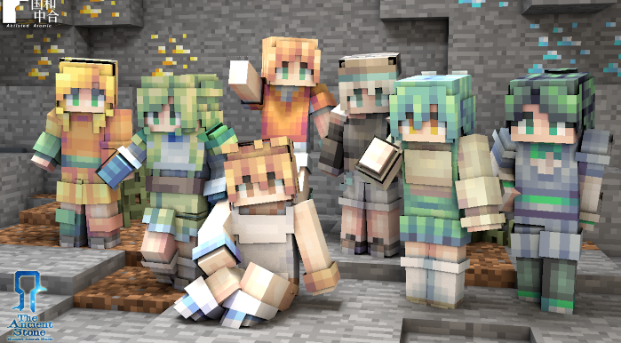
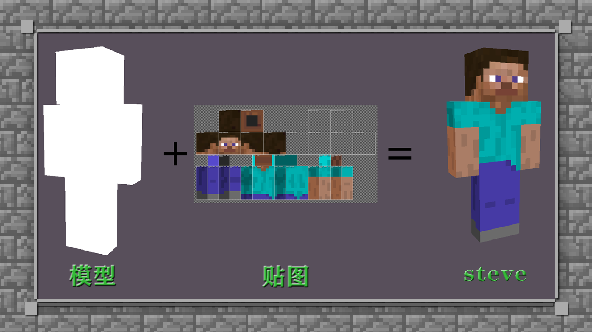
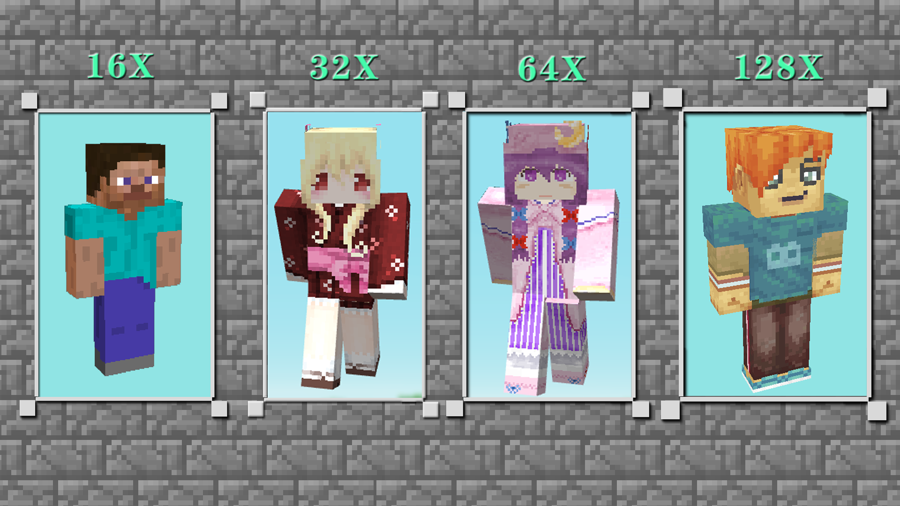

--- 
front: https://mc.res.netease.com/pc/zt/20201109161633/mc-dev/assets/img/1_1.8e80cb04.png 
hard: Getting Started 
time: 10 minutes 
--- 
# Make the character unique - understand the concept of skin 
#### TAG: skin theory concept 
#### Author: Ancient Stone 
#### What is skin? 

Skin is an indispensable element in "Minecraft" and is the existence of highlighting the personality of the character. 
If from the player's perspective, skin is a setting like clothes, then what will it be like in the eyes of developers? If you want to create a skin that belongs to you, how should you make it? 
The above questions will be answered in this tutorial. I believe that everyone will gain something from this skin tutorial~ 

 

Conceptually, the skin is composed of a character texture. At this time, you may ask: What is a texture? In fact, a texture can be understood as a "body" that is flattened into a "surface" according to its own structure. That is, it is flat before use, and after use, the player's character gives it volume and framework, so that the texture is filled and three-dimensional. 

 

#### The magic of skin-resolution 

Did you know? The fineness of skin drawing is actually optional. 
The key to determining the fineness lies in "resolution". The higher the resolution, the higher the fineness, and the more grids that can be fine-tuned. At present, the most basic and commonly used official texture specification is 16x, but in fact, the resolution fineness of the texture can be set and adjusted. Next, let's get to know the performance of skins with different resolution sizes. 

 

#### After watching the comparison, do you have a preliminary understanding of skins with different resolutions? 

Different skin resolution sizes give a higher precision to the visual effect. Resolution is actually one of the determining factors for whether the texture is high-definition and fine. 
For beginners who have just started practicing, it is recommended that you choose the official specification of 16X for drawing. If you want to challenge the ultimate level of fineness, you can choose other specifications. The premise is of course to master the basic drawing knowledge first, and other upgrade challenges will not be a problem~ 
Note: Skin3d currently does not support 32x skin drawing. If you need skins with corresponding pixel sizes, you can choose blockbench.