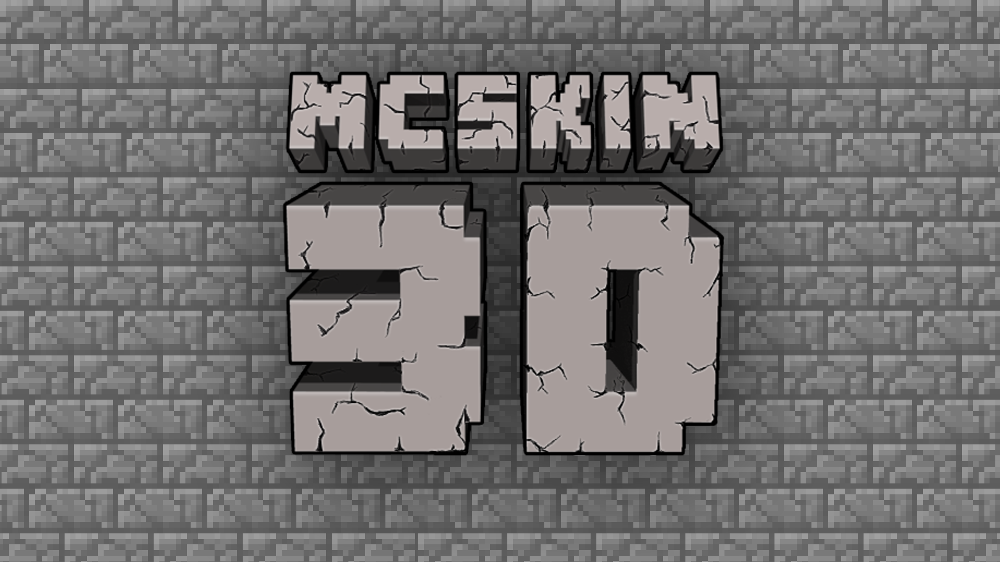
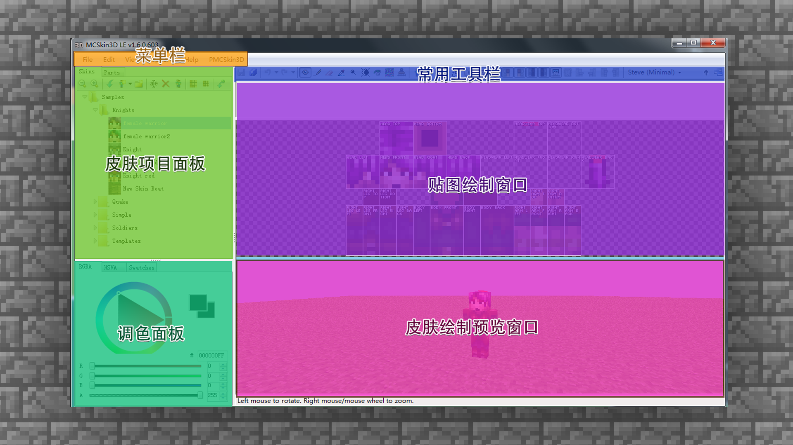
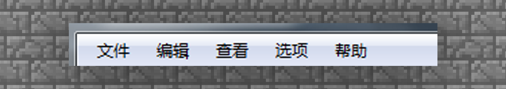
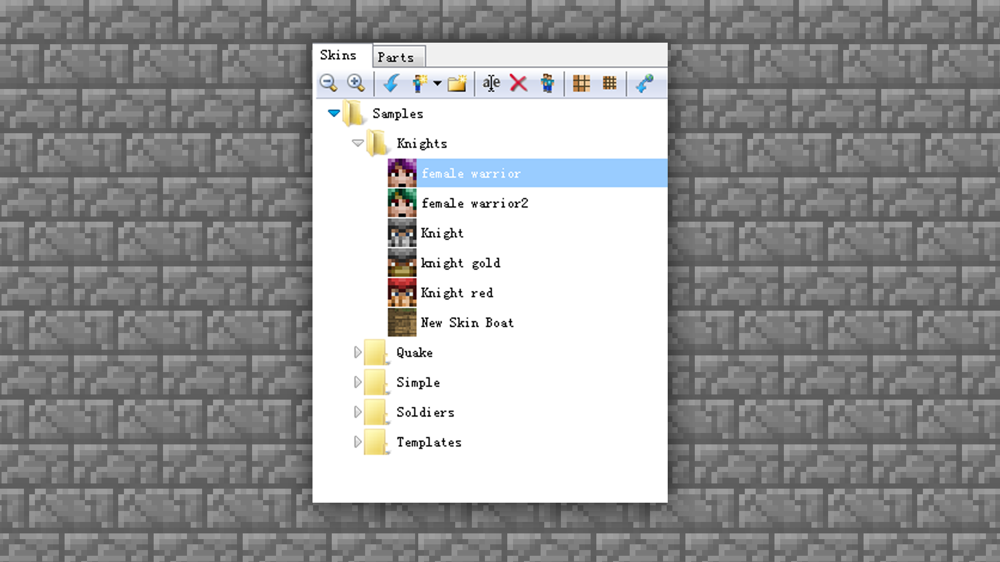
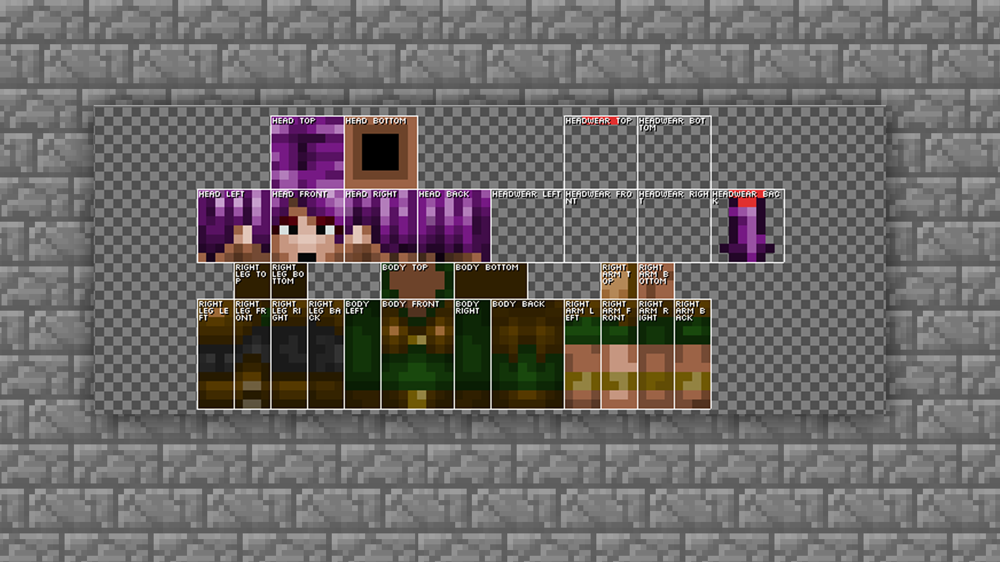
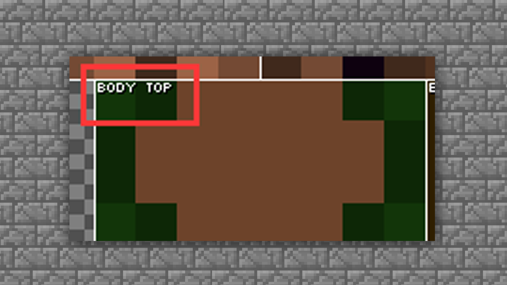
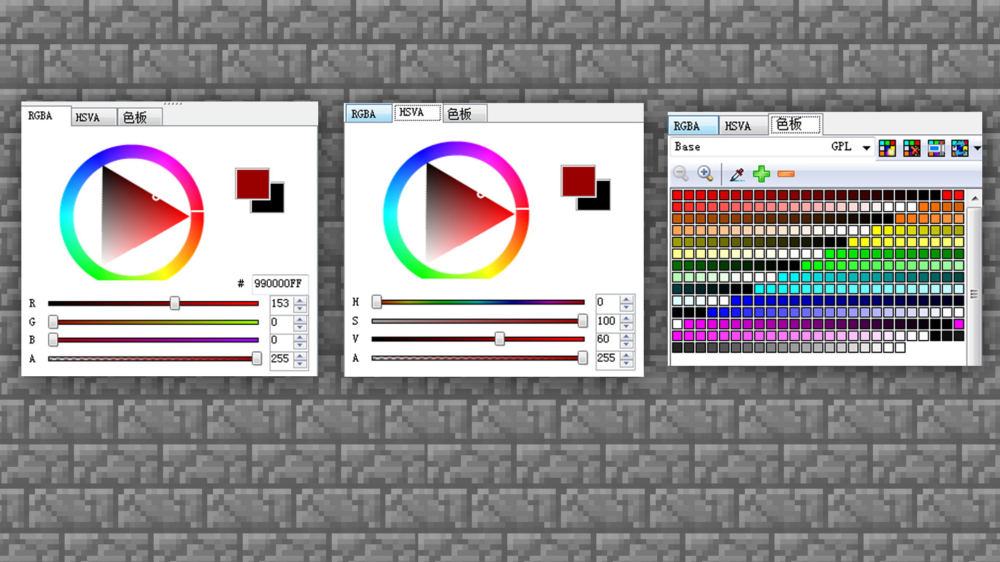
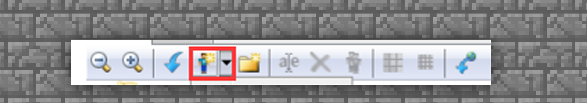
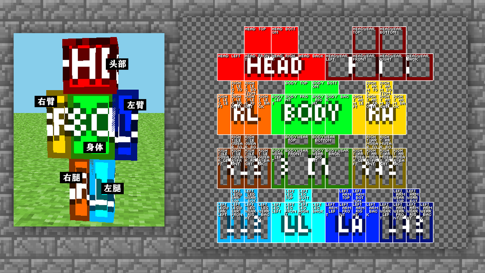

--- 
front: https://mc.res.netease.com/pc/zt/20201109161633/mc-dev/assets/img/2_1.ef3f2015.png 
hard: Advanced 
time: 20 minutes 
--- 
# Create a unique skin - design skin & MCSKIN3D software 

#### TAG: Skin design MCSKIN3D 

#### Author: Ancient Stone 

#### Create a unique skin - design skin & MCSKIN3D software 

Through the above explanation of the basic concepts, I believe everyone has a general understanding of the skin. But practice makes perfect, let us use MCskin3D software to actually make a personalized skin of our own. 

 

#### MCskin3d interface introduction 

MCskin3d is a free skin maker, through which you can make and use skins in "Minecraft". You can find the skin drawing method that suits you best through continuous attempts. At the same time, you can browse all skins in the software and manage them in batches. This editor supports editing in 3D view, 2D view editing, and 3D and 2D half view editing, so that skin design is no longer a problem. 

Next, let's learn how to operate it together~ 

-First, we download MCSKIN3D and open the software interface. 

As shown in the figure below, the software interface is clearly divided into six major blocks: menu bar, common toolbar, skin project panel, texture drawing window, color palette panel, skin drawing preview window. 

 

Menu bar: It contains all functions and operation commands of MCSKIN3D, including 5 major menu categories. Through the operation of the menu, you can complete the operations such as project material management, project editing, view adjustment, etc. 

 

Common toolbar: It contains tools frequently used when drawing and editing skin maps. Simply click the button in the toolbar to select the corresponding editing operation, such as lens adjustment, drawing tools, eraser, color picking, skin display mode selection, etc. If you want to learn MCSKIN3D well, you must first try out all the functions of the tools~ 

 

Skin Project Panel: All newly created skins or drawn skin files will be saved in this panel, which can be distinguished intuitively from the small icons, and you can right-click the skin here to [rename]. You can also zoom in and out, copy, and increase or decrease the resolution, which is very clear and convenient. 

 

Texture drawing window: This area is used for fine-tuning textures, and is a very important part. This part is needed when drawing eye color, character bangs, and clothing accessories. When you are proficient in the operation, you can basically draw roughly on the texture directly, and then switch and adjust the model texture back and forth. This part is more advanced, and you can try it when you have a certain level of proficiency. 

 

Each piece of the texture has the model block name written on it, so you can find the part you need to draw well. If it is still difficult to distinguish, then use the following method to draw later to distinguish the color model block well in the early stage. 

 

Color palette: a color blending and selection panel, where you can select and blend your favorite colors, and then use the drawing tools to color. Of course, there is also a black technology here, which is the color palette. You can save your favorite colors or used colors in the color palette, so that you can easily retrieve them. 

 

Skin drawing preview window: The drawn skin will be displayed and read in 3D in this part. You can use the mouse to move the perspective accurately to see the effect and picture feeling of the skin. The model previewed here is the same size as in the game, so you can adjust it with confidence. 

 

#### MCskin3d New Skin Type 

The modules have been introduced, let's start the actual operation. 

First, find the button to create a new skin in the menu bar in the skin project panel. 

 

Then select the skin type model you want to draw. ALEX and STEVE correspond to the latest double-layer skin mapping model, and the one with the minimal label is the old version of the mapping model, that is, the single-layer skin version ALEX and STEVE. 

So what is single-layer skin and what is double-layer skin? Let's learn through cases. 

—Single-layer skin: The skin has only one layer, and only one style can be drawn for both arms and feet, and then the software automatically mirrors and copies. Generally suitable for novices to practice. 

 

—Double-layer skin: refers to adding another layer of texture on the basis of a single-layer skin, which is equivalent to giving the character another piece of clothing and a hat. In addition, the hands and feet of the double-layer skin can be drawn separately on the left and right sides, and the software will not mirror and copy. It adds more fun and choices for creation. It is generally the skin format that novices often choose after they advance. 

 
