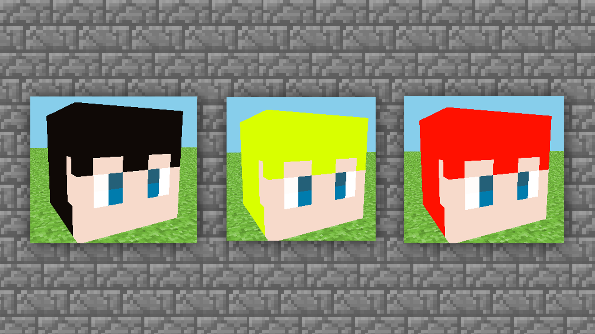
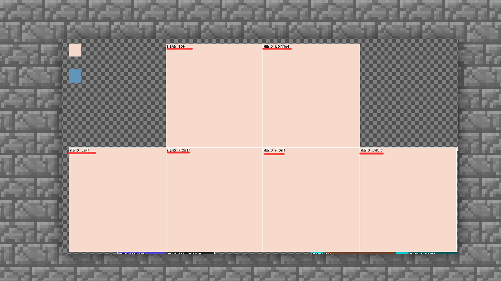
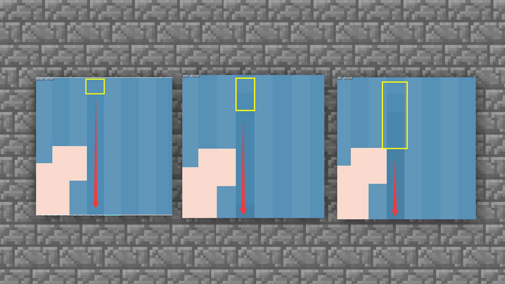
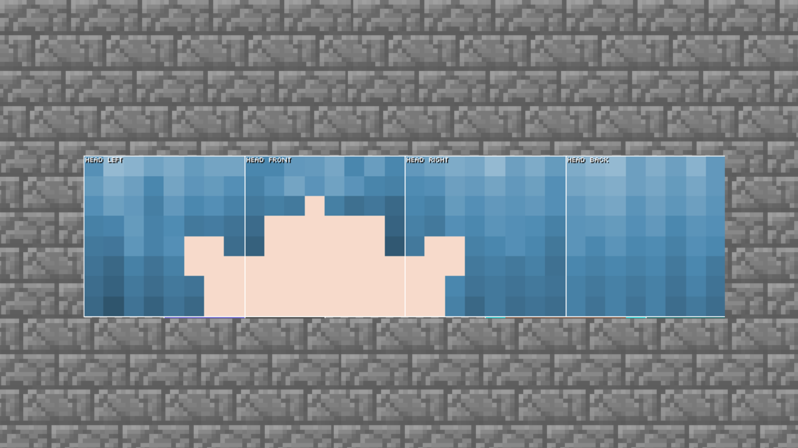
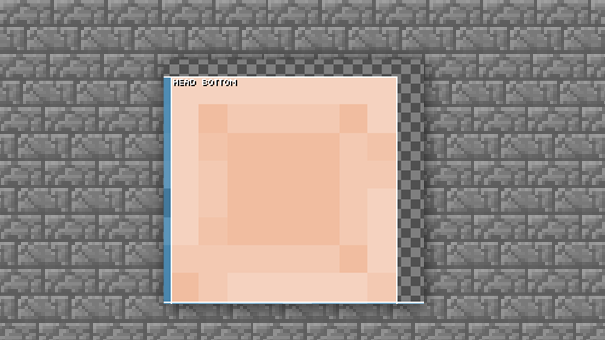

--- 
front: https://mc.res.netease.com/pc/zt/20201109161633/mc-dev/assets/img/3_3.64e2c533.png 
hard: Advanced 
time: 20 minutes 
--- 
# MCskin3d skin drawing - new and head drawing 

#### TAG: skin head drawing new 

#### Author: Ancient Stone 

#### MCskin3d skin drawing - head drawing 

So, let's start with a single-layer skin. First create a single-layer STEVE skin. 

Select [Skins] → [Players] → [Steve (Minimal)] 

 

After confirming the new creation, we can see that an original Steve is generated in the software. Turn on the 2D/3D hybrid mode in the toolbar. Display the texture and model together. 

Note: Of course, you can also start drawing directly. As long as you are confident, you can start in any mode. 

 

 

First, we start drawing the head. Undisplay all areas outside the head. 

Click the option in the box to undisplay all parts except the head from the toolbar. 

 

After clicking on the torso, hands and feet, only the head and helmet are left, so you can draw accurately. 

 

The structure of the head is that each face is an 8*8 pixel grid. In this limited grid, if we need to draw all the contents such as eyes, hair, mouth, etc., the number of grids is relatively tight. 

Therefore, we need to make trade-offs for some content. And we need to pay attention that when drawing, the colors should not be too bright or too heavy (too high saturation), such as bright red or dark black. 

 

(The above cases are not recommended for everyone to use~ because they are not conducive to later beautification) 

The correct way to choose colors can refer to the following two methods: 

First, you can choose a relatively intermediate color, such as black, gray and white. Gray is between black and white, that is, gray can add shadows and highlights in the later stage, which is very suitable as an intermediate color. 

Second, you can choose the character picture case you like or want to draw and directly pick the color. 

 

In the case, we choose several neutral head skin and hair colors that can add or subtract shadows and highlights to demonstrate to everyone. 

 

After the color is selected, use the pencil mode in the toolbar to draw the head. The two colors selected first are left in the blank space of the map. 

(Note: All the colors can be left outside the texture, which can well ensure that the color will not deviate from the original color after later drawing~ Leaving the color outside the texture display will not affect the character's skin itself, so the blank space can be used at will, and the author's signature can also be left.) 

 

First color the face. The current operation is to color the base color, which can be directly painted with a pencil and a large brush. 

 

The head model block [top] top of the head, [bottom] chin connecting the neck, [front] face, [Right] right side face, [Left] left side face, [Back] back of the head, all painted with skin base color. 

 

#### How to draw hair: 

Next, let's draw the hair. The hairstyle in the head area has certain limitations in terms of the degree of drawing. We can use bangs to increase the beauty of the skin. 

 

The base color bangs in the first part only need to have a rough distribution shape, because they will be superimposed by the helmet later, so you don't need to worry too much about the problem that the bangs seem a bit dull in the initial performance. 

To complete a good-looking skin, you need to add a lot of beautification elements in the later stage. 

Next, start to superimpose the shadows on the hair, that is, color the hair texture. Make the hair look more natural. 

We select the lighten/darken tool in the toolbar: 

 

You can adjust the strength of the tool according to your actual situation to find the feel of the painting. Brightening is used to reflect the highlight part, so start from the dark shadow to increase the texture. 

As we all know, the texture of hair is line by line, so you also need to try to draw it line by line in the pixel. 

 

As shown in the figure, first distinguish the lines one by one. 

 

Although the current texture may be relatively rigid, it has a preliminary expression of the layers of the hair. Then the next important step is: the overlapping of the dark shadow. 

 

Leave a grid from the first darkened area and draw a line. Then the number of grids can be adjusted according to personal visual effects. Keep repeating the process of deepening the shadows, and the layers of the hair will stand out. 

 

Note: In many cases, you don't need to apply the shadows regularly. Applying them regularly will make the performance look rigid. 

Next, add a highlight part. The highlight does not need to be applied all over, only part of it is fine. For example, just like the highlight in the example picture, the hair can be given a local highlight feeling. 

 

In the tool selection, you need to choose brighter between brighter and darker. In order to make the highlight slightly more obvious, the intensity is increased by 3 in the example picture. You can choose according to your own visual effect. 

 

Then select the area with the brightest highlight, which is usually in the middle part of the upper forehead. 

 

Directly use the tool to draw a brightening line. 

 

After this addition, do you feel that the hair is a little more prominent? 

Then we adjust the surrounding gradient transition to be natural. 

 

Next, start drawing the top of the head. According to popular understanding, the top of the head generally has a [swirl], that is, the hair is scattered according to one or more center points. 

So in the current case, if you need to draw a middle-parted feeling, you need to continue to use the darkening function. 

 

The hair is divided into two halves, and then the other hair is drawn vertically. 

 

After completing the current step, you can see that the top of the head has taken shape. Next, you need to follow the content mentioned above to draw the shadow and highlight parts. 

 

After filling the shadow and highlight, the hair drawing is basically completed. Many details can be adjusted according to personal preferences. 

#### How to draw the face 

Next, the face will be refined. The face is generally drawn according to the direction of the hair roots, and shadows and highlights are also needed. 

#### Continue to use the [Darkening Tool] 

 

Draw a circle of shadows along the roots of the hair. Using the overlay effect, you can draw the shadow of the face. 

 

The face is relatively flat at present, so we can use highlights to increase the volume. 

 

The part below the neck is a blind area, so you can just paint it a little. Apply some shadow effects roughly, and use the lighten and darken tools to paint. 

 

After completing the current step, the performance of the face is roughly the same. Next, we will start with the two most important points of the head: bangs (helmet part) and eyes. 

Let's start with bangs. 

#### How to draw bangs 

The drawing part of bangs is the helmet drawing part in the texture. 

 

Generally speaking, if the hair part is already completed, you can use PS tools to copy and modify it directly. Of course, if you are not very familiar with PS, then we can just draw the bangs part again according to the hair drawing method. 

 

This is the second layer of bangs. It looks dull now, so we need to adjust it. 

That is, trim the edges twice. 

 

Then we color the shadow and highlight of the second layer of helmet according to the shadow of the first layer of hair. 

 

The trimmed hair will become very natural. After some detailed adjustments to the color and shadow, we can draw the facial features and eyes. 

#### Drawing eyes 

There are actually two ways to draw facial features. The first is the conventional two-grid drawing method that everyone often uses, and the second is the Japanese three-eye drawing method. The mouth part is usually chosen by everyone according to their own preferences 

The first: the conventional two-grid eye drawing method. The height of the eyes is best in the fifth to seventh rows of the face. Different height positions can make the eyes show different states. 

 

The second type: This is a more Japanese-style drawing method, which makes the distance between the two eyes farther, and adds eyebrows and light blush, which will make the effect more cute. 

 

So you can draw the eyes according to your own preferences and aesthetics, and try to add some light and dark adjustments to the eyes. 

So far, we have completed the steps of drawing the head. If the head is well started, the following drawing will be smoother.