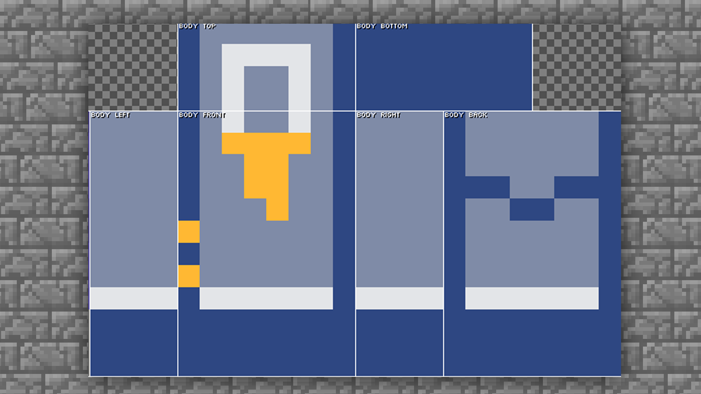
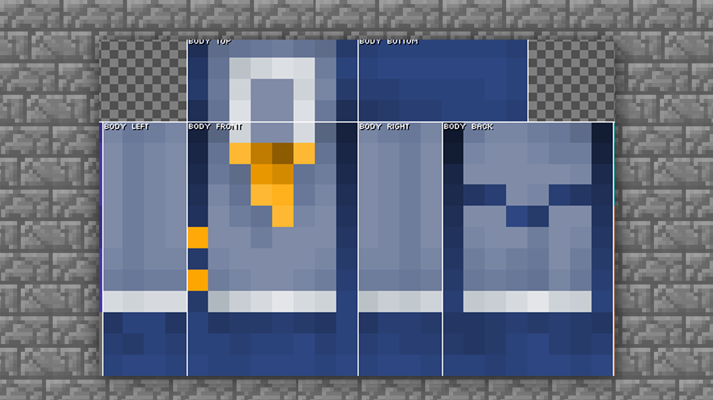
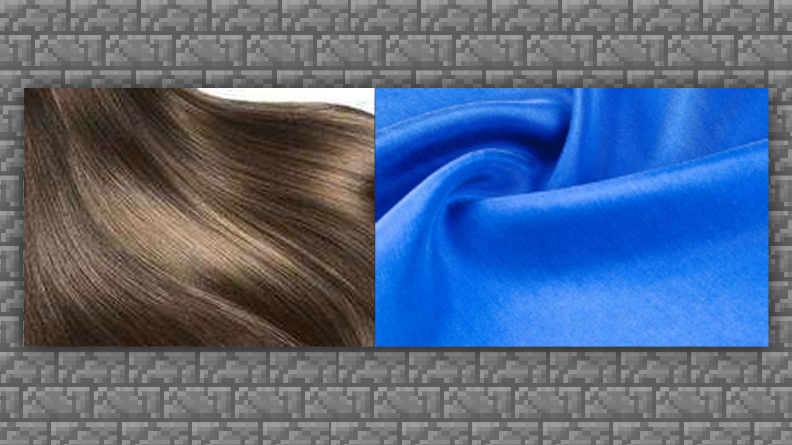

--- 
front: https://mc.res.netease.com/pc/zt/20201109161633/mc-dev/assets/img/4_1.6b2b8b48.png 
hard: Advanced 
time: 20 minutes 
--- 
# MCskin3d Skin Drawing - Body Drawing 
#### TAG: Skin Body Drawing 
#### Author: Ancient Stone 
#### Overview of Body Drawing 

After repeatedly practicing the drawing of the head, let's continue to draw the body. In fact, after understanding the rules for drawing hair, everyone can find a good way to draw. 
The basic operation of the body is actually the same as the head, and the focus is that the clothes need to be simplified. 

 

The body part actually has few faces. In a single-layer skin, the body is only a cuboid, and no external decoration can be drawn. However, double-layer skin can add more expression. In the later stage of double-layer skin, you can refer to the tutorial of the head for trial research. 

#### Modeling choice: 

If you are doing original drawing, you can find some real clothing combinations for reference. You can try some color combinations that you don’t usually use. Such a mix and match combination often gets a lot of creative gains~ 

And you can also make magic changes on real clothing cases, and you will get more design ideas. 

 

#### Color selection: 

When choosing colors, don’t choose colors similar to your hair, which will lead to unclear layers. Generally, when choosing colors, you can refer to neutral colors, not similar to your hair, and not pure colors. 

 

Through the interpretation of the above two points, everyone has a little understanding. Next, let's go directly to the drawing steps to consolidate the knowledge. 

#### Body drawing skills: 

First, let's set the interface to only display the body part. Hide all parts other than the body in the middle of the [Toolbar]. And set the mode to mixed mode. If it has always been this mode, there is no need to set it. 

 

After setting, you can get a drawing interface like this. The texture part only needs to draw the body part, that is, the texture of the body is OK. The hands and feet on the left and right sides do not need to be drawn for the time being. 

First, clear all the original parts of the body. Use [Toolbar] → [Eraser] 

 

Then use [Toolbar] → [Pencil] to apply a base color to the clothes. 

Note: You can also draw the outline first, so that you can better color the blocks. In the demonstration part, we will take the base color first as an example. 

 

Then start to roughly draw parts such as collars and buttons. In the case, the image of a man in suspenders is expected, so you need to reserve the positions of the suspenders and bow ties in advance. In case you find that there are many accessories that are not drawn in the later stage of drawing. 

 

After the base color is laid, you can start to process the light and shadow. There is one thing you need to pay attention to: most common clothing belongs to the fabric category, the light and dark relationship is relatively scattered, and there will not be too strong contrast. Therefore, try to use the middle color to transition the large areas of the clothes. 

We use the [Toolbar] → [Luminosity Brush] to color the first layer of details. 

 

Next, start to refine the light and dark of the clothes to increase the texture of the clothes. 

Continue to use the [Toolbar] → [Luminosity Brush] to darken and overlay 

 

The overall darkness has been added almost, and you can deepen the side joint connection a little bit, because the fabric that fits the joint will have wrinkles, and it will be darker in visual performance. You can refer to the mirror. 

Continue to use the [Toolbar] → [Luminosity Brush] to darken and overlay the side joint contact part. 

 

Above, the overall light and shadow are basically applied, and then you can start to increase the brightness. It should be noted that the highlights of clothes are different from those of hair. The performance of hair is mainly direct reflection, but the diffuse reflection of clothes is close to frosted glass, which is what we often call frosted light. 

 

So we also need to pay attention to the light feeling when coloring, do not apply direct highlights, and the color should be softened and extended. 

 

At this point, the drawing of the body is basically completed. We unhide the head we drew before. If you think the overall effect is not good, you can make fine adjustments. After the adjustment is completed, you can proceed to the next step. 

 

