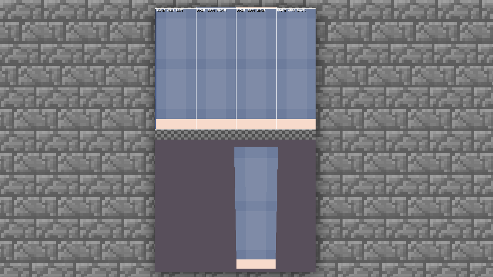
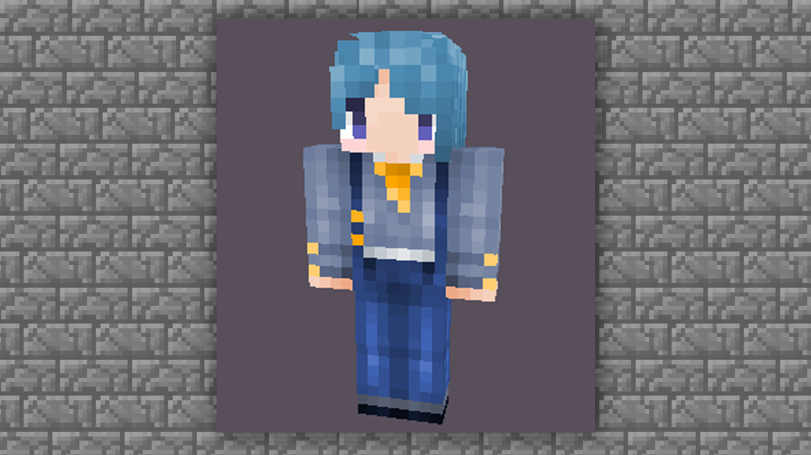

--- 
front: https://mc.res.netease.com/pc/zt/20201109161633/mc-dev/assets/img/5_19.c1161836.png 
hard: Advanced 
time: 20 minutes 
--- 
# MCskin3d skin drawing - limbs drawing and finalization 

#### TAG: skin limbs upper limbs lower limbs finalization 

#### Author: Ancient Stone 

#### Drawing of hands and feet 

Through the drawing of the head and body, we have a basic understanding of the method of drawing the overall structure. 
In the single-layer skin, only one hand and foot needs to be drawn and it will automatically become two, similar to the feeling of mirroring. But in the double-layer skin, it is different, and there is also a little content to pay attention to here. 
First, let's unhide the arm part. 

[Toolbar] → [Blending Mode] Open & Display [Arm Part] Separately. You can do it on the left or right. 

 

#### — Color Selection 

The color of the clothes on the hands and feet can be selected according to the color of the clothes on the body. If the design is sleeveless, just draw the skin color according to the color of the face. 
Next, let's get started directly. First, paint the base color of the arm according to the base color of the clothes. 

 

Don't forget to draw the hand part. 

 

Then you can draw the general shadow first. The upper limbs can be roughly divided into three parts: arm, forearm, and hand. Because the volume of the blocks is the same, we only need to use shadows to divide the arm into two parts. 

Also use [Toolbar] → [Lighten and Darken] to draw the arm in sections. 

 

 

Then darken the parts close to the body, such as the armpits and the sides and front of the body. At this time, you can unhide the body parts, and then observe and draw. 

 

First darken the armpits and the parts close to the body. Use [Toolbar] → [Lighten and Darken] to select darkening.

 

Then add a little highlight to the middle part of the arm, not too bright, and refer to the clothing settings of the body for brightness. 

 

Next, we will transition the light and shadow relationship of the front to the side. 

 

When drawing the inner part, there is no need to arrange the highlight part. Because this is the backlit side, you can transition to dark colors to lower the light. 

 

For the other back side, you can directly follow the same pattern or copy it directly. 

 

Okay, the arm part is basically completed, and then you can color the hand part. 

The hand part is the same as the side, and the color of the part close to the body becomes darker. The color is lighter near the outside. You can hold your fist and observe it yourself. 

 

In this way, the structure of the entire arm is completely drawn. Let's display both arms and the body to see the overall effect. 

 

Here we mainly check whether there are any problems with the connection part. If there are no major problems, we can start drawing the legs. 

#### Drawing of legs 

The drawing of legs is actually the drawing of pants. The drawing method of pants is roughly the same as that of sleeves, because the lower limbs can also be divided into three parts, and you only need to display each part. 

First, lay the base color as usual. Then here I will show you a little trick. If you want to connect the upper and lower body reasonably, you need to extend the clothes of the body part. 

 

Based on the drawing of the hands, continue to add the distinction between light and dark in the legs. 

Use [Toolbar] → [Lighten and Darken] to select darkening 

 

Similar to the drawing of the upper limbs, the armpits are darkened in the upper limbs, and the legs are darkened between the legs because this is the least exposed to the light source. Similarly, we also need to pay attention to the superimposed color and number of dark parts, and pay more attention to the seamless connection with the upper part of the body. 

Continue to overlay the dark part, and then overlay the highlight part with the upper limbs. 

 

Finally, we will complete the two parts of the sole and the thigh root. 

For the thigh root, it is recommended that you draw it according to the combination of the upper and lower parts, otherwise the skin will feel a little exposed when walking. 

There are many ways to draw the sole, but because the sole is rarely seen in actual situations, you can play it as you like. In the case, choose the round-shaped drawing method. You can also choose the stripe drawing method (for stripes, see finger drawing) 

 

Let's take a look at the overall effect. 

 

According to the overall effect, you can add a little detail decoration to complete the draft. 

 

#### Conclusion 

The basic skin tutorial ends here. The basic tutorial can only be used as a guide and reference. If you want to draw skin in your own style, you need to practice more. Practice makes perfect~