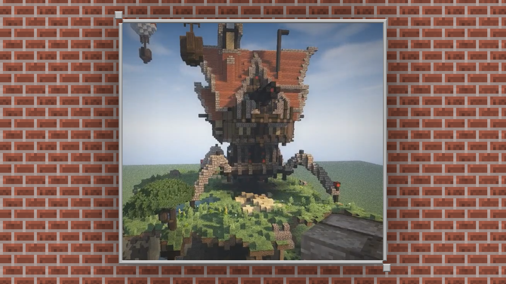
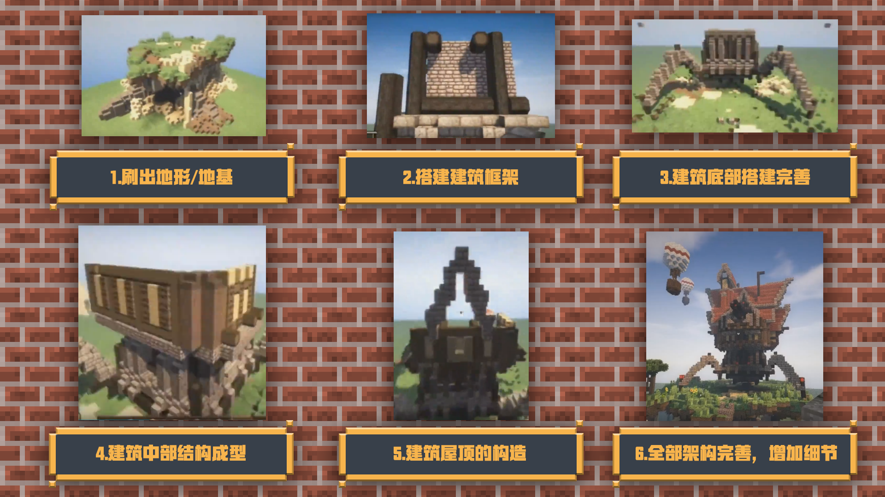

--- 
front: https://mc.res.netease.com/pc/zt/20201109161633/mc-dev/assets/img/1_2.5ba9cda9.png 
hard: Getting Started 
time: 10 minutes 
--- 
# Ideas and basic methods for building 

#### TAG: Building ideas 

#### Author: Ancient Stone 

Building modules are a very free part of the game "Minecraft". Whether you are a new player or a veteran player, you can freely choose and combine blocks. 

Block buildings can build various terrains that meet the needs of players. If you only need to build a small hut in the survival mode, then it can be loaded by placing blocks by one person or several friends. But if you want to create a large map for viewing, if time is not very generous, we can try to use third-party tools to build buildings. 

In this chapter's tutorial, we will learn how to use appropriate tools to assist construction and increase engineering efficiency; and how to quickly build a building prototype through certain ideas. 

Let's quickly get into the explanation~ 

#### Ideas and basic methods for building construction 

【Laying the foundation】 is the first step in all building construction. Only a suitable foundation can make a good framework for the entire house, and then progress to a complete building. Buildings need to be stacked layer by layer through blocks, and a reasonable structure can become a complete whole. 

Therefore, the basic principle of building is to stack blocks from the bottom to the top, from the foundation to the top. 

 

Let's take a look at the following process, how a building is built without super flat conditions. 

 

The above is a building construction process from 0 to 1, and for the structural combing of the entire building, etc., you need to learn and understand the structure of the real building. Different architectural styles have different architectural structures, which require more practice, analysis and practice to become proficient.