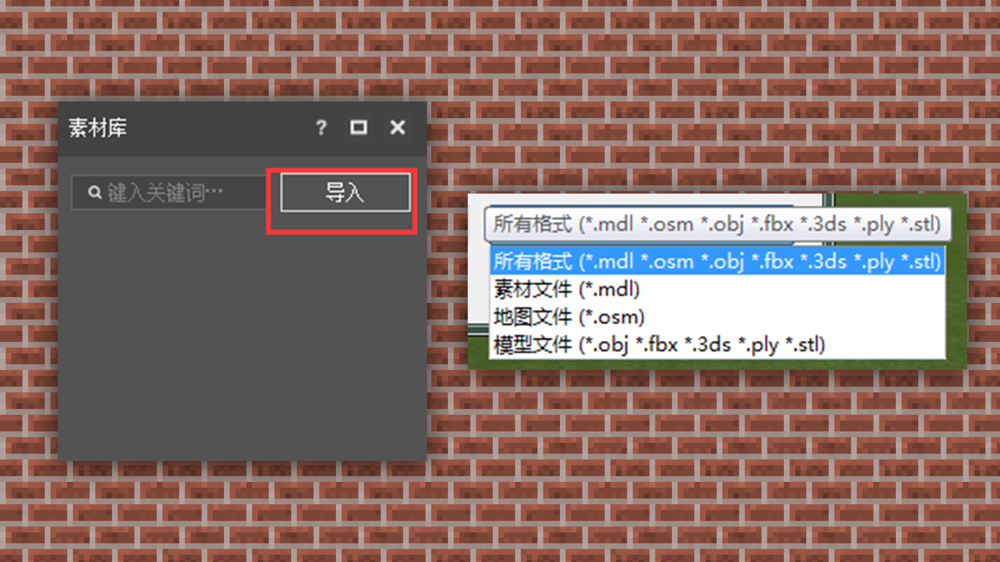

--- 
front: https://mc.res.netease.com/pc/zt/20201109161633/mc-dev/assets/img/2_1.89b0526c.png 
hard: Getting Started 
time: 15 minutes 
--- 
# Selection of building tools, taking MCStudio as an example for a brief introduction 
#### TAG: Building tools MCStudio 
#### Author: Ancient Stone 

#### —Choice of building tools, taking MCStudio as an example for a brief introduction 

Currently, the most commonly used building tools are: the map editor in the official developer tool MCStudio, the God of Creation plug-in and brushes embedded in the client, etc., which can all be used as building auxiliary software. 

MCStudio: This is a collection of official development tools. In the map editor of the tool, terrain, God of Creation, and brushes are combined into one, which is a very convenient collection of building auxiliary tools. 

The interface of the map editor is divided into 6 major parts: [Menu bar] + [Toolbar] + [Material information] + [Brush information] + [Material information] + [Preview interface] 

 

[Menu bar]: Select and jump to various editors. 

[Toolbar]: All basic tool selections, including saving, in-game testing and other functions are included. 

 

[Material information]: This location will display detailed block information. We can add commonly used building blocks here, and we can also set the proportion of mixed blocks to fill. 

 

[Mixed fill]: You can use mixed blocks and set the numerical ratio of each block for random filling. The total ratio cannot exceed 100%. Select Add component - select a material you want to mix. 

 

Here, three blocks are selected for blending, and the settings are 20%, 30%, and 50%. 

 

After setting, select the brush-select the block graphic, and you can see the effect of the blending ratio. 

 

[Brush Information]: The brush tool contains terrain presets, which have different pen tips to draw different shapes. The brush is convenient for smoothing the edge transition of the terrain, which can make the terrain or the surface of the house more natural. 

 

[Material Information]: In the material module, we can import some other buildings or models directly into the current map for use and editing through common formats such as obj and fbx. It is a very convenient and quick operation. 

 

[Preview interface]: refers to the direct preview of the building effect. You can see the preview effect, coordinates, start/end coordinates of the selected area, and size coordinates of the finished building in real time, which is convenient for developers to perform timely editing operations. 

 

