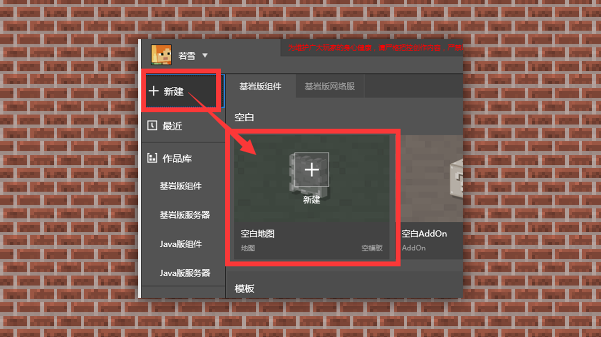
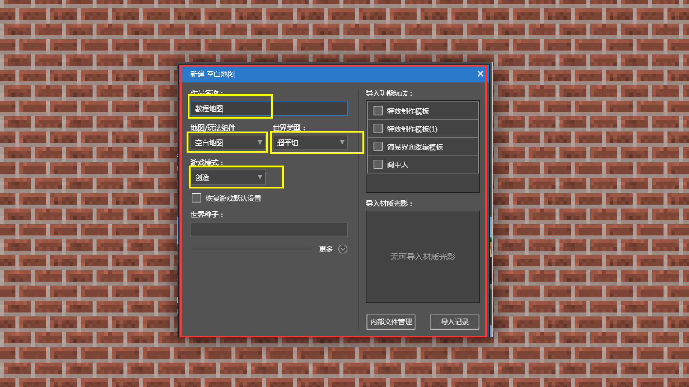
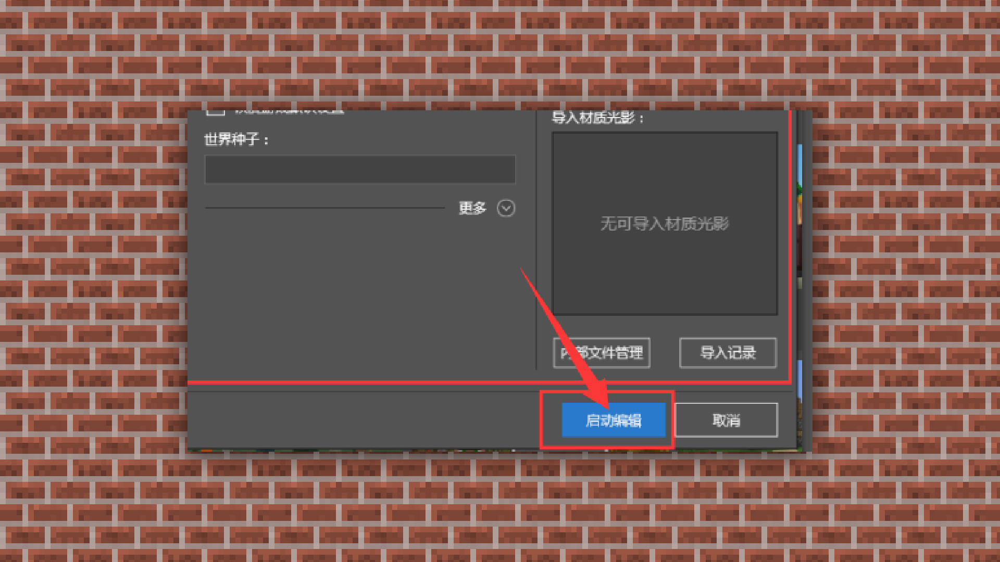
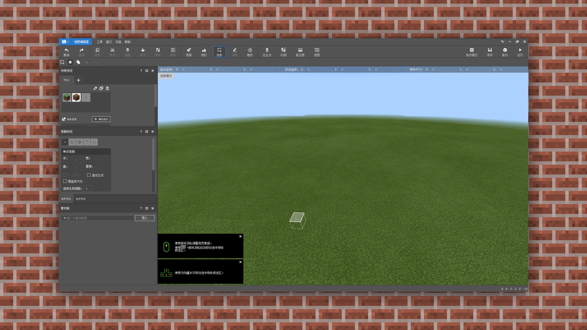
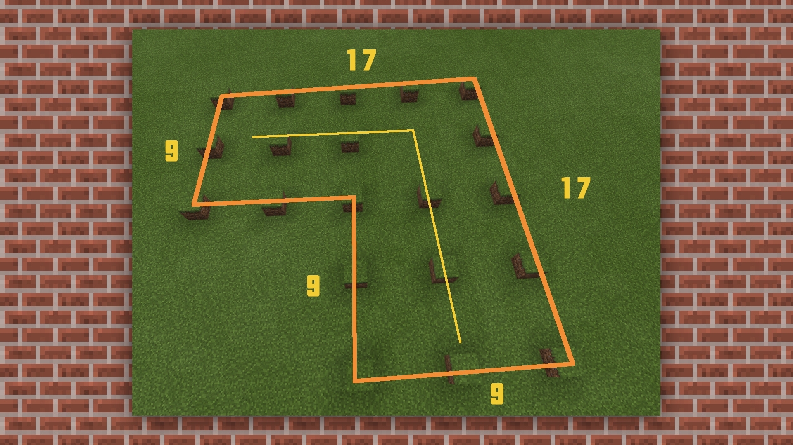

--- 
front: https://mc.res.netease.com/pc/zt/20201109161633/mc-dev/assets/img/3_6.b846242f.png 
hard: Getting Started 
time: 15 minutes 
--- 
# Use MCStudio map editor to build simple buildings① 
#### TAG: Building tool MCStudio 
#### Author: Ancient Stone 
#### Use MCStudio map editor to build simple buildings① 

According to the basic process, let's try to build small buildings. Let everyone get familiar with and understand the construction function of this software. 

#### —, Open MCStudio and click to create a new map 

Set the work name, world type, and game mode, and set and import the map gameplay components according to the construction requirements. After setting, just click Start Editing to load the construction interface. 

1. Select New - Blank Map 

 

2. Set the map format and mode 

 

3. Click Start Editing to enter the building interface. 

 

#### 2. After the map is created, set the brush parameters and plan the foundation at the same time. 

This time we plan to build a small survival house with a garden and a small pool. In general building planning, it is recommended that you use the odd length and width law, such as 1-3-5 or 15-17-19. Because if you need to build a pointed roof in the later stage, it will be more convenient to build. 

 

The brush can be set to different shapes and sizes. The current brush types include: [Single Point Brush] [Square Brush] [Spherical Brush] [Cylinder Brush] [Hemisphere Brush] 

 

We first set the brush to [Single Point Brush] and divide the foundation plan according to the odd number rule. 

Select [Brush] in the [Toolbar], and then preset the material to the selected plan block. 

 

 

Note: The odd number rule is not an absolute rule, but in the initial learning process, you can divide it according to the odd number rule, which is more convenient for adjustment and understanding.