--- 
front: https://mc.res.netease.com/pc/zt/20201109161633/mc-dev/assets/img/4_39.d7f86d50.png 
hard: Advanced 
time: 25 minutes 
--- 
# Use MCStudio map editor to build simple buildings ② 
#### TAG: Building tools MCStudio map editor 
#### Author: Ancient Stone 

#### Use MCStudio map editor to build simple buildings ② 

#### — , foundation construction, lay a good foundation 

In survival mode, because there is a necessary condition to defend against monsters, we will build a high foundation. At the same time, in order to make the foundation look more solid, you can choose to use stone blocks to build the "beam" part. 

Use [Brush] - [Single Point Brush] to set the material, check [Generate Straight Line] + [Overwrite Original Block] to start the foundation frame construction. 

Note: All adjustments must be completed when the foundation is laid. If there is a big misalignment due to poor foundation in the later stage of construction, it will be very difficult to adjust. 

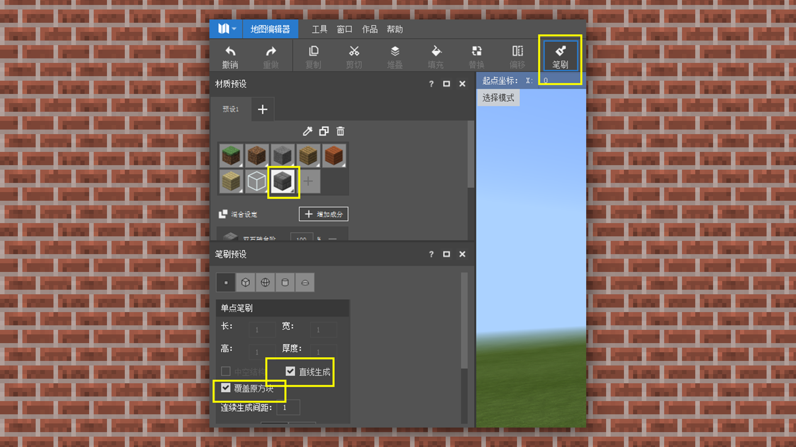 

 

 

Then you need to check the overall shape planning. If there is no problem, you can fill the foundation. In the later stage of construction, if you want to build a beautiful basement, you can keep the blank part in the middle for later development. 

When filling a large area, we can use a brush, or select the [Select] tool in the [Toolbar] to select a block for operation. 

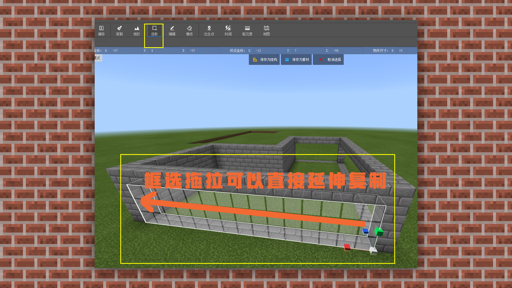 

Then use [Fill] to select the block to be filled.

 

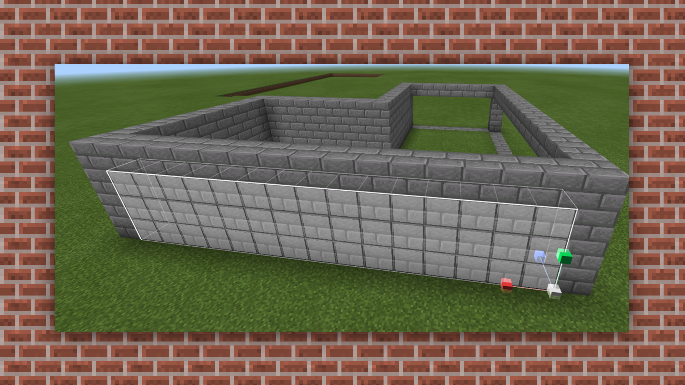 

Similarly, fill all the surroundings. 

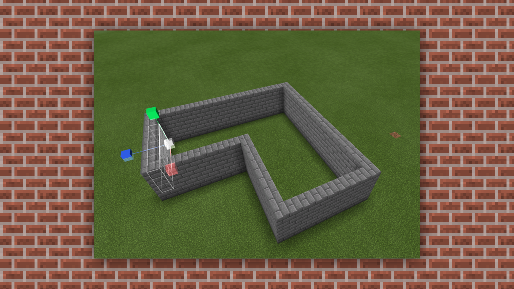 

After filling, you can replace the key pillars according to the aesthetics. Select the pillar you want to replace and click [Replace] 

 

Click [Replace] and then replace [Selected Block] with [Block you want to replace] and click Replace. 

 

Replace each pillar to see the effect. 

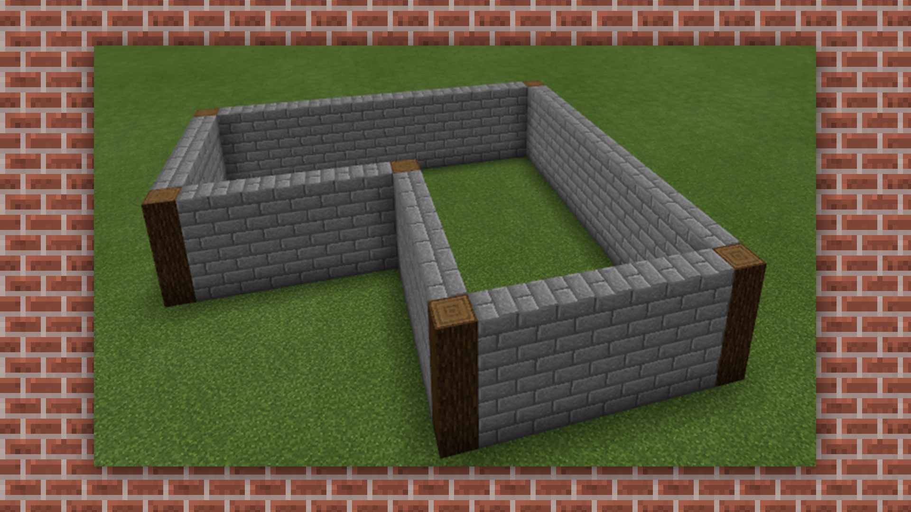 

Then we continue to use [Select] + [Fill] to complete the platform and fix the foundation. 

 

Based on the above foundation conditions, we will build the platform building. 

Also use the [brush] to build the foundation of the middle building. And roughly build the general part of the building first. 

 

Then we also use the [brush] to [single-point draw] the roof part, but we will find that the direction of the staircase part will be wrong, so we need to [select] the block and then [rotate] it, and rotate it to the angle we need according to the XYZ axis. 

 

Then stretch the side to copy and stretch it into a row. 

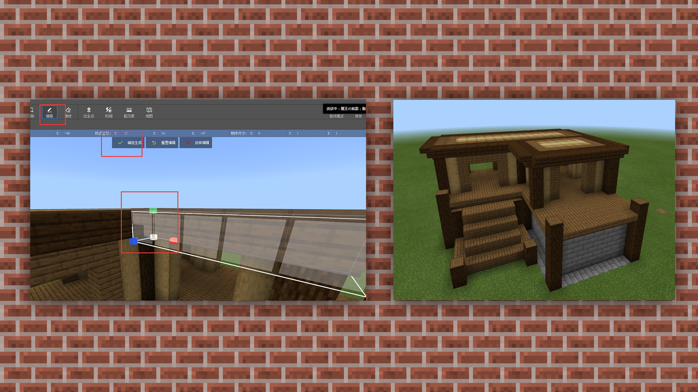 

Then, there is another way at this time. If you find it difficult to adjust the angles and corners in the software operation. Then we can click the game mode or run in the toolbar. 

 

[Game Mode]: This mode can directly operate the game in the window, which is no different from the game. Then exit the mode and exit directly with ESC. 

 

[Run]: Perform real-life testing in the game. This function is mainly to observe the actual situation of the game operation and whether there are any blocks missing. 

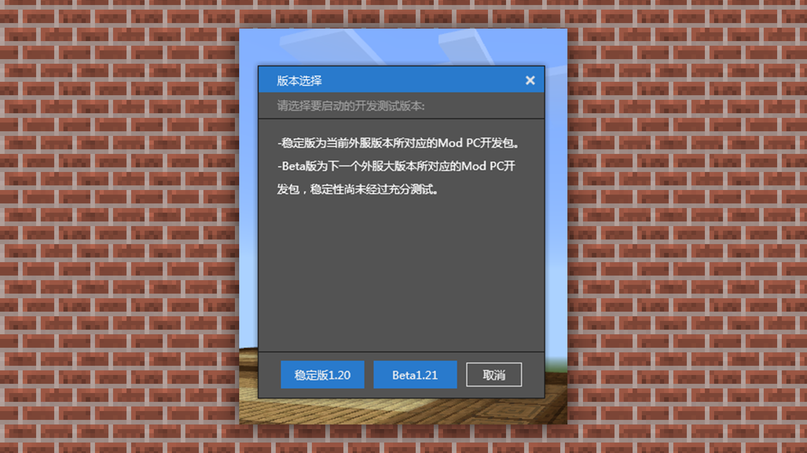 

By building some buildings in the game, exit to the software interface and use tools to copy and extend. 

 

Select the side to stretch and copy 

 

This way we can quickly complete the repeated filling of the roof. 

 

Repeat the above steps to complete the roof. 

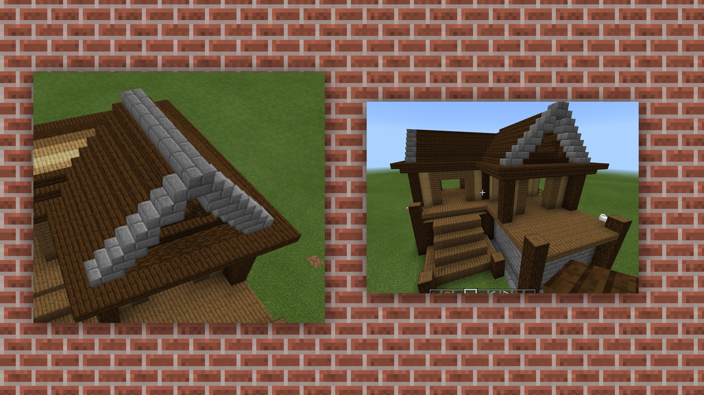 

Next, we just need to perfect some details and windows. 

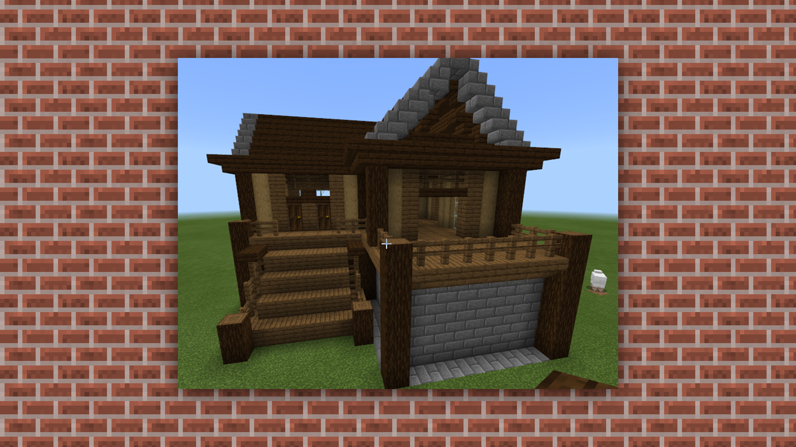 

After the building is basically completed, we can use [Brush] + [Material Mixing] to pave the road surface on the ground. But be sure to fill the proportion to 100%, otherwise there will be air blocks. 

 

As shown in the figure below, the total of the comprehensive proportion distribution is 100%, and there will be no empty effect after using the brush to apply it once. 

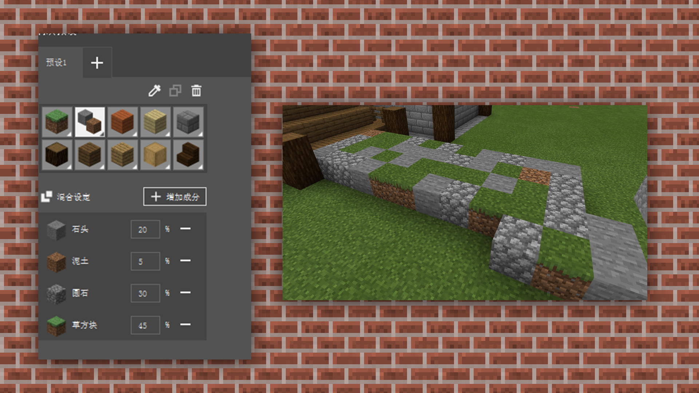 

Next, we will try to add some natural environment around the building for transition. 

Use [Terrain Preset] + [Terrain] in [Toolbar] to add natural plants. 

 

If you think that the design of the terrain has no gap and the aesthetics are reduced, you can continue to use the terrain's [Rise] to build the terrain. 

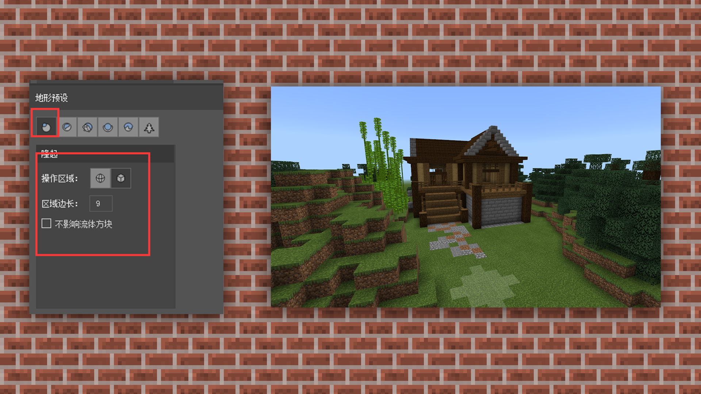 

Then use trees to fill the surrounding blanks. 

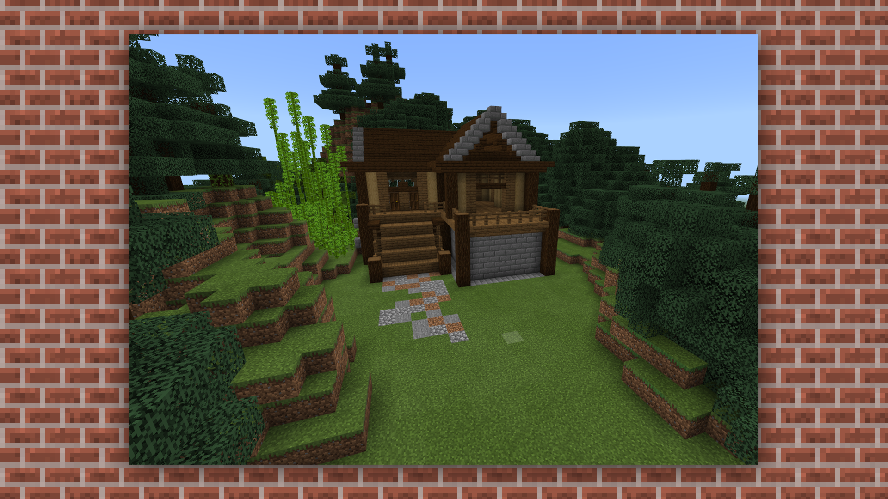 

In this way, we have completed a simple forest cabin. Then we can add some pools and decorations as appropriate. 

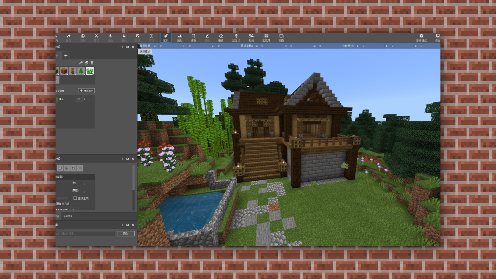 

Of course, if we don’t have such a good control over the environment, we can actually use the basic templates of the [Material Library] to beautify the surroundings. Let’s learn how to use the [Material Library]. 

We can find some preset materials in the built-in materials of the material library. 

 

We can select a type we like, click it, and the mouse operation on the construction preview interface will generate this building template. 

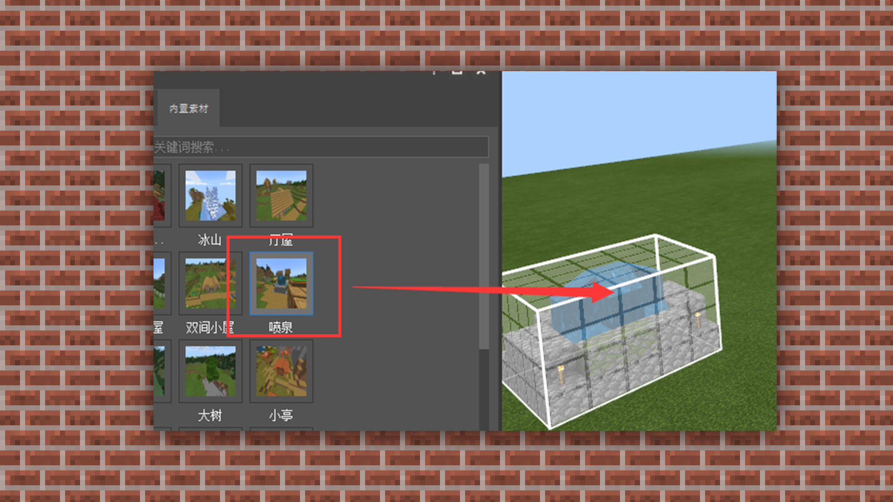 

Then we just need to select a location we like, and then click the left mouse button to [Confirm Generation]. Ps: Of course, if you think the location is wrong, you can also reposition it. 

 

After confirming the generation, the building template will automatically generate on the scene. 

 

Of course, we can also import some material templates we like to place. We select the custom material under the material library and click Import. 

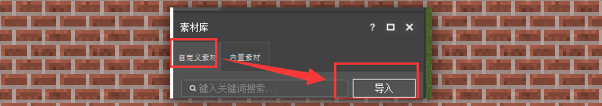 

Then we can adapt the MCS building format to import. The most commonly used format is OBJ format. We also select a small building in OBJ format to import. 

 

After selecting the file, click Open. The material will be automatically imported into the material library. 

 

Then we can operate and place it in the same way as the preset material. 

 

The landscape and effects produced in this way can be richer and more natural. 

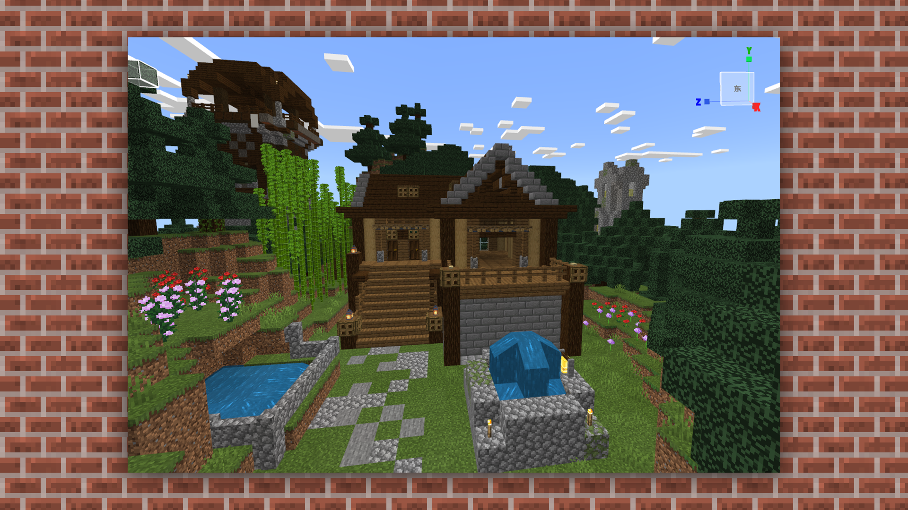 

Then when all the content is done, you can find the finished map in [Library] [Bedrock Edition Components] after saving. 

 

To open or export a map, select the map and right-click to perform the corresponding operation. After successful export, you will get a compressed package of the map, which is convenient for everyone to use and extract. 

