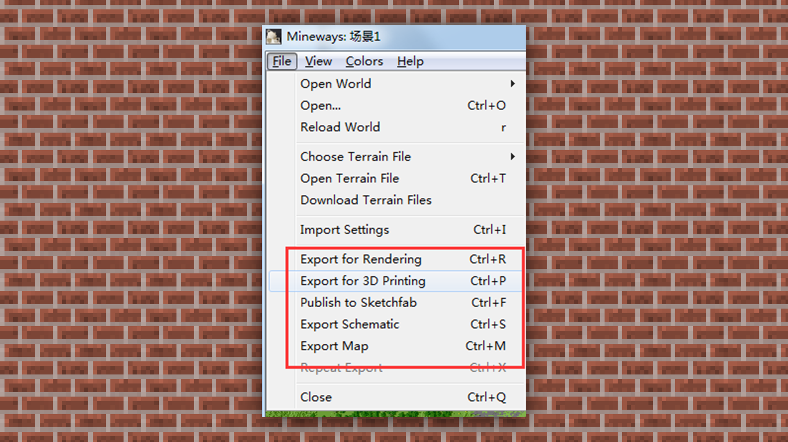
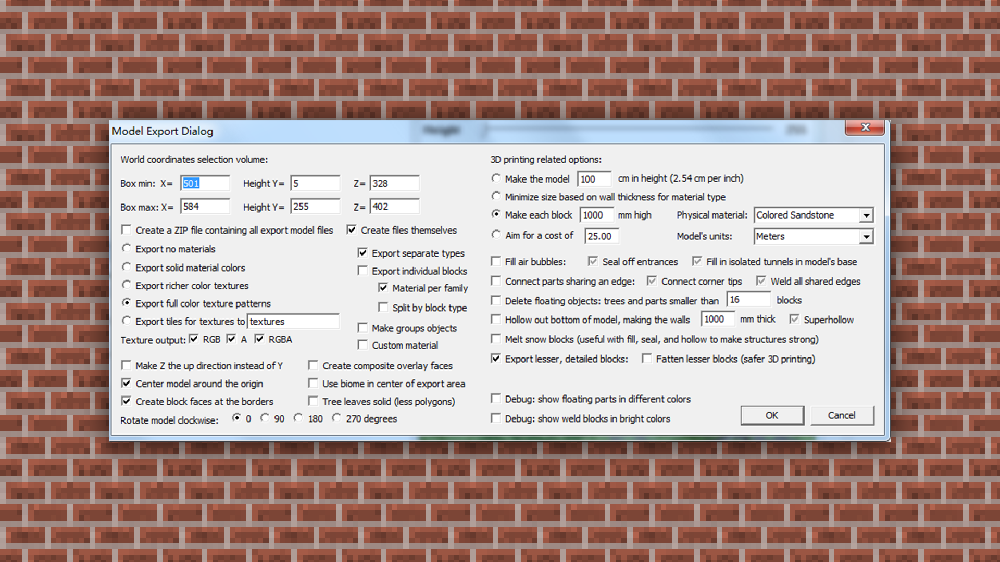
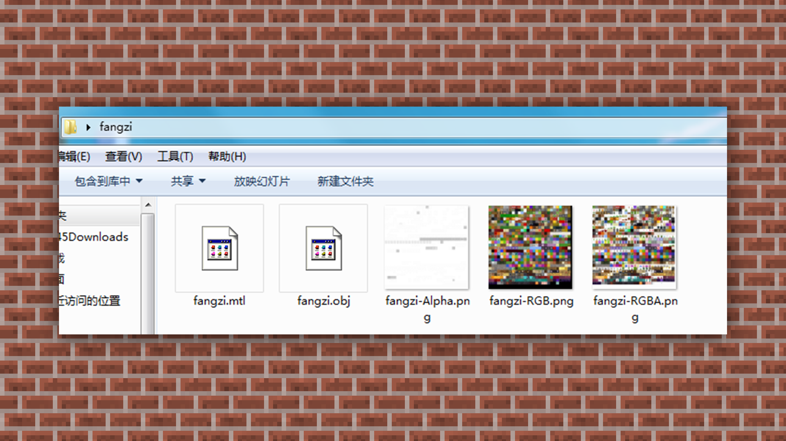

--- 
front: https://mc.res.netease.com/pc/zt/20201109161633/mc-dev/assets/img/5_1.c65f0cb0.png 
hard: Advanced 
time: 10 minutes 
--- 
# Building map format conversion 
#### TAG: Building format conversion model 
#### Author: Ancient Stone 

#### Building format conversion 

When we need to make animations or renderings, the import format of the map terrain often becomes a problem. 

In this section, I will simply share a way to convert the map to OBJ 3D format. 

First, you need to download the Mineways software. Mineways can convert my world map into a 3D model for 3D rendering and animation production. 

 

First, we will find the level.dat file of the imported map through the path of File->Open World->Find Your World in the software, and open it after loading. 

 

After Mineways loads the map, you can use the left mouse button to drag and view the map. Ctrl+left mouse button drag can select and adjust a square area. 

 

Then you can select Files->Export for Rendering (OBJ format for exporting models for rendering), a format that can be easily imported into mainstream 3D software such as Maya/3Ds Max. The rest of the formats can be imported according to the different software used. Generally, OBJ import is the most frequently used. 

 

Click Export, select the file save location and set the file name. 

 

The model setting interface pops up. Because it has been selected, there is no need for extra settings. Just use the default option. 

 

After waiting for the export to be read, we can get 5 files in the storage location, including texture files, material files and OBJ files. These files usually need to be used together. Finally, we import them into the 3D software for rendering and animation. 

 

Through the above basic architecture tutorial, do you have a certain understanding and comprehension of how to get started with architecture? You can practice as many times as you want, including exporting and changing the format of files, so that architecture will not stop at the game framework.