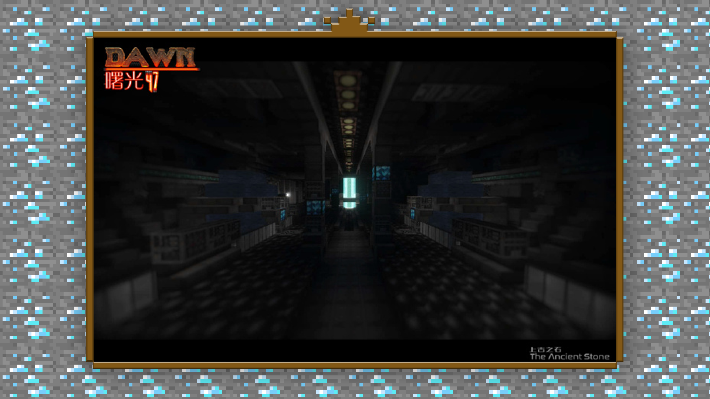
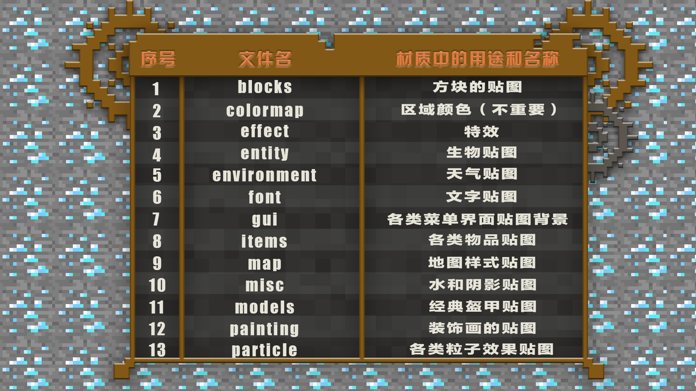

--- 
front: https://mc.res.netease.com/pc/zt/20201109161633/mc-dev/assets/img/1_1.825ef175.png 
hard: Getting Started 
time: 10 minutes 
--- 
# 1.1 Getting Started - Basic Concepts of Materials 
#### TAG: Material Concept 
#### Author: Ancient Stone 
#### Basic Concepts of Materials 

Texture Pack is a file package in Minecraft that can change the appearance of blocks, items, creatures and interfaces in the game. To make the game environment atmosphere meet specific requirements, adding a specially customized texture pack is the fastest and most direct way to assist in achieving visual effects. 

 

Like skins, texture packs have many resolutions to choose from, usually with the following size options: 16X, 32X, 64X. Because drawing texture packs is difficult to get started with, it is generally not recommended for beginners to directly draw materials higher than 32X. Starting from the [official common format 16X] is the best choice to control the overall effect of the material. 

The texture folder contains all the textures and UI in the game. We distinguish the file location of each texture well in the early stage of production, which will help to find the texture later. The default location of the texture pack is resourcepacks in the .minecraft root directory of the game. Copy it in and the import and installation will be successful. 

 

Next, I will explain the meaning of each folder in the texture pack to you~ We can randomly download an original texture pack and decompress it. 

First enter the textures folder, file path: texture pack/assets/minecraft/textures This part is the texture material we need to draw mainly. 

 

 

For developers who are just starting out, after deciding on the style you want to draw, it is recommended that you start drawing from the block folder first. The type of block is the most important. When the drawing of the block texture is about 60% complete, the entire material package can basically be characterized.