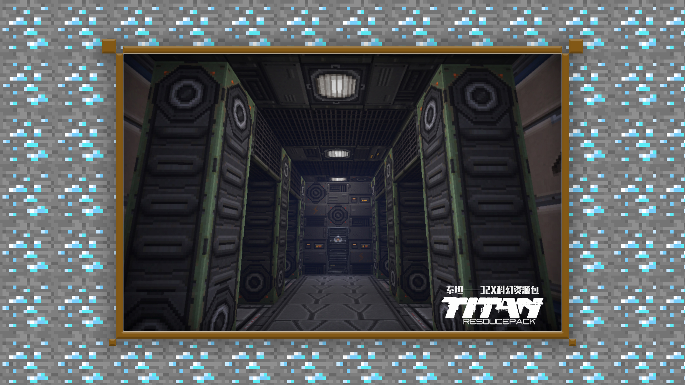
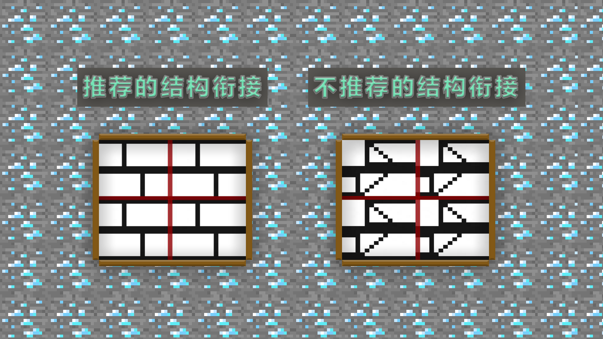
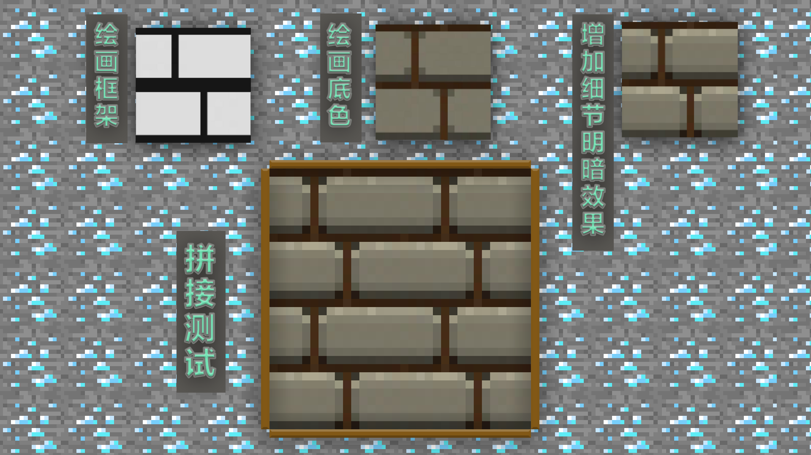

--- 
front: https://mc.res.netease.com/pc/zt/20201109161633/mc-dev/assets/img/2_3.ddc36ed4.png 
hard: Advanced 
time: 15 minutes 
--- 
# 1.2 Getting Started - Ideas and Basic Methods for Material Drawing 

#### TAG: Material Drawing Ideas 

#### Author: Ancient Stone 

#### Ideas and Basic Methods for Material Drawing 

When preparing to draw a material package, you need to think about three issues first: 

First, choose the style type of the material package. 

Different style types have different difficulty levels for finding and referencing materials. Medieval style, science fiction style, modern style, and Japanese style are all popular style types. When starting out, most people will choose to try a modern style with more reference materials. At the same time, the final drawing result is also simple and concise, which is very suitable for practicing as a basic creation. Here, we recommend that in addition to the modern style, novices should also try other styles, which will greatly help expand their own drawing ideas and proficiency. 

Second, where is the resolution of the picture positioned. 

When you first start, we recommend that you use the official regular resolution of 16X. The resolution of 16X will be easier to control in terms of the volume of the drawing, and you can try other resolutions after you are a little proficient. 

Third, whether the production cycle and difficulty of the overall material can be borne by itself. 

After clarifying the style and resolution you want to do, you need to start planning the production cycle and production difficulty. Formulating a reasonable production cycle for yourself will help manage the project itself and will be very helpful for making large-scale projects in the future. 

After thinking through the above three steps, the material production process will be more organized and the goals will be clearer. After you prepare yourself both mentally and in execution, the drawing process will be much easier~ 

 

The following content requires a certain understanding of material drawing. You can review the previous courses at any time. 

The difficulty of material production lies in the control and skills of pixel painting. Usually in pixel painting, we have relatively little space to add details. So when drawing, you must plan well, create the structure first, complete the base, and then beautify and modify. 

 

Among common mistakes, we often see that the pixels are too messy because we are eager to show the final effect when painting. This is something we need to avoid. 

As can be seen from the figure below, the blocks need to be spliced together, that is, the blocks need to be connected to each other. At this time, we can refer to the basic art principles of sketching, from the whole to the details, and never focus on one detail and refine it. Similarly, when drawing materials, we can first build the structure. Once the structure is established, the subsequent drawing will not be so cumbersome. 

 

