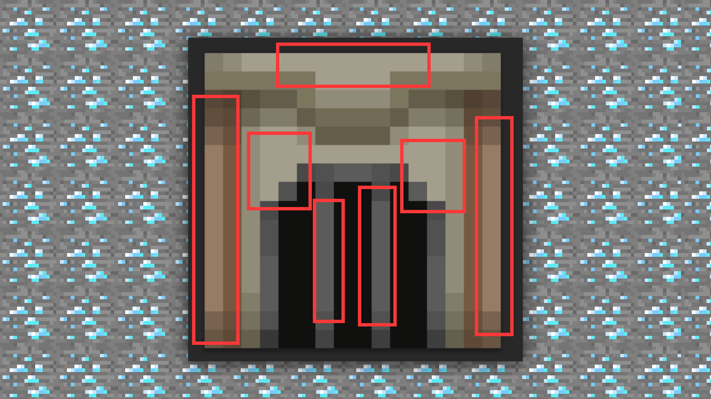

--- 
front: https://mc.res.netease.com/pc/zt/20201109161633/mc-dev/assets/img/3_11.30ea58db.png 
hard: Advanced 
time: 15 minutes 
--- 
# 1.3 Getting Started - Basic Material Drawing Techniques - How to Use PS to Draw Materials 
#### TAG: Material Basic Techniques 
#### Author: Ancient Stone 
#### Basic Material Drawing Techniques - How to Use PS to Draw Materials 

Next, let's draw a material block map~ 

First, we randomly select a map from the block folder of the texture package. The style is temporarily set to medieval style, and the resolution is selected as 16X. Directly import the map that needs to be modified in PS or create a new 16X canvas. Direct import can keep the size and resolution within a controllable range, which is a very convenient method. 

In order to avoid confusion, we directly create a new canvas and change the canvas properties below to adjacent, so that even if you zoom in or out, the image will not be blurred. 

 

After creating a new canvas, if you forget to adjust some parameters, you can also find the image size in the image mode to modify it. 

 

Then we will draw according to the basic method mentioned earlier. Starting from the structure, first set the brush to pencil and the pixel to 1. The transparency is selected according to the needs. If you want to do overlay, you can choose less, and it is also possible to draw directly with 100% concentration. Here we choose 20% transparency for drawing. 

 

Then start to draw the structure. This time we will draw a medieval furnace. First, sketch out the general idea. The furnace has a burner, and usually the items to be burned are placed above the furnace, so we draw a groove on the upper side. It's roughly like this. 

 

Then choose the right color to lay the base color for it. 

 

In order to highlight the three-dimensional effect, we need to start adding dark shadows. Because of the lighting effect, we can refer to the skin to draw the body parts to overlay the shadows at the joints. 

 

The effect after drawing the shadow. 

 

From the current effect, the shadow alone will look dull, so we can start to modify the bright part to improve the texture. 

 

The effect after adding highlights. 

 

The furnace is used to burn items, so we also need to light its fire, which can well increase the functional special effects. 

 

Is the furnace more lifelike after adding the flame? Then you can further adjust the contrast and brightness of the picture. Next, you can complete the drawing~ 

 

Above, a furnace block texture is completed. Through the above steps, we can see that drawing textures and drawing skins are similar in principle, and the final effect needs to be achieved through continuous superposition. This is a process of tempering and improvement, so you don't need to rush, just practice step by step.