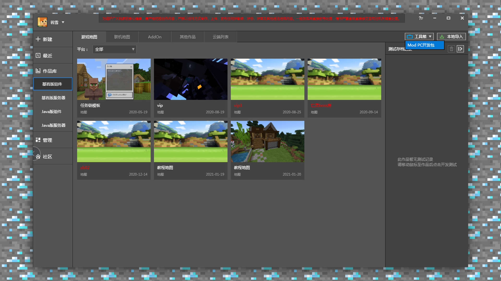
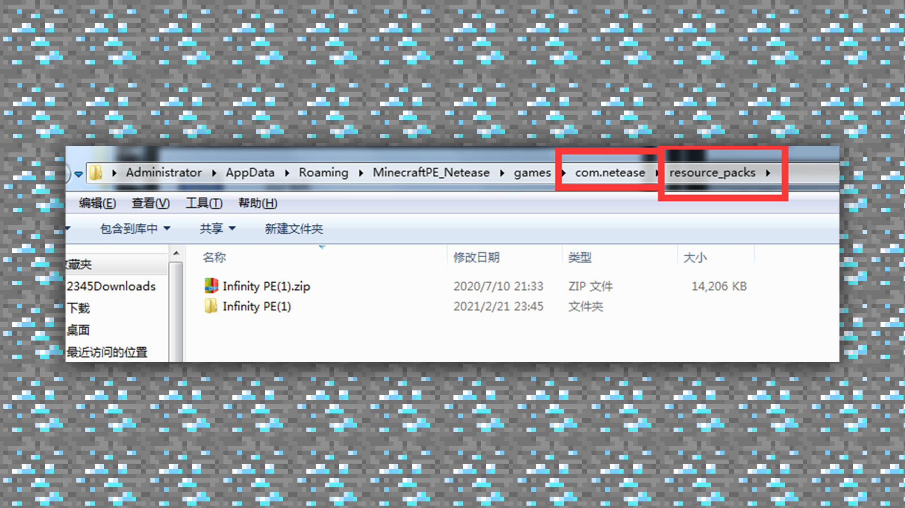

--- 
front: https://mc.res.netease.com/pc/zt/20201109161633/mc-dev/assets/img/4_7.a42d1dc4.png 
hard: Advanced 
time: 10 minutes 
--- 
# 1.4 Getting Started - Correct Methods for Importing and Exporting Materials 
#### TAG: Material Import Export 
#### Author: Ancient Stone 
#### Correct Methods for Importing and Exporting Materials 
First, we will organize and package the prepared material packages, that is, package them into compressed packages. 

 

First, we need to log in to MCstudio. In the Bedrock Edition component category, click [Toolbox] on the right, download the Mod PC development package, and then go to the directory on the C drive 

(C:/MCStudioDownload/game/MinecraftPE_Netease/1.21.0.116635) to open the test application. 

 

 

Then we need to place the material file in the 

C:/Users/Administrator/AppData/Roaming/MinecraftPE_Netease/games/com.netease/resource_packs file, and then run the client for testing. 

 

After running the game, enter Settings-Storage to view it. 

 

If the texture pack appears in the storage, it means that the texture pack has been successfully imported and can be opened for testing. 

 

Next, you can enter the game to place and observe, and see if there is anything else that needs to be adjusted or modified. 

 

The basic tutorial of the texture pack is here~ 

The above basic learning can serve as an introduction to everyone's learning, and the more in-depth learning afterwards requires everyone's persistent practice. Textures and various painting methods are not learned in one day, and persistence will definitely produce results. Let's work hard together.