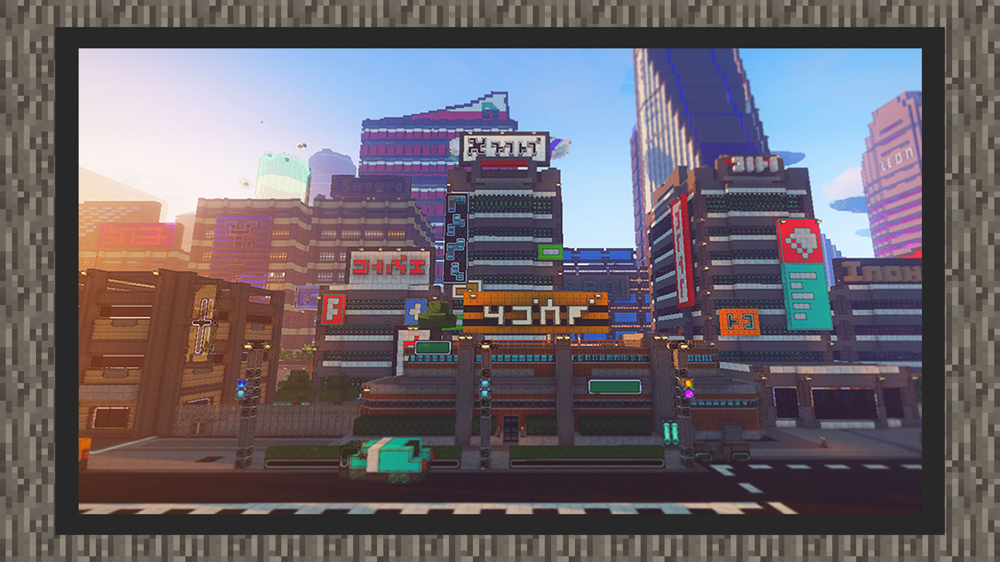

--- 
front: https://mc.res.netease.com/pc/zt/20201109161633/mc-dev/assets/img/5_4.bc1d6a5a.jpg 
hard: advanced 
time: 20 minutes 
--- 
# 1.5 Advanced - Make the material move - Dynamic material production skills 
#### Author: Ancient Stone 
#### Tag: Dynamic material production concept 
#### Basic concept of dynamic material 

What is a dynamic material? The simplest description is a moving texture. 

Earlier, we followed the tutorial to draw a static texture, but no matter how vivid the drawing is, the static screenshot will not move. 

Therefore, in order to make the material more colorful, or to attract more attention through the material, dynamic material is a necessary advanced practice. Next, let's make a dynamic texture together. 

 

#### Dynamic material drawing skills - How to use PS to draw materials 

If you have practiced the basic material drawing method, then I believe you are already familiar with the starting concept of materials~ 

The only difference between dynamic maps and static maps is: 

Dynamic maps are composed of multiple maps, while static maps only need one. Then we will directly skip the basic composition and start the combination concept of dynamic maps. 

Here we use a magic ball that has been drawn as an example. 

 

The key to dynamic loop is to loop without lag, so that the overall dynamic looks like a natural transition cycle, not a lag. 

If we want to achieve a natural cycle, we need to make the dynamic process of the dynamic map more detailed. For example, the magic ball in the case, we hope that it has a flashing light effect inside, so its extension is from the center to the outside and then shrinks back. 

 

First, draw several large keyframes according to the general path. 

 

This is the general process of flickering, but the frame rate will make the picture have a stuttering effect. 

So in order to achieve a smooth transition, we need to fill in the frames, which simply means to fill in the pictures and make the pictures play more smoothly. 

This step requires the assistance of the PS timeline. First, open the PS timeline, which is the PS animation interface. 

Then sort the drawn layers in the timeline in order. 

 

Then we will find that there are many missing transition frames. Next, we will draw the missing frames according to the missing parts to make the aperture have a transition before fission. 

 

After filling in the frames, you can try to play. 

 

The flashing transition is now complete, and we need to sort the textures we made. 

Sort the dynamic textures vertically according to the official sorting method in the game. (ps: Only the content originally set as dynamic effects in the game can be replaced with dynamic textures, such as: flames) 

 

After the replacement, test it according to the import method of the basic material tutorial, and you can see the dynamic effect.