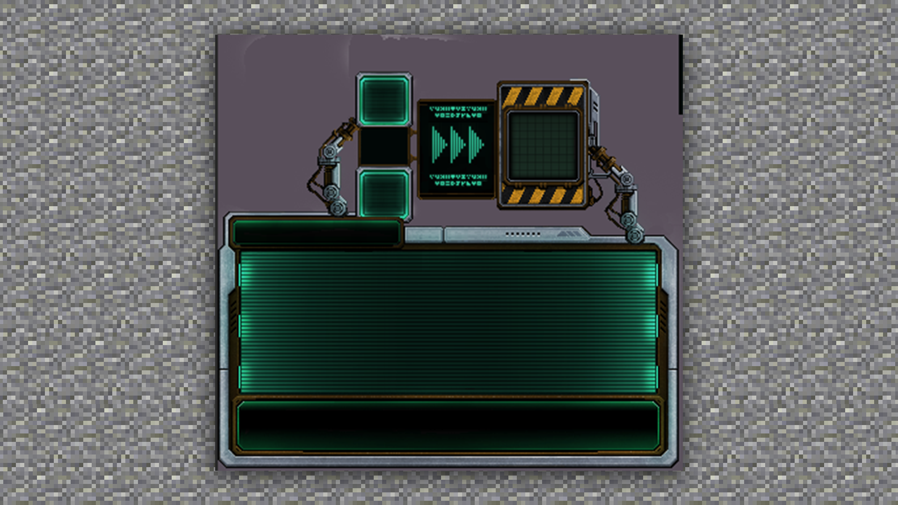

--- 
front: https://mc.res.netease.com/pc/zt/20201109161633/mc-dev/assets/img/1_1.50a37da0.png 
hard: Getting Started 
time: 5 minutes 
--- 
# Basic concepts of UI 
#### TAG: UI concept 
#### Author: Ancient Stone 
#### Basic concepts of UI 

UI design can be simply understood as the design of the user interface in a broad sense, which is the overall design of the human-computer interaction, operation logic, and interface aesthetics of the software. From the perspective of work content, it is generally divided into three categories: graphic design, interaction design, and user testing. 

 

UI design is not just about art painting, but also about positioning the software users, usage environment, and usage methods. Simply put, UI design is the process of constantly designing visual effects for users to achieve satisfaction.

In MC, the beauty and fun of the UI interface can give players an immersive experience. 

