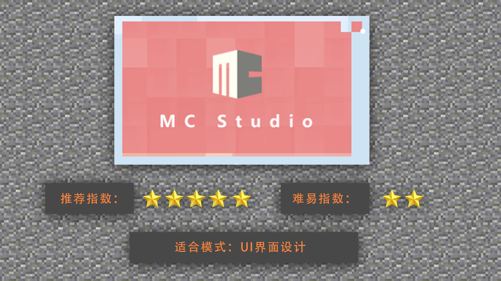
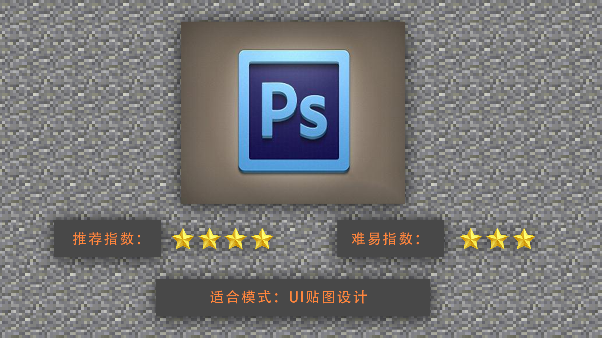

--- 
front: https://mc.res.netease.com/pc/zt/20201109161633/mc-dev/assets/img/2_1.adb83915.png 
hard: Getting Started 
time: 5 minutes 
--- 
# Introduction and selection of UI production tools 
#### TAG: UI production tools 
#### Author: Ancient Stone 
#### Introduction and selection of UI production tools 

After understanding the basic concepts, let's start to understand the most common Minecraft UI interface design software. 

 

MCStudio interface editor: It is a convenient development software developed independently for the Chinese version of Minecraft, specifically for in-game UI production. MCStudio not only includes UI interface design, but also includes preview testing in the game after direct import into MC, etc. It can be well tested and modified on the actual machine, which is very suitable for novices to use. 

 

PS: Photoshop is commonly used in various professional designs. It can also be of great help in the flat texture design of the UI interface, but PS cannot directly create UI software, so it can only be used as an auxiliary texture.