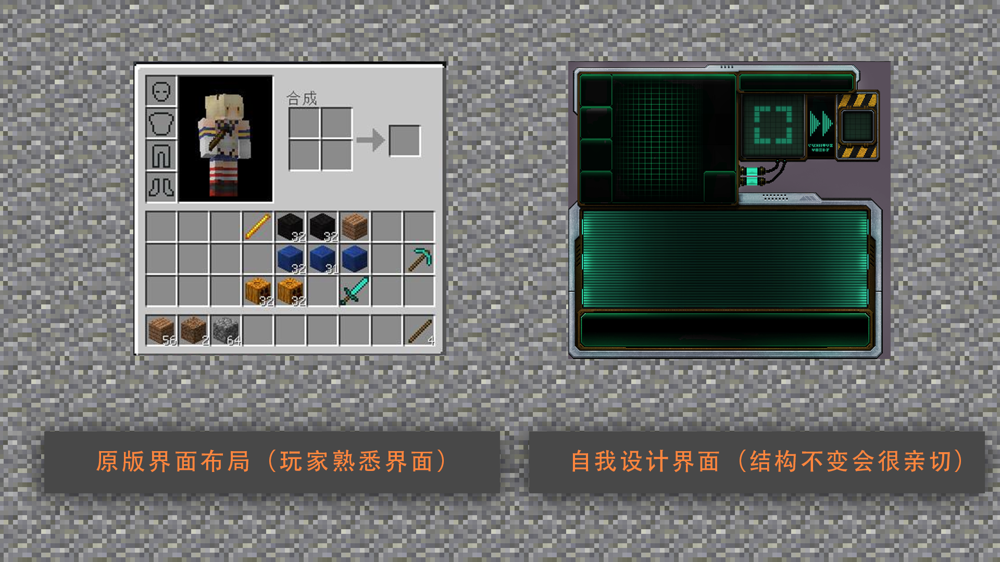
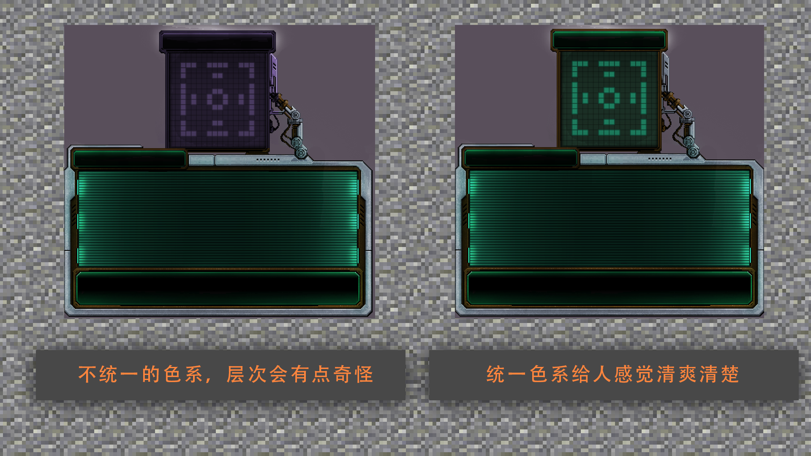
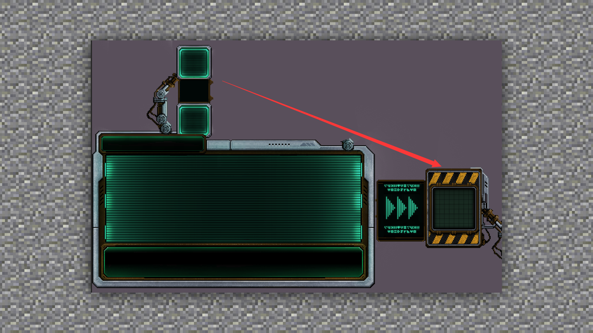
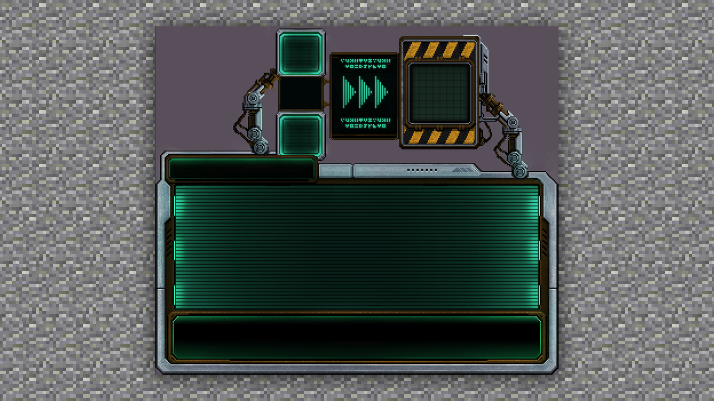

--- 
front: https://mc.res.netease.com/pc/zt/20201109161633/mc-dev/assets/img/3_1.ab492eaf.png 
hard: Getting Started 
time: 10 minutes 
selection: true 
--- 
# Planning and basic methods for UI production 
#### TAG: UI production planning 
#### Author: Ancient Stone 
#### Planning and basic methods for UI production 

Next, let's take a look at the three major plans and precautions that UI design should pay attention to: 

#### 1: Design should be consistent 

In the actual UI design process, we need to have a certain understanding of human-computer interaction. Then we should focus on the player experience. When designing the interface, it should be simple and intuitive, so that players can see the corresponding functions on the interface at a glance after getting in touch with the gameplay. It is best to make the operation simple and clear. 

 

#### 2. Design accuracy 

When designing the interface, you should try to use consistent symbols, colors, etc., and the meaning of the displayed information should be very clear. 

 

#### 3. Rational design layout 

A reasonable layout will bring convenience to players. When playing games or browsing pages, players basically follow the habit of top-down and left-to-right. Therefore, when designing the interface, we must avoid the problem that the function buttons are too scattered, causing the player's mouse or virtual joystick to move too far and too long. Do more "subtraction" operations, hide the uncommon button function areas, and keep the interface simple. 

 

Such a layout distance is too far, which is easy to distract the visual focus and make people dizzy. 

 

By arranging the layout according to human body habits, a good interactive effect can be achieved for the viewing angle.

Therefore, the game UI interface design requires careful thinking and conception.