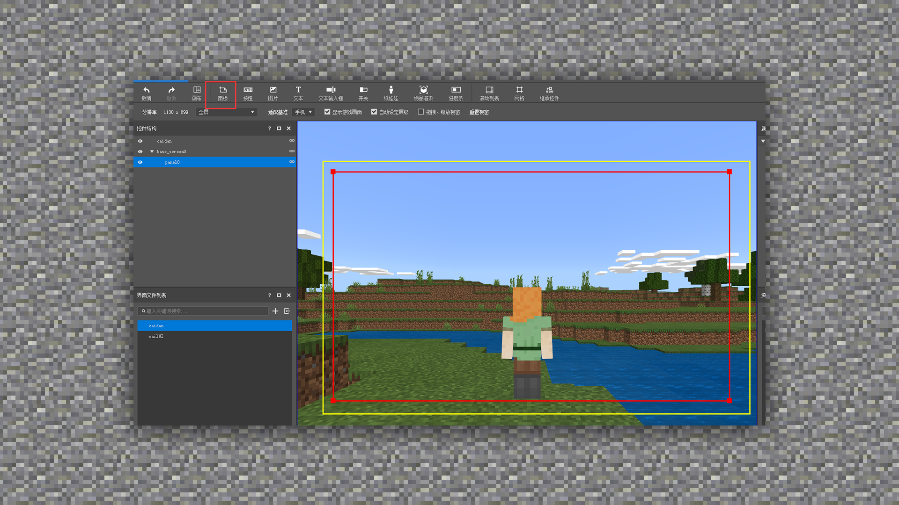
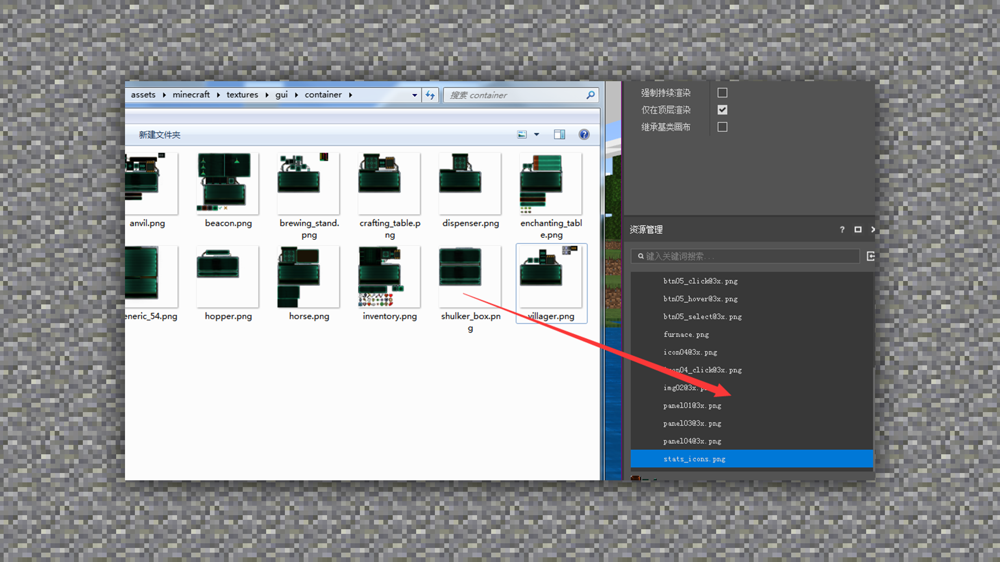
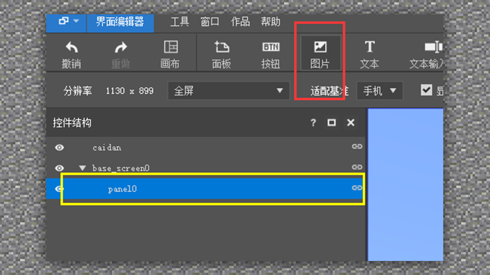
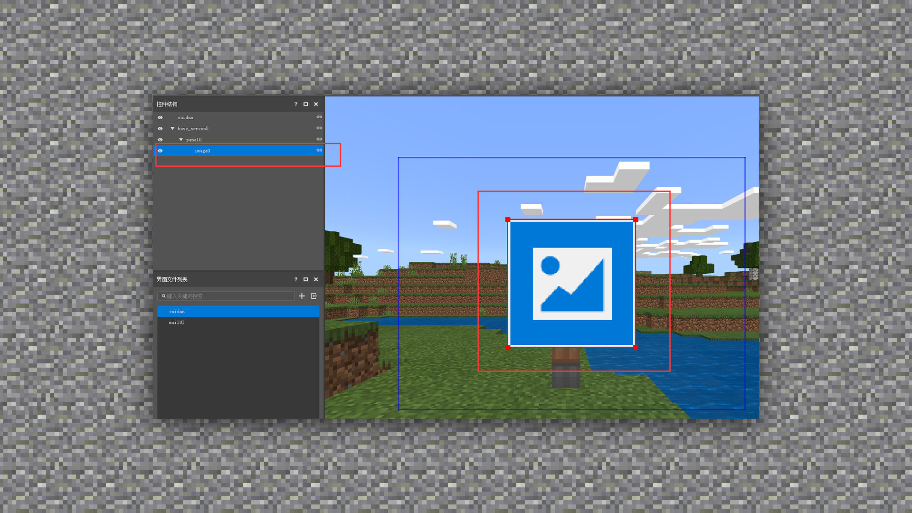
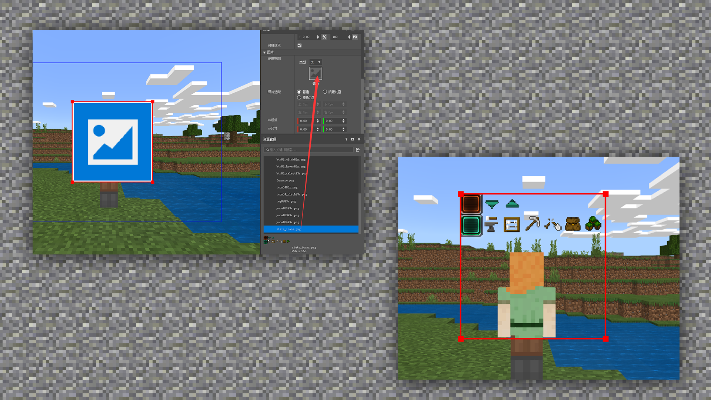

--- 
front: https://mc.res.netease.com/pc/zt/20201109161633/mc-dev/assets/img/4_1.0d097818.png 
hard: Advanced 
time: 20 minutes 
--- 
# Icon production method and specifications, in-game application 

#### TAG: UI production method game application 

#### Author: Ancient Stone 

#### Icon production method and specifications, in-game application 

 

Then import the drawn texture into the resource management interface of the interface editor. 

 

Next, you need to create a new background image as the bottom of the panel. Ps: Be sure to select the previous layer before clicking Add Image. 

 

You can see that we have obtained an image layer without an image. 

 

Next, just drag the imported icon texture directly to the image layer to replace it. 

 

In this way, you can directly see the effect of the in-game icon, isn't it amazing? So after the icon is made, we must do more tests and standardize it from the size, so that the number of later modifications will be greatly reduced and efficiency will be improved.