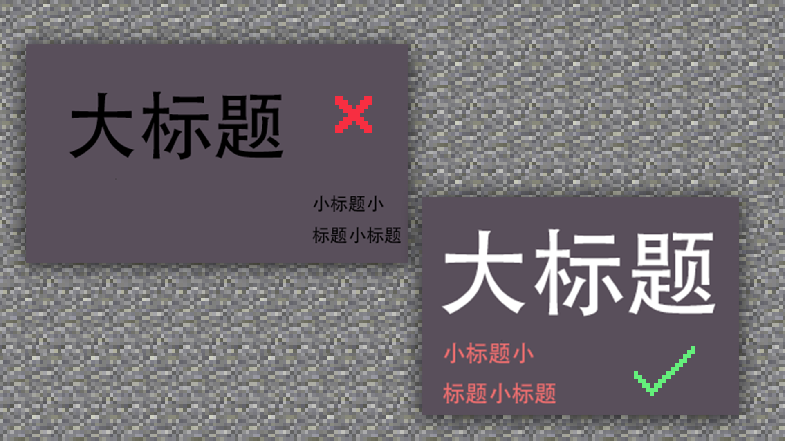
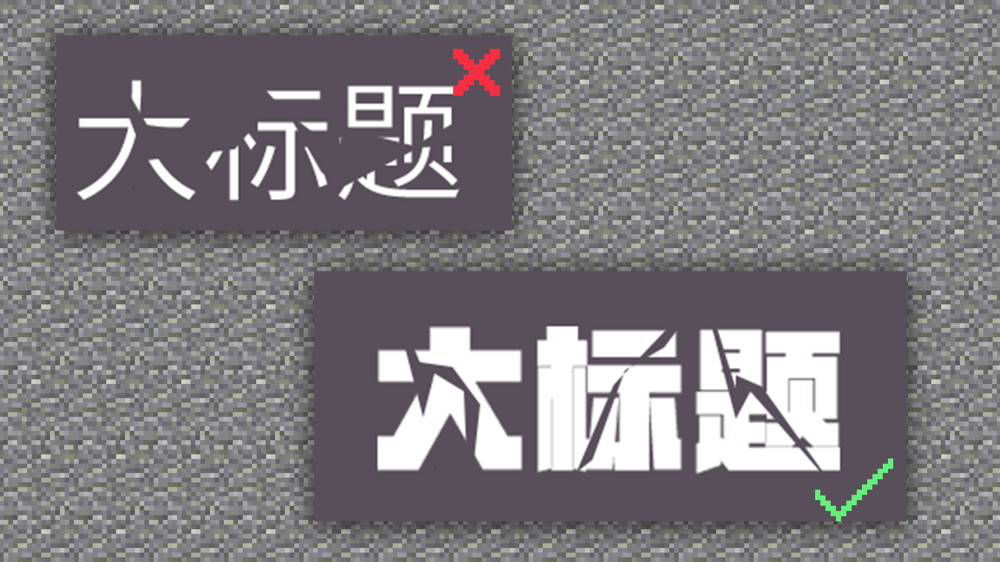
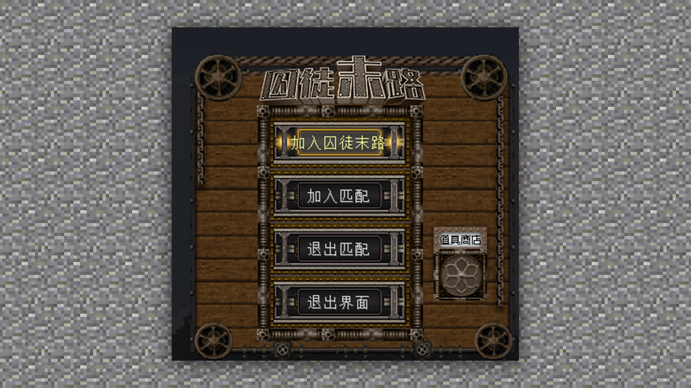
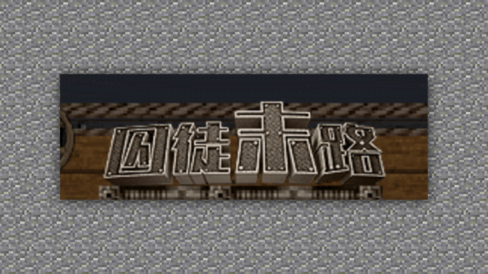
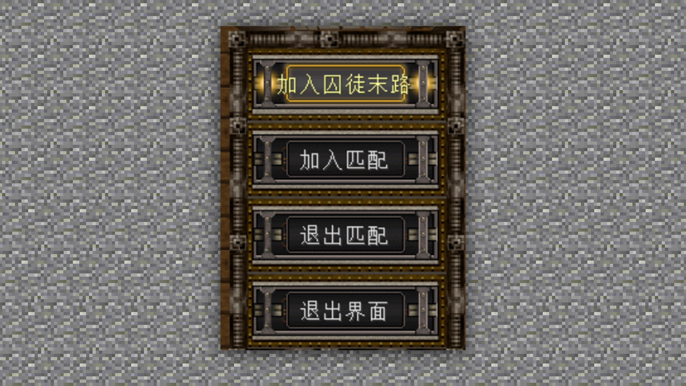
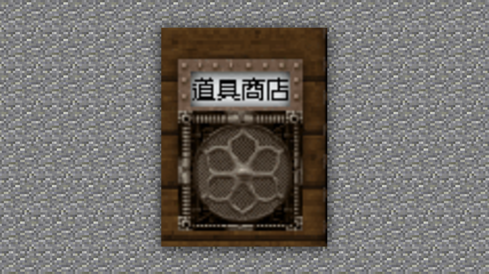

--- 
front: https://mc.res.netease.com/pc/zt/20201109161633/mc-dev/assets/img/5_1.ab84a7ba.png 
hard: Advanced 
time: 15 minutes 
--- 
# Font production method and specifications, in-game application 

#### TAG: font production method game application 

#### Author: Ancient Stone 

#### Font production method and specifications, in-game application 

Font design is an unavoidable topic in graphic design, because good UI and graphic designers must master how to design reasonable fonts, or design different fonts that meet the needs in different places. The same is true in the game, this is a set of universal understanding ideas. 

 

#### First, the layout of the title text 

If the text you designed is not attractive enough to users and players, or if they feel tired and lose interest in reading the font design, then you need to observe whether there is a problem with the layout of the text, or if the paragraphs are too jumpy. Generally speaking, your eyes will first see the big title, and then naturally return to the left to start reading. 

 

#### Second, the fragmentation of the text 

The fragmentation design of the text has a certain two-sidedness. If used well, it can reflect the toughness and sense of lines. If used poorly, it will be a collapse-like failure. Only the right font and the right fission effect can achieve the right visual experience. 

 

#### Third, Graphics 

Sometimes, overly graphic designs will reduce the recognition of the text itself, but appropriate graphic design will greatly improve the overall recognition. Reasonable graphics and integration are the most difficult. 

 

Text design is a part with framework specifications but design freedom. It has a similar design concept to ICON. The imaginative design and conception must have a basic specification framework. Designing under the basic specifications will give people a sense of chaos, which needs to be kept in mind. 

Therefore, in the game, due to the functions carried by the text, we need to consider whether the players can see clearly when playing the game, the usage of these icons and the practicality of these buttons. 

That is, in the game, we need to consider the readability of the text. Referring to the above concept, let's make a simple layout of the text effects in the game. 

 

In the text layout, we can see that the logo text of the right size is just the main part of the entire menu. 

 

Put all the matching information in the middle part, and give it a uniform design. 

 

Then we see the last part. Subconsciously reading from left to right can directly see the prop store. 

 

Among all the font designs, only the logo is typeset separately, and the rest are simple and unified, so as not to give players a messy visual experience.