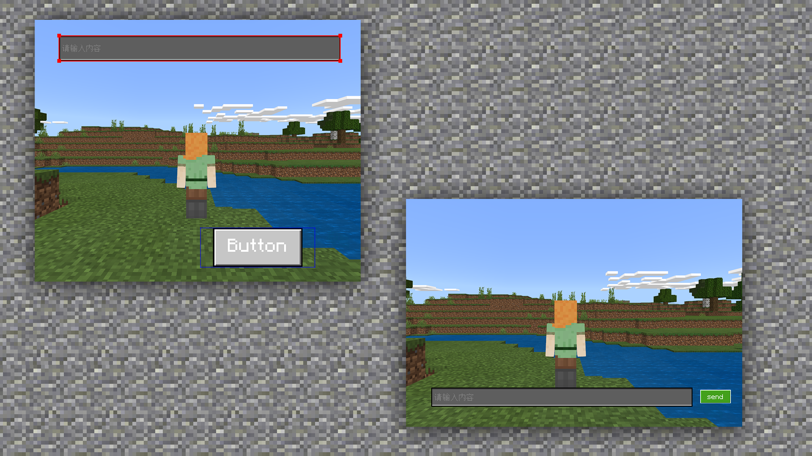

--- 
front: https://mc.res.netease.com/pc/zt/20201109161633/mc-dev/assets/img/6_1.4f0e1f91.png 
hard: Advanced 
time: 10 minutes 
--- 
# UI interface production method and specifications, in-game application 
#### TAG: interface production method game application 
#### Author: Ancient Stone 
#### UI interface production method and specifications, in-game application 

After understanding the basic specifications and applications of the above icons and texts, let's look at the key interface layout design. The UI interface is the top priority of the overall layout, which is closely related to the actual game time of the players. 

 

So when making a UI interface, you must first finalize the style, and then customize the color tone, just like when making a texture pack. After you have determined it, you will definitely not choose the wrong color on a large scale when you start drawing. 

 

For the layout specifications of the UI interface, we can refer to the layout of fonts. 

First of all, never jump to layout. 

For example, if the input box and the send key are too far apart, it will feel very unhumane to interact. Under normal circumstances, it is recommended to place them closer. 

 

We can directly set the effect before and after the button is pressed in MCStudio, so that it will give people a real click feeling. 

 

So a reasonable UI interface needs to be combined with icons, text, and physical interactions to be completed. For example, this potion crafting table. 

 

It optimizes the shortcomings of the original version and rationalizes the design of the potion interface. You can clearly see the location of the materials for placing and outputting the medicine. 

 

Through its theme, everyone can also understand that this gameplay belongs to the sci-fi interface design. 

 

And it also abandons the original division and changes it to striped text line sorting. This design is clean and concise, and the primary and secondary relationships are clear. 

 

Through the above learning, we can see that a good UI interface requires good ideas and layout. As long as we practice and understand more, we can definitely arrange our own UI interface~