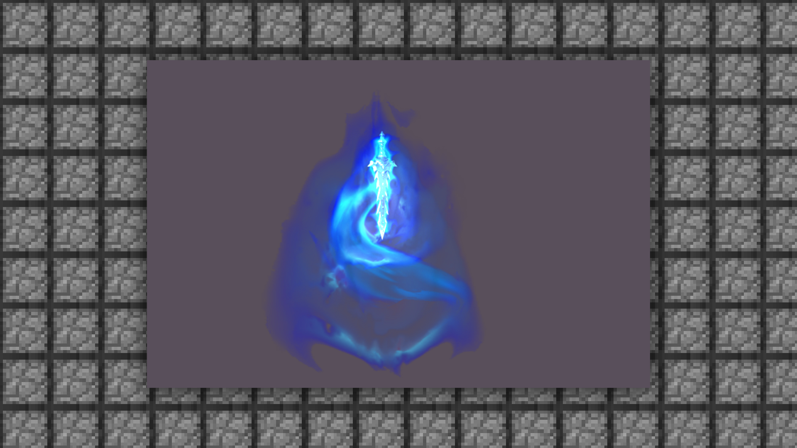
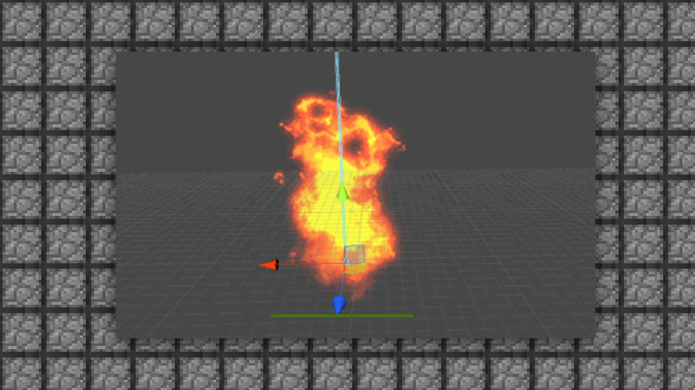

--- 
front: https://mc.res.netease.com/pc/zt/20201109161633/mc-dev/assets/img/1_1.d3ce2af8.png 
hard: Getting Started 
time: 5 minutes 
--- 
# 1.1 Introduction to the basic concepts of special effects (2D+3D) 
#### TAG: special effects concept 
#### Author: Ancient Stone 
#### Introduction to the basic concepts of special effects (2D+3D) 
Special effects are one of the indispensable contents in game design. With good models and actions, plus good special effects, the artistic vision of this gameplay will be guaranteed to a certain extent. At present, in terms of the selection of special effects specifications, we divide them into 2D special effects and 3D special effects. 
2D special effects can be simply understood as special effects completed by outputting sequence frame images, which are mainly completed by hand-drawing or pictures, and then converted into formats through various conversion software and installed in the game. 

 

3D special effects rely on engine development special effects. After the creation of the engine, the special effects will be more three-dimensional and cool, and the rendering special effects can be superimposed in the engine. It is the most common way to make special effects in games on the market. 

 

Currently, the most commonly used special effect format in the MC game is 2D special effects.