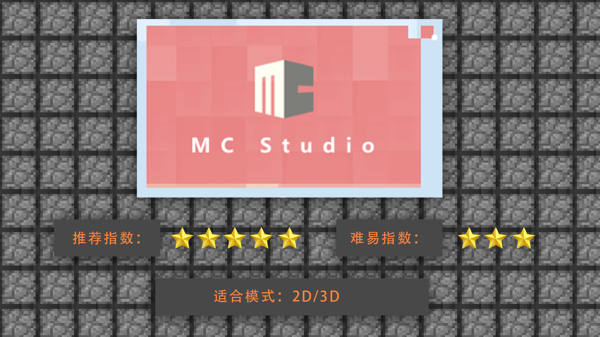
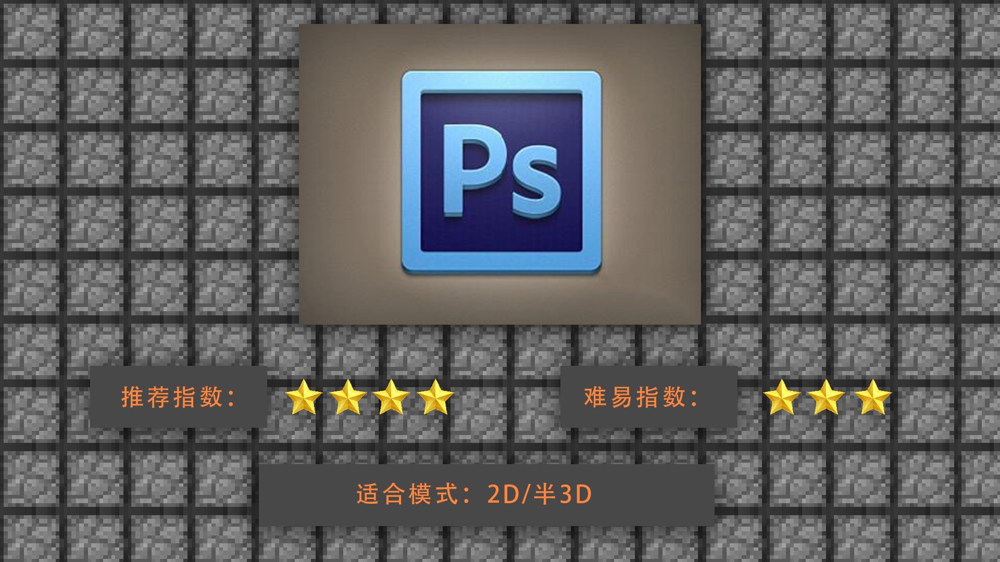
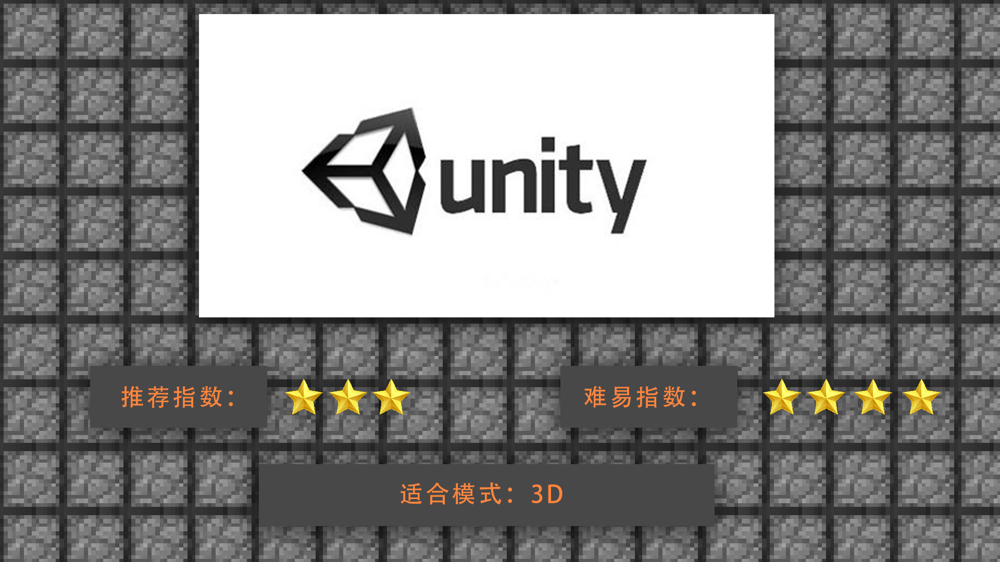

--- 
front: https://mc.res.netease.com/pc/zt/20201109161633/mc-dev/assets/img/2_1.37709151.png 
hard: Getting Started 
time: 5 minutes 
--- 
# 1.2 Introduction to production tools and tool selection, advantages and disadvantages 
#### TAG: special effects production tools 
#### Author: Ancient Stone 
#### Introduction to production tools and tool selection, advantages and disadvantages 

After understanding the basic concepts, we began to understand the classification of tools for making special effects on the market. 

 

MCStudio Special Effects Editor: It is a comprehensive software developed independently for the Chinese version of Minecraft, specifically for the convenient production of special effects in the game. MCStudio not only includes special effects, but also includes in-game reading after direct import into MC, etc. It can be well tested and modified on the actual machine, and is very suitable for beginners to use. 

 

PS: Photoshop is often used to complete the hand-painting and puzzle steps of 2D special effects. Because Photoshop has its own animation frame rate production, it can be used to produce flat 2D special effects, and it can also be used to produce 3D auxiliary textures. Therefore, it is very suitable for beginners who want a hand-painted style or are not very proficient in editor control. You can use PS for practice and production. 

 

U3D: The full name is Universal 3D, referred to as U3D. U3D is also a universal 3D graphics format standard. The U3D engine is a software that can produce 3D stereoscopic special effects. Through the production of U3D, the flat 2D can be turned into three-dimensional pixels. It is one of the most commonly used software in the current game market. However, U3D cannot be exported to JAVA format and can only be used for games developed by U3D or the engine.