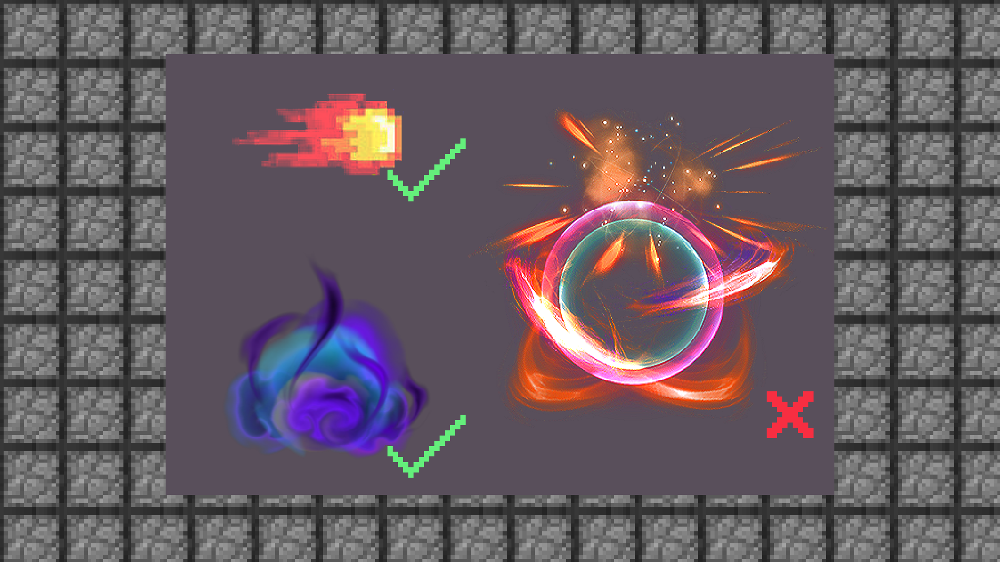

--- 
front: https://mc.res.netease.com/pc/zt/20201109161633/mc-dev/assets/img/3_2.00180f2e.png 
hard: Getting Started 
time: 10 minutes 
--- 
# 1.3 Introduction to the ideas and specifications for special effects production 
#### TAG: special effects ideas specifications 
#### Author: Ancient Stone 
#### Introduction to the ideas and specifications for special effects production 

After choosing a special effects software that suits you, we have to start learning the ideas for special effects production. 
Generally speaking, our design can start from a draft, of course, we can also directly draw using the method that everyone is used to. 

#### The general thinking of 2D special effects is as follows: 

Concept effect → hand-drawn draft → sort out the order of layers → software draft → determine the style → start coloring → dynamic link → confirm export → convert to various formats 

#### 3D special effects will be more complicated: 

Concept effect → hand-drawn draft → sort out the order of layers → software draft → determine the style → engine draft production → hook production of various effects → particle rendering → animation link production → set basic code → finished product confirmation export → convert to various formats 

So it is generally recommended that you start with 2D production, sort out the ideas and then try 3D advanced. 

#### Production specifications 

After clarifying the production process, we also need to pay more attention to the production specifications of special effects. 
First of all, it is not recommended that the special effect colors are too bright, unless the game has special requirements, otherwise the overly bright special effects may lose and tear the textures in the game. 

 

Secondly, when making MC-style game special effects, we must pay more attention to the pixel texture problem. If the mod is more realistic, the special effects can also be close to the realistic style, but if it is a pure pixel style, then a hand-painted pixel style will be closer to the mod game style. The idea here is mainly to think about the integration of styles, which is something that many novice friends will ignore. 

 

Next, when making special effects, we recommend using a transparent background. 

If the background is not removed when exporting the finished product, an error will occur when importing the game. Ps: The gray and white grid is a transparent layer, don't think it has a background~ 

