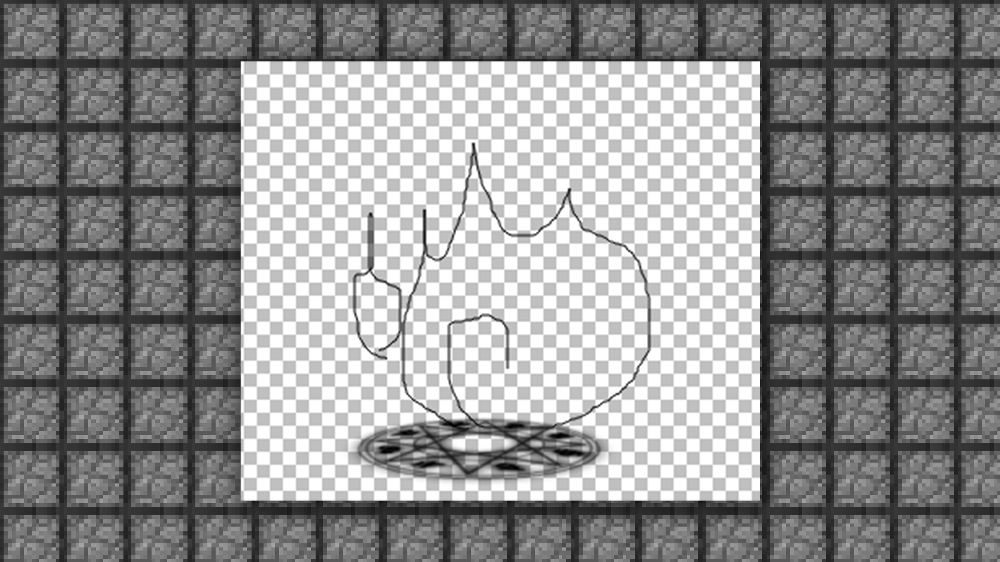
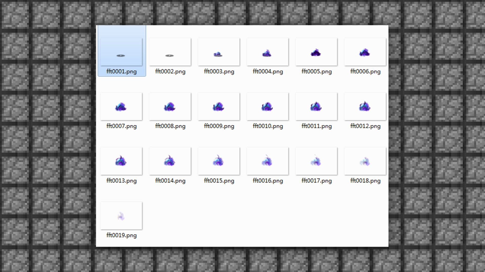

--- 
front: https://mc.res.netease.com/pc/zt/20201109161633/mc-dev/assets/img/4_4.fa202650.png 
hard: Advanced 
time: 25 minutes 
selection: true 
--- 
# 1.4 Make a special effect of your own 
#### TAG: Special effect MCStudio production 
#### Author: Ancient Stone 
#### Use MCStudio special effect editor and third-party software to make special effects 

Next, let's make a special effect of our own. 

Here we use MCStudio test import as an example to introduce special effect production. 
First, let's conceive a special effect of flames appearing from a magic circle based on the production process mentioned in the previous content. Let's first determine the shape of the magic circle. Here, the magic circle is set to be placed on the ground, so the perspective of the magic circle is definitely not a bird's-eye view, but a side view. 

 

At present, the rotation of the magic circle alone is relatively monotonous. If we add the element of fire, it may have a good effect. 

First, let's quickly make a draft. 

 

Then we open PS to draw the shape of the flame. 

 

After both are finalized, let's conceive the process of the flame appearing. 

Normally, the flame is released from the center of the magic circle, so let's draw the basic process. 

 

 

Next, we save the image in layers as PNG. PS: PNG is a format that can retain transparent layers. 

 

Then we can use TexturePackerGUI to convert the sequence frame images to JAVA. 

 

First open the software, and then drag all the sequence images into it. 

 

After importing, we need to set 

Allow rotation is not checked 

Trim mode is selected as None 

 

In this way, each small image in the exported large image is the same size. 

Note: The official currently only supports sequence frame sub-images of the same size. 

 

Then select publish to package and export. 

 

We can get the json special effects file. 

 

Next, you need to open MCStudio to start the sequence frame import test. 

First, we open the special effect editor interface of MCStudio. 

 

Let's get to know the special effect editor first. 

 

Property panel: used to display or modify the properties of the selected item, including displaying/modifying the properties of particle special effects and sequence frame special effects, and displaying the properties of model-related files. 

Timeline panel: used to control the playback of special effects and characters, including play, stop, frame-by-frame playback, and can drag the duration of special effects when playing skeletal animation. 

Resource manager panel: used to display the resources owned, including three shortcut directories for special effect editing and corresponding shortcut buttons. 

Mounting panel: used to mount special effects to characters, and can control the position of different special effects playback. 

Preview settings panel: used to preview characters/models and special effects, and can support multiple different models and special effects to play at specified locations. 
Then we import the sequence diagram we just made into the game to test the effect. First, you need to create a new sequence frame to import. Select [Resource Management]-[EFFECTS] under Sequence Frame New. 

 

to name it and click OK. 

 

Then there will be a new special effect property box in the right window. 

 

Then drag the drawn and edited texture into the texture part to replace it. 

 

The system software will automatically import the special effects configuration file. We only need to drag the json file into the time bar to see the effect. 

 

Next, you need to set the hanging point. You can choose the bottom hanging point or any part of the body to hang the point. The different hanging point positions will make the special effects appear in different positions. 

