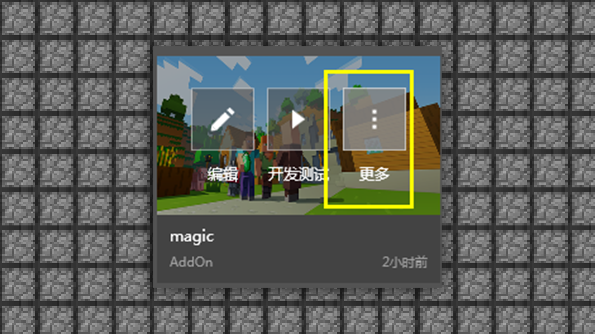
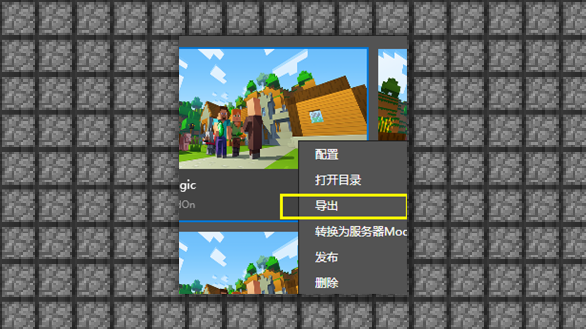
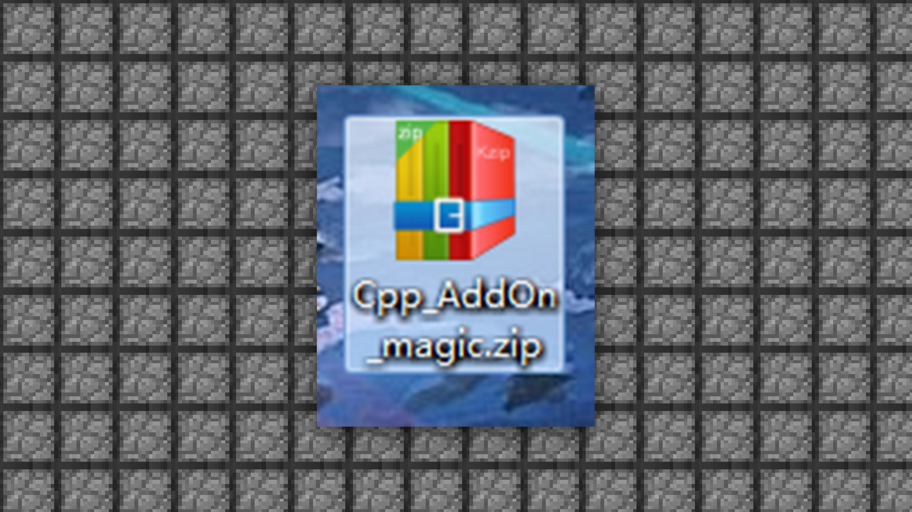

--- 
front: https://mc.res.netease.com/pc/zt/20201109161633/mc-dev/assets/img/5_1.a60dd16d.png 
hard: Advanced 
time: 5 minutes 
--- 
# 1.5 Correct way to output special effects 
#### TAG: Special effects output 
#### Author: Ancient Stone 
#### Correct way to output special effects 

After editing and saving the special effects, we return to the original interface. Then click More to export. 

 

Click Export 

 

Set the file name. 

 

This addon package with special effects is now available. How to assemble and combine it depends on your attempts and practice~ 

