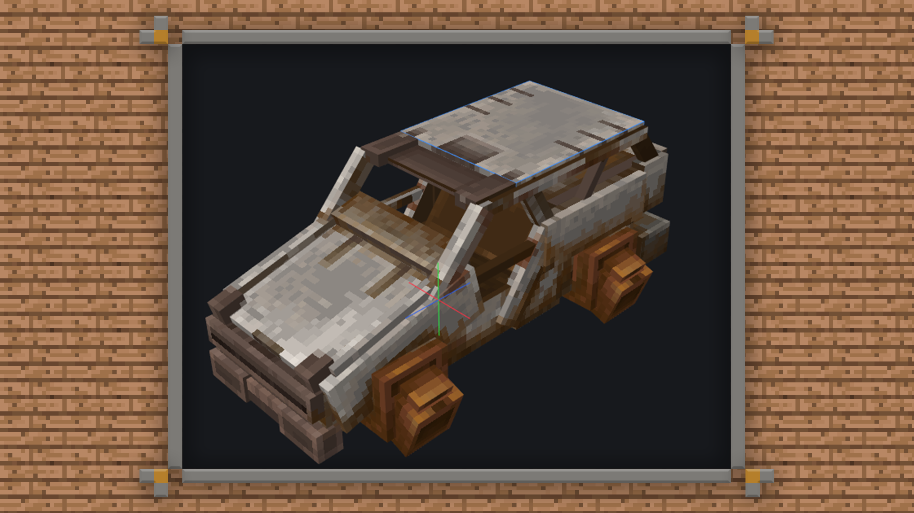
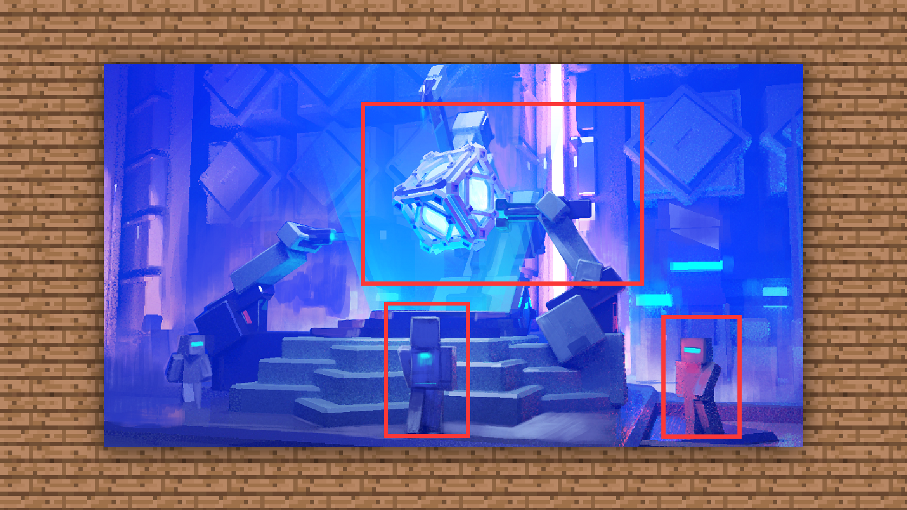

--- 
front: https://mc.res.netease.com/pc/zt/20201109161633/mc-dev/assets/img/1_1.f80ddfd5.png 
hard: Getting Started 
time: 10 minutes 
--- 
# 1.1 Basic concepts of models and model actions 
#### TAG: Model Action Basic concepts 
#### Author: Ancient Stone 
#### Basic concepts of models and model actions 

Models and actions are necessary components in the game development environment, and are one of the core components in 3D games. Good models and actions can add luster to the game. 

In Minecraft, especially when making gameplay, addons, and servers, outstanding monster models and equipment models will definitely make this gameplay more attractive to everyone. So what exactly does the model and model action include? 

 

For example: In the visual performance of a game, it is mainly divided into characters, actions, special effects, and scenes. Characters and scenes can be understood as models. 

 

And the action includes many setting conditions, including the walking and interaction of characters or monsters, the running of mounts, and the attack of monsters, all of which rely on actions to operate. A character is lifeless after being designed. He needs to be given walking, running, jumping, attacking and other behaviors by the action designer before he can be vividly presented to the players.