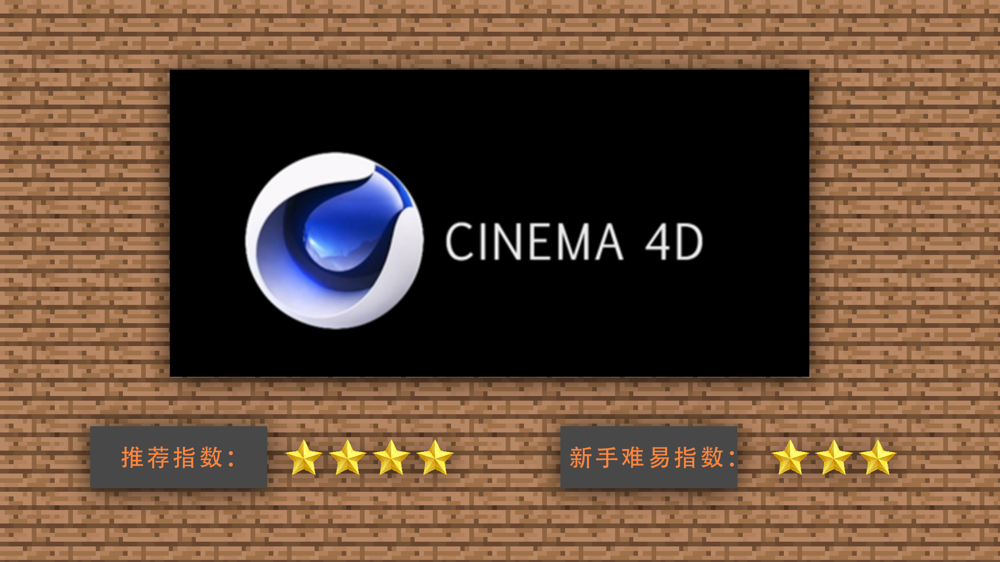
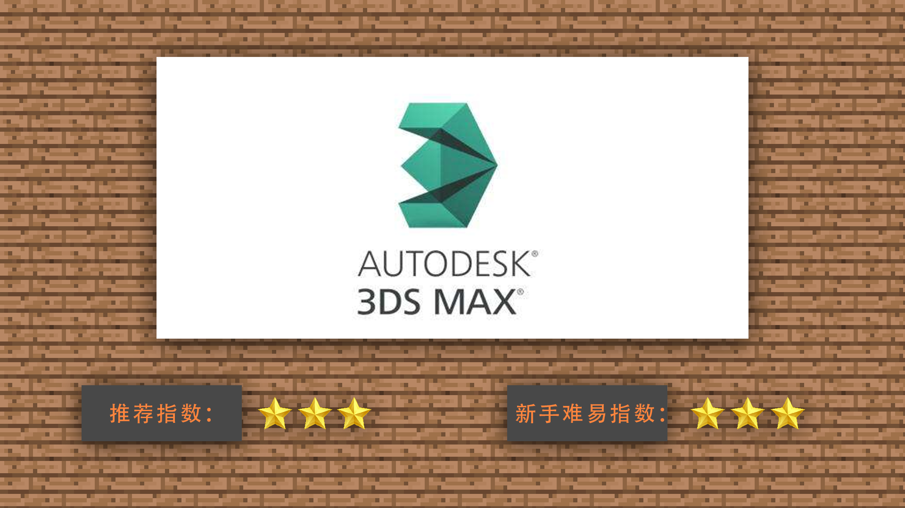
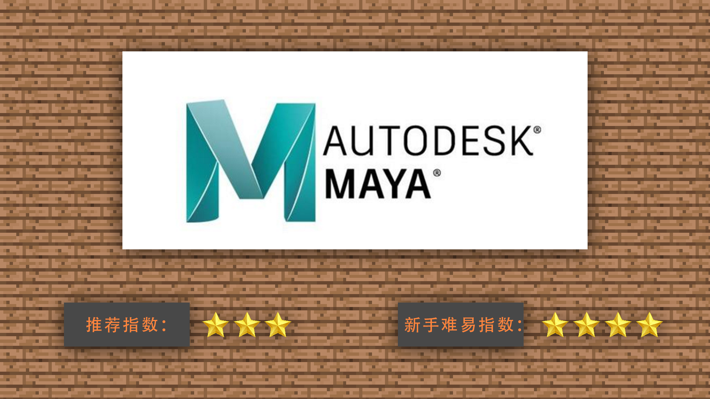
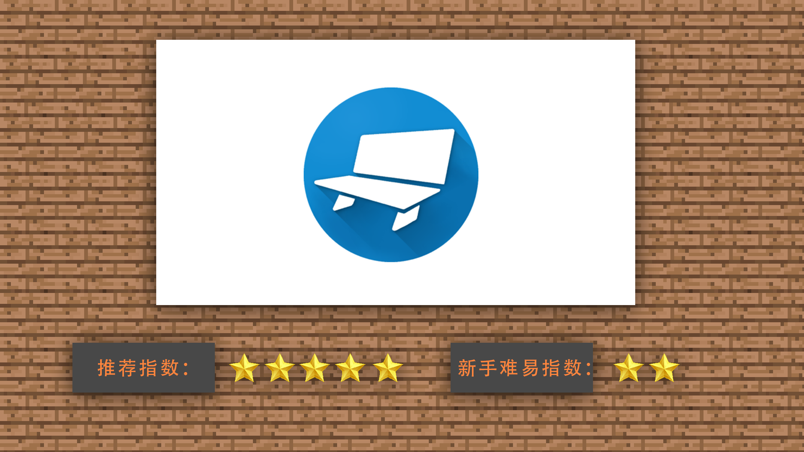

--- 
front: https://mc.res.netease.com/pc/zt/20201109161633/mc-dev/assets/img/2_4.e07554ef.png 
hard: Getting Started 
time: 10 minutes 
--- 
# 1.2 Introduction to model making tools and tool selection, advantages and disadvantages 
#### TAG: model action tool selection 
#### Author: Ancient Stone 
#### Introduction to model making tools and tool selection, advantages and disadvantages 

After understanding the basic concepts, we began to understand the classification of model making tools on the market. 

The most well-known model making software on the market now are: C4D, 3DMAX, MAYA, BLOCKBENCH 

 

CINEMA 4D is a 3D software produced by MAXON of Germany. It has powerful modeling and animation functions and strong scalability, and the operation is relatively simple. With the continuous enhancement and update of functions, the application scope of CINEMA 4D is getting wider and wider, involving multiple industries such as film and television production, graphic design, creative graphics and game development. In MC animation production, it is also a commonly used software. 

 

3D Studio Max, often referred to as 3ds Max or MAX, is a 3D animation rendering and production software based on PC system developed by Discreet (later merged by Autodesk). It was used in animation production in computer games, and later began to participate in special effects production of film and television, such as X-Men II and The Last Samurai. After Discreet 3Ds max 7, it was officially renamed Autodesk 3ds Max, and the latest version is 3ds max 2020. It is one of the most commonly used modeling software on the market. 

 

Maya, that is, Autodesk Maya, is the world's top 3D animation software produced by Autodesk of the United States. It is used for professional film and television advertisements, character animation, movie stunts, etc. Maya has complete functions, flexible work, easy to learn and use, extremely high production efficiency, and strong rendering realism. It is a high-end production software at the movie level. It is a software that advanced developers and designers on the market will choose to learn. 

 

Blockbench is an easy-to-use model design software with a beautiful interface and powerful and practical functions. It can help you get easier operation when designing models. Although the software is only more than 30 MB, it is very small compared with other modeling software, but it has a friendly difficulty level in designing some simple 3D models, and can also design some component models. The software also provides rendering functions, and there are many rendering data that can be set, such as automatic UV, etc. It is very suitable for beginners to learn the basics of modeling and animation. 

Through the introduction of the above software, we can roughly find that the learning of software modeling is similar to the learning process of other modules, which is basically divided into novice to advanced. Then we give priority to Blockbench for basic novice practice and production.