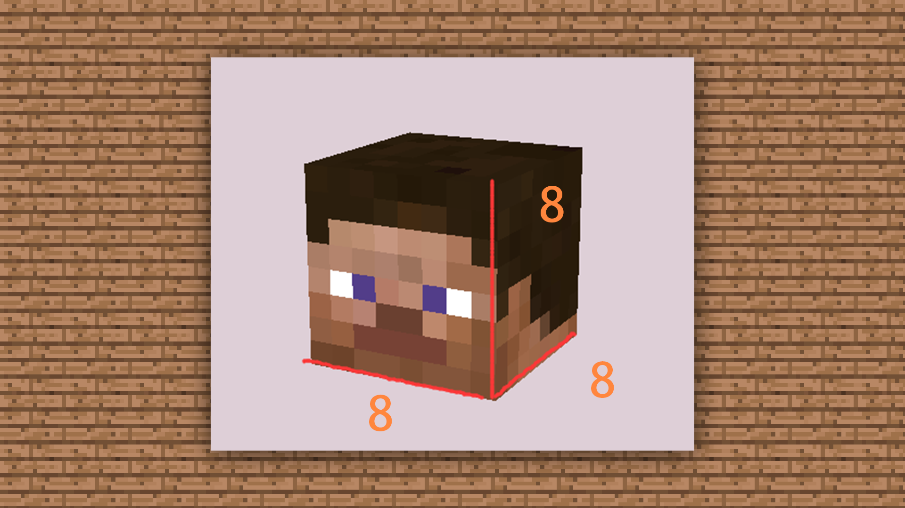
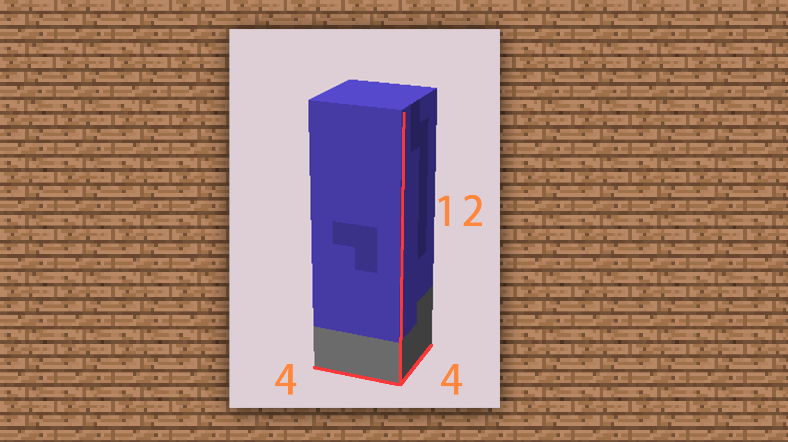

--- 
front: https://mc.res.netease.com/pc/zt/20201109161633/mc-dev/assets/img/3_7.39cb019c.png 
hard: Getting Started 
time: 15 minutes 
--- 
# 1.3 Introduction to the ideas and specifications for making MC effect models 
#### TAG: Model Ideas Specifications 
#### Author: Ancient Stone 
#### Introduction to the ideas and specifications for making MC effect models 

After choosing the software, let's first understand the conceptual ideas of MC model making. First of all, we need to know what the basic official size is. Secondly, the drawing specifications for textures and the modeling rules for models. 

The official model resolution and size of MC is 16X, that is, the resolution of character design is limited to 16X. 

 

If you find it difficult to understand, the easiest way is to count the number of grids using the official skin. 

For example: 1. Head size: 8 grids in length, width and height 

 

2. Body size: 8 grids in length, 4 grids in width and 12 grids in height 

 

3. Arm size: 4 grids in length, 4 grids in width and 12 grids in height 

 

4. Leg size: 4 blocks long, 4 blocks wide, 12 blocks high 

 

#### Production standards and taboos 

Understanding the proportion of the characters clearly will give us a concept of the basic model of the characters in Minecraft. If we want to be closer to the official style of MC, we need to make it simple when making the model. 

I hope you can remember these three points: 

1. It is not recommended to be too messy 

2. It is not recommended to have too many joints 

3. Avoid overlapping blocks 

#### 1. It is not recommended to be too messy 

This point is related to the drawing method of the texture. If the noise or shadows of the texture are intertwined and chaotic, no matter how good the model is, it will fail. 

 

#### 2. Too many joints are not recommended 

If the model block has too many joints, it will lose the original style of MC, and it will give people an unclear feeling after being implemented in the game. So we can avoid the design of too many joints. 

 

#### 3. Avoid block overlap 

If overlap occurs during modeling, importing the overlapping model into the game or making animations will cause flickering or tearing, that is, the overlapping blocks are too close to each other to produce broken surfaces. Many errors will occur. 

 

After we understand the specifications and size rules here, we can practice and learn new skills by following the actual cases~