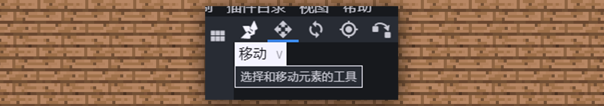
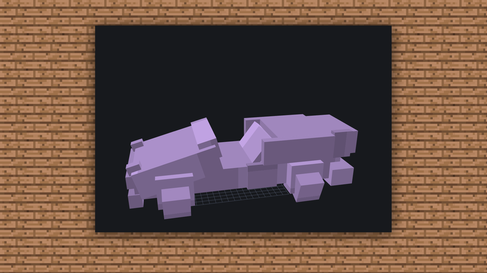
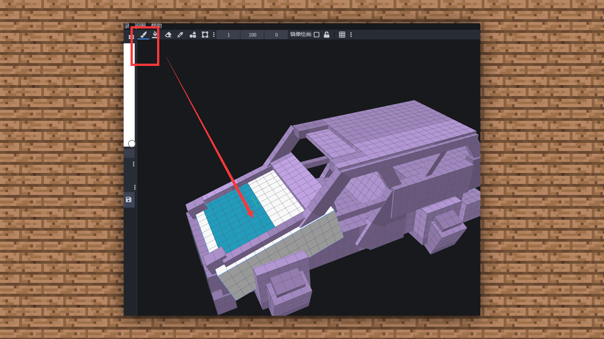

--- 
front: https://mc.res.netease.com/pc/zt/20201109161633/mc-dev/assets/img/4_1.9a961fec.png 
hard: Advanced 
time: 30 minutes 
--- 
# 1.4-BLOCKBENCH Tutorial-Output Model Case 
#### TAG: Model BLOCKBENCH Case 
#### Author: Ancient Stone 
#### Open Source Software: BLOCKBENCH Usage Tutorial-Output Model Case 

In the process of making models, we must make them in order: from bottom to top, from the framework to the whole, from the whole to the details, from the details to the texture drawing. If not, it is easy to rework due to some minor problems, or cause all the overturns and restarts. 

So every step needs to be serious and cautious. Next, let's try to make a model. 

The finished product is as follows: 

 

#### Start making 

First, let's open BB. You can search for Blockbench in the search engine, find its official website and download it. 

 

After opening the software, you can see that the software interface clearly divides the model creation formats into different categories. We just need to choose the version we want to make. Ps: In BB, the skin player entities are all set by default according to the official format, and you don't need to re-build them according to the size. It's very convenient. 

 

But here we have to pay attention that there is an old version of the Bedrock model created in the middle of the Bedrock version. The difference between the two Bedrock versions is. 

 

The blocks created by the Bedrock version model can be rotated in any direction without restrictions.

 

However, the old Bedrock Edition model cannot rotate blocks directly. You need to create a group before you can rotate the direction. 

 

Then let's select the module board entity to make the car. 

 

Enter the interface after selection. 

 

First, create a bottom as the chassis of the car. First select [Add Cube] in the Outline module, and then we create a cube. 

 

After the cube is added, we can directly use the left and right buttons and the scroll wheel of the mouse to scale the object and move the canvas. The left mouse button is for moving the object's direction, the right mouse button is for moving the object up, down, left, and right, and the scroll wheel is for zooming in and out. 

 

You can use the [Move] function on the toolbar to move and adjust the cube. 

 

Use [Size] to adjust the size of the cube 

 

Use [Rotate] to select and rotate the cube tool 

 

We use the size button, then click the blue horizontal arrow to stretch the block to the length we want. (After becoming proficient, you can directly enter the block parameters to set the length, width and height) 

 

Because the chassis of the car is relatively wide, we continue to select [Size] and select the red arrow from the side to extend the side. 

 

Then we use the same method to draw the rear bumper of the car. 

 

And make a rectangle and place it on the rear as a cushion for the rear lights. 

 

Then continue to follow the above operation method, first stack the chassis of the car with blocks and perfect the bottom. 

 

 

Then we start to stack the window frames and the upper part of the roof frame using the same method. 

 

 

Then cover the roof. 

 

The basic model of such a car has been completed. 

Then let's create a texture for the car. 

 

Choose a color you like, but the resolution must be 16X 

 

After the texture is created, we switch the interface to the drawing board mode. 

 

Then drag the newly created material directly to the surface you want to draw. Then the surface turns white, and you can start drawing. 

 

Then we use the color picker to pick colors. 

 

After picking colors, we select a brush and start coloring. 

 

After selecting the brush, we can set the brush size, opacity and softness. Just choose according to your personal drawing habits. 

 

[Size]: refers to the brush stroke size, 1 is 1 pixel block. The larger the value, the larger the brush. 

 

[Opacity]: You can adjust the transparency of the brush color, 100 is solid color, 0 is transparent. 

 

[Softness]: refers to the softness of the color under the brush, there will be a layer of frosted texture, you can try to draw it. 

 

Then start to try to color it by referring to the skin painting method, and make a car of your own~ 

